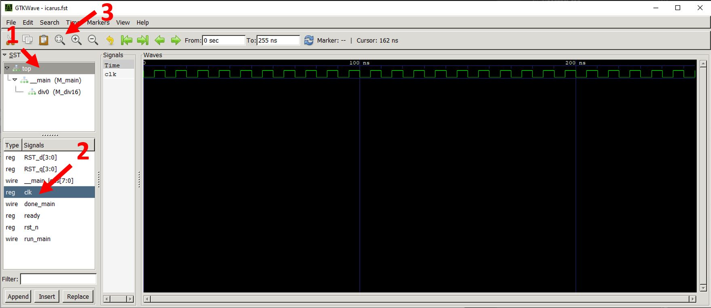

# Getting started with Silice

Here are the instructions to setup Silice from scratch. Once done, head out to [writing your first design](FirstDesign.md) or try our [example projects](projects/README.md).

We will first compile Silice and then compile or install the Open Source tools we will be using to synthesize a working design from a Silice code. We will also install the tools to directly program the boards.

The instructions depend on your target platform, please follow the links below!
- [Getting started under Linux](GetStarted_Linux.md).
- [Getting started under Windows](GetStarted_Windows.md).
- [Getting started under macOS](GetStarted_macOS.md).

# Testing

Once everthing is installed, let's run a couple tests:

## Hardware division 

From a shell starting from the silice folder:
```
cd projects
cd divstd_bare
make icarus
```

You should the following Window open and this as the last line in the console:
```
20043 /     41 =    488
```
Yes! The hardware division is working.

The window is gtkwave, which is opened on the result of the simulation using icarus Verilog.

<p align="center">

</p>

For fun, you might want to select `> top` in the left panel, then double click on `clock` in the list theat appears in the bottom part of the panel. Finally click on the left-most magnifier icon. This reveals the clock signal! This is extremely useful to explore the signals in your design and verifiy that it works as intended.

## VGA

Now we are going to test simulation with Verilator. This compiles the design into an executable
that can simulate much faster than icarus.

From a shell starting from the silice folder:
```
cd projects
cd vga_demo
make verilator
```

This executes the simulation, which outputs image files (tga format) in the subdirectory *BUILD_verilator*.
Look at them in sequence :-)

<p align="center">

</p>

*Note*: there is an embarassing known issue in my Verilator simulation code which may result in a segfault on simulation startup. So if this happens, you've just hit the bug. Working on it, but it is a non trivial issue unfortunately.
