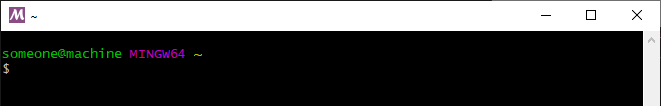

# Getting started with Silice on Windows

## Install and compile

Silice runs smoothly under Windows using [MSYS2 / MinGW64](https://www.msys2.org/). MSYS2 is great to
use Linux-style tools under Windows, and installs a self-contained environment easy to later uninstall.

Please download and install MSYS2 (msys2-x86_64) from https://www.msys2.org/
Be sure to follow the instructions on the download page to update your MSYS2 install to latest.

From there, open a MinGW64 prompt, launching `c:\msys64\mingw64.exe` (assuming MSYS2 is 
installed in its default location). Be sure to use MinGW**64**, *not* 32, *nor* a MSYS prompt.

The prompt should look like this (note the MinGW64 label in purple):

  

Then, from the prompt, enter the Silice directory and type: `./get_started_mingw64.sh`.

**Note:** this automatically downloads a pre-compiled FPGA + RiscV toolchain from https://github.com/sylefeb/fpga-binutils/ (~290MB) as well as installs required MinGW64 packages. For details please refer to the [script source code](get_started_mingw64.sh).

## Path

The shell path has to include `Silice/bin` for proper operation. Under a bash shell, this can be set with `export PATH=$PATH:<path-to-silice>/Silice/bin` where `<path-to-silice>` is to be replaced with the path on your system. 

## Testing

Time to [run a few tests](GetStarted.md#testing) and [start having fun!](projects/README.md)
