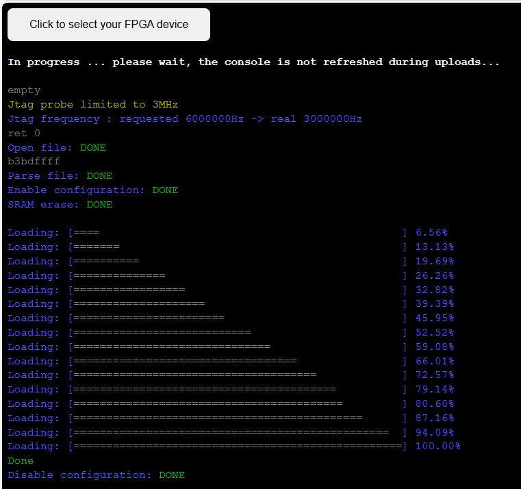

# Getting started with Silice using YoWASP (all platforms)

Silice is now available as a [YoWASP python package](https://pypi.org/project/yowasp-silice/).
This is a great way to use Silice under any platform that supports python.
Yes, this means no more pain with compiling tools from source or dealing with
incompatible binaries.

> **Note:** There are some limitations:
> - [easy-riscv](./projects/easy-riscv/README.md) is not supported
> - projects requiring RISC-V compilation will have to install gcc RISC-V natively
> - simulation requires native verilator and gcc installation

[YoWASP](https://yowasp.org/) runs WebAssembly compiled tools from python, and
has packages for many EDA tools, be sure to check it out!

To install Silice with YoWASP, simply run [get_started_yowasp.sh](get_started_yowasp.sh), assuming you already have a working installation
of `python` and `pip`. This will install all required YoWASP packages.

> **Note:** if you run into the `externally-managed-environment` python error,
> create and activate a local python environment with `venv`,
> see https://docs.python.org/3/library/venv.html.

Then, head to a project, such as `projects/blinky` and run:

```make yowasp-<BOARD>```

where BOARD is the name of a [supported board](frameworks/board). For instance:

```make yowasp-icebreaker```.

This will automatically launch a *local* webserver, serving [openFPGALoader-online](https://github.com/sylefeb/openFPGALoader-online). Open http://localhost:8000/ from a WebUSB enabled browser (Chrome/Edge) to program your board directly!


