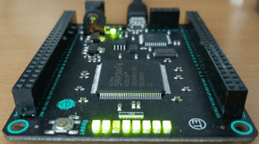

# Silice
*A language for hardcoding Algorithms into FPGA hardware*

**Important: Silice is in alpha stages and under active development [read more](#project-status-alpha-release)**

Silice makes it possible to write algorithms for FPGAs in the same way we write them for processors: defining sequences of operations, subroutines that can be called, and using control flow statements such as *while* and *break*. At the same time, Silice lets you fully exploit the parallelism and niceties of FPGA architectures, describing operations and algorithms that run in parallel and are always active, as well as pipelines. Silice *remains close to the hardware*: nothing gets obfuscated away. When writing an algorithm you are in control of what happens at which clock cycle, with predictable rules for flow control. Clock domains are exposed. In fact, Silice compiles to and inter-operates with Verilog: you can directly instantiate and bind with existing modules.

To setup Silice, see the [getting started](GetStarted.md) guide. To start writing code, see [writing your first design](FirstDesign.md). To see what can be done with Silice, checkout our [example projects](projects/README.md) (all are available in this repo).

The Silice [documentation is here](docs/silice.pdf).

You do not need an FPGA to start with Silice: designs and their outputs (e.g. VGA signal) can be simulated and visualized. Silice works great with the open source FGPA toolchain (yosys/nextpnr/icestorm), see our [Ice40 examples](projects/README.md).

While I developed Silice for my own needs, I hope you'll find it useful for your projects!

#### A first example:

##### Code:
```c
1  algorithm main(output uint8 led) {   
2    uint28 counter = 0;      // a 28 bits unsigned integer
3    led := counter[20,8];    // LEDs updated every clock with the 8 most significant bits  
4    while (1) {              // forever
5      counter = counter + 1; // increment counter
6    }  
7  }
```

##### Compile:
```
silice first_example.ice -f frameworks/mojo_led.v -o Mojo-Project/src/mojo_top.v
```

##### Enjoy!



##### Explanations:

Line 1 is the entry point of any Silice hardware: the main algorithm. Line 2 we define
a 28 bits unsigned int, initialized to 0. Initializers are mandatory and are always constants.
Line 3 we request that the output led tracks the eight most significant bits of the counter variable.
The syntax [20,8] means 8 bits wide starting from bit 20. The assignement to led
uses the := operator which is an *always* assignement: led is now automatically 
updated with counter after each rising clock. Such assignements have to appear
at the top of an algorithm, right before any other instruction.

Finally, lines 4-6 define the infinite loop that increments the counter. Of course the
28 bit counter will ultimately overflow and go back to 0, hence the cyclic LED light pattern.
In this case, the loop takes exactly one cycle to execute: we have one increment per cycle 
at 50 MHz (the clock frequency of the Mojo v3).

We then compile with silice. The -f parameter indicates which framework to use: this is an
FPGA plateform dependent wrapper code. Here we are using the Mojo framework with LEDs only.
Several other frameworks are provided, and it is easy to write your own. 

The -o parameter indicates where to write the Verilog output. In this example we overwrite 
the main file of a pre-existing project, which is then compiled using Xilinx ISE toolchain.
Fear not, we also have examples working with yosys, nextpnr and [project icestorm](http://www.clifford.at/icestorm/)!

#### Cycles and control flow:

Here is another small example outlining a core principle of Silice:

##### Code:
```c
1 algorithm main() {   
2    brom int12 sintbl[4096] = {...}
3    ...
4    while (1) { // render loop
5      // get cos/sin view
6      sintbl.addr = (viewangle) & 4095;
7  ++:
8      sinview     = sintbl.rdata;
9      sintbl.addr = (viewangle + 1024) & 4095;
10 ++:
11     cosview     = sintbl.rdata;
12     ...
13 }
```
##### Explanations:

This code is storing a sine table in a block ROM and accesses it to obtain a cosine and sine for the current view angle.
Note the use of the **++:** *step* operator in lines 7 and 10. This explicitely splits the exectution flow and introduces a one
cycle delay, here waiting for the brom to output its result in field *rdata* for the select address in *addr*.
Anything is between is considered combinational; for instance lines 8 and 9 are executed in parallel, as they
each produce two pieces of independent circuitry.

## Design principles

Silice does not attempt to abstract away the hardware: the programmer remains in control and very close to hardware features. However, Silice makes it much easier to reason in terms of execution flow and operation sequences than when using Verilog directly. But when Verilog makes more sense, simply import Verilog directly into Silice!

Silice is reminiscent of high performance programming in the late 90s (in the demo scene in particular): the then considered high-level C language was commonly interfaced with time-critical ASM routines. This enabled a best-of-both-worlds situation, with C being used for the overall program flow and ASM used only on carefully optimized hardware dependent routines.

Silice does the same, providing a programmer friendly layer on top of Verilog with a familiar syntax, while allowing to use low level Verilog modules whenever needed. Silice also favors parallelism and performance everywhere, allowing to fully benefit from the natural parallelism of FPGA architectures.

The main features are:
- Prioritize combinational over sequential execution. Parallelism comes first!
- Clearly defined rules regarding clock cycle consumption.
- Explicit clock domains and reset signals.
- Inter-operates easily with Verilog, allowing to import and reuse existing modules.
- Familiar C-like syntax.
- Powerful LUA-based pre-processor.

## Getting started with Silice

See the [getting started](GetStarted.md) guide. Silice runs great both on Windows and Linux!
To start writing code, see [writing your first design](FirstDesign.md).
To see what can be done with Silice, checkout our [example projects](projects/README.md) (all are available in this repo).

## Project status: Alpha release

Silice can already be used to create non trivial designs, from a tiny Risc-V processor to an entire game render loop (visit the [examples](projects/README.md) page).

However Silice is under active development. I decided to open the repo so everyone can join in the fun, but it is far from complete: documentation is lacking, some examples are outdated or far from polished, some very important language features are missing, and many known issues exist (head out to the [Issues](https://github.com/sylefeb/Silice/issues) page). I am confident I can avoid major code breaking syntax changes, but some adjustments may be necessary.

I hope you'll nevertheless enjoy diving into it, and will find it useful. Please let me know your thoughts: comments and contributions are welcome!
