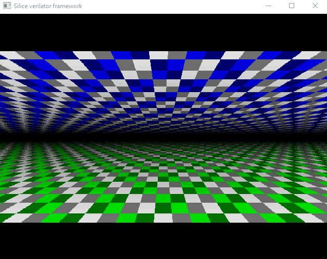

# Silice Verilator graphical simulation framework

This simulation framework is used everytime a Silice design is compiled with `make verilator`. There are three variants:

1. [verilator_bare](verilator_bare.cpp) for basic simulation without a graphical output.
1. [verilator_vga](verilator_vga.cpp) for simulation with VGA output.
1. [verilator_vga_sdram](verilator_vga_sdram.cpp) for simulation with VGA output and an SDRAM memory chip.

In particular 3. works great to simulate boards such as the `ULX3S` or `de10-nano` with an SDRAM MiSTer module.

Both 2. and 3. open a window showing the simulation output. This is achieved with `glut` and `OpenGL`, so freeglut has to be installed on the system (packages are often called `freeglut3` and `freeglut3-dev`, on MinGW it is simply `freeglut`).

For more details on how the graphical output is performed see comments in [VgaChip.cpp](VgaChip.cpp) and [display.cpp](display.cpp).

To see how this gets compiled from Silice to Verilog and then Verilator see the bash script [verilator.sh](../boards/verilator/verilator.sh).

Here is an example of [`projects/vga_demo/vga_flyover3d.si`](../../projects/vga_demo/README.md) (simulation runs much slower than hardware, where this demo is otherwise perfectly smooth).

  

This works with most projects, including [WolFPGA](../../projects/wolfpga/README.md) and the [Doom-chip](../../projects/doomchip/README.md).

## Reusing the framework

You are welcome to do so ([MIT license](../../LICENSE_MIT)). The framework is not specifically tied to Silice. A good starting point is the bash script [verilator.sh](../boards/verilator/verilator.sh) where all command lines are called. Silice produces a Verilog output (`build.v`) which is then fed into Verilator. All generated source files are then compiled and linked against the framework, and the resulting executable is launched.

## Links

To learn more about graphical simulation of Verilator outputs, I recommend the following projects.
- [A tutorial on the topic by @WillFlux](https://projectf.io/posts/verilog-sim-verilator-sdl/) (Verilator, SDL).
- [VGA Clock project by Matthew Venn](https://github.com/mattvenn/vga-clock) (Verilator, SDL).
- [Frederic Requin's 1943 FPGA recreation](https://github.com/fredrequin/fpga_1943) features a simulation framework, both VGA and SDRAM (was a great inspiration for this framework) ; it outputs images and raw data.

## Credits

- The SDRAM c++ simulation code ([sdr_sdram.cpp](sdr_sdram.cpp)/[sdr_sdram.h](sdr_sdram.h)) is from https://github.com/fredrequin/fpga_1943
