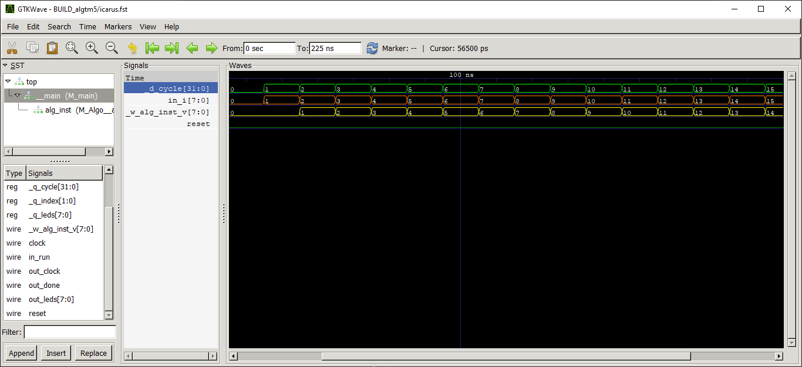
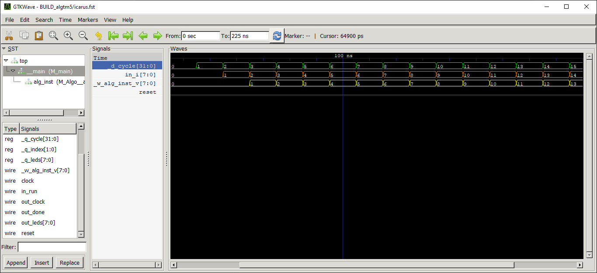
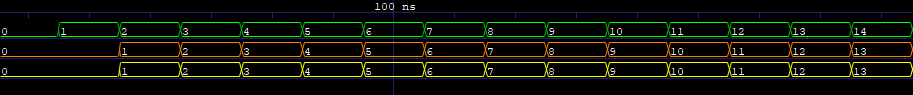
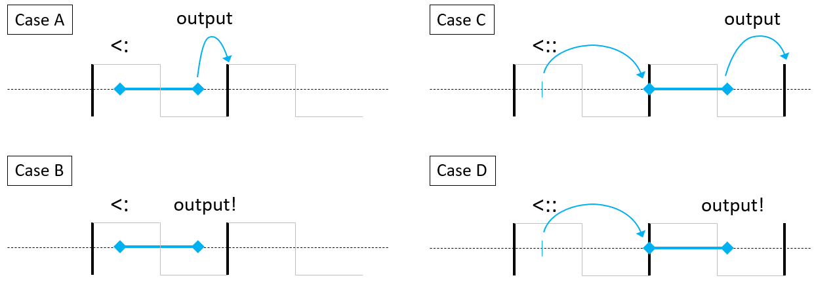

# Algorithm calls, bindings and timings

Here we explain how algorithms can be instantiated and called, and in particular how inputs are outputs are *registered*, and what it means.
This is an important topic with direct implications on synchronization between parallel operations, and the max frequency of your design.

Even if you are familiar with Silice call and binding syntax, make sure to read the [last section](#timings) on timing considerations.

## Calls

For these explanations let us assume an algorithm with *N* outputs and M *inputs* called respectively `out1 ... outN` and ` in1 ... inM`.

A first way to use an algorithm is through the call syntax. The algorithm is first instantiated as:

`Algo inst;`

And then called as:

 `(out1,...,outN) <- inst <- (in1,...,inM)`

This call is *synchronous*: we wait for the algorithm to terminate before getting its outputs. In fact, it can be decomposed in two parts that can be called separately as well:
- the async call `inst <- (in1,...,inM)` which starts the algorithm,
- the join `(out1,...,outN) <- inst` which waits for termination and reads the output.

Between call and join the caller continues its operations. Also note that the async call does not introduce any cycle for the caller. The join, however, waits for as many cycles as necessary. Hence, a join in an instruction block makes it a non *one-cycle* block -- one implication, for instance, is that join cannot be used in an always block which *has to* be a one-cycle block.

Instead, test whether the algorithm is done using `isdone(inst)`. This is a simple test and can therefore be used anywhere.

The join both waits for the algorithm to be done and read its outputs. However, it is also possible to read the outputs
of an algorithm at any time using the dot syntax, e.g. `inst.out1`. In such cases, it is of course your responsibility to know whether the outputs are valid when read.
Similarly, the inputs can be written using the `inst.in1 = ...` syntax.

For these reasons, an algorithm instance can also be called *without* any parameter on either side, e.g.: `() <- inst <- ()` or `() <- inst <- (in1,...,inM)` or  `(out1,...,outN) <- inst <- ()`. The same is true of separate async / join calls.

When called with `inst <- (...)` it takes one cycle for the algorithm to start. Upon termination, it takes one cycle for the caller to be notified. Thus, calling an algorithm that executes in exactly `C` cycles will take `C+2` cycles when called as `(...) <- inst <- (...)`.

Note that input/output [interfaces](Documentation.md#interfaces) have to be bound: they cannot be passed in a call (see next).

## Bindings

Unit input and outputs can be bound upon instantiation (the same is true of imported Verilog modules):

```c
  rv32i_cpu cpu<!cpu_reset>(
    boot_at          <:: cpu_start_addr,    // bound, registered
    user_data        <:  user_data,         // bound, immediate
    ram              <:> mem,               // interface binding
    predicted_addr    :> predicted_addr,    // output binding
    predicted_correct :> predicted_correct, // output binding
  );
```

All or only parts of the inputs and outputs may be bound.  However, once at least one *input* binding exists, the only way to call the algorithm within the unit is with empty parameter lists: `inst <- ()`. The 'dot' syntax is no longer available for bound inputs. There is no impact on outputs.

The difference between *registered* (`<::`) and *immediate* (`<:`) binding is explained next.

## Timings
<a href="#timings"></a>

Here we discuss the differences between using the `<:` and `<::` binding operators as well as using `output` and `output!` in a unit declaration. Both relate to when the parent and instantiated units see the changes in inputs and outputs, either immediately (`<:`, `output!`) or with a one cycle delay (*registered*, `<::`, `output`). This has important implications for keeping things in sync (latencies), and in terms of the generated circuit depth (critical path and maximum possible frequency).

To illustrate this, let us use a simple example case. In the design below, the unit `Copy` always copies its input to its output. Since the unit uses an `always` block it does not have to be called or started. In `main`, we create a cycle counter and bind it as an input to an instance of `Copy`.

```c
unit Copy(
  input  uint8 i,
  output uint8 v) // can be output or output!
{
  always {
    v = i;
  }
}

algorithm main(output uint8 leds)
{
  uint32 cycle = 0;
  uint8  value = 0;

  Copy inst(
    i <: cycle,  // can use <: or <::
    v :> value,
  );

  while (cycle != 16) {
    cycle = cycle + 1;
  }
}
```

From a binding point of view, there are four possible variants of this design. The output `v` of `Algo` can use either `output` (register) or `output!` (immediate). The input in `main` be bound using either `<::` (registered) or `<:` (immediate).

- When using immediate (`<:`, `output!`), changes in value are visible within the same cycle.
- When using registered (`<::`, `output`), changes in value are visible only at the next cycle.

These variants offer different tradeoffs in latencies and resulting circuit depth.

In the figures below we can see the signals over time, simulated by *Icarus Verilog* and visualized with *GtkWave*. In green `cycle` in `main`, in orange `i` as seen in `inst`, in yellow `value` as seen in `main`.

- A) **Using `<:` and `output`.** The input change in `main` is immediately visible in `inst`: the green and orange waves are the same. However the yellow wave is delayed by one cycle: this is the effect of `output`, which introduces a one cycle latency before the change to `v` is reflected in `main`.
<p align="center">
  
</p>

- B) **Using `<:` and `output!`.** All three waves are the same. Compared to the previous case, using `output!` implies that changes to `v` are immediately reflected in `main`.
<p align="center">
  
</p>

- C) **Using `<::` and `output`.** The use of `<::` introduces a one cycle latency before the change of `cycle` in `main` is reflected in `i` as seen from `inst`. The use of `output` introduces another one cycle latency before the change to `v` is reflected in `main`. This results in a two cycles delay between the green and yellow waves.
<p align="center">
  
</p>

- D) **Using `<::` and `output!`.** Compared to the previous case, we keep one cycle latency on the input, but the use of `output!` means that changes to `v` are reflected immediately in `main`. Hence, there is a one cycle shift between the green and orange waves, while the orange and yellow waves are the same.
<p align="center">
  
</p>

At this stage you might be wondering why we don't always use `case B`, since it produces no delays between the waves. Well of course there is a catch -- in fact two of them! `Case B` means, in essence, that the unit becomes a piece of circuitry connected between `cycle` and `value` in `main`, *without any flip-flop in the path*. Why does this matter? Circuits are physical devices and signals take time to propagate and stabilize through gates. This is why the frequency of a design is limited. Flip-flops mitigate this by enabling to store the values across cycles, resuming propagation on the next cycle. So long circuits without any flip-flop in the path lead to a lower design frequency. This longest path is referred to as the *critical path* in the design (and it is the worst case that matters). The critical path is reported after place and route, for instance by *NextPNR*. By using `case B`, we are likely to produce longer circuits.

So that's the first catch, what is the second one? Well, combinational loops! As we directly connect `cycle` and `value` in `main`, we now have to be very careful that `cycle` never depends in any way to a change in `value`, otherwise we create a loop in the circuit. This quickly becomes impractical -- nevertheless `case B` is definitely possible and useful in specific cases (but in terms of Silice you might consider using a `circuitry` instead).

Now, what use are the other cases? `Case A` is the standard setup in Silice, with inputs directly connected and outputs registered on a flip-flop. `Case D` is the opposite with inputs registered on a flip-flop and outputs directly connected. `Case C` is the most conservative, with both inputs and outputs registered on flip-flops.

Let's have a second look at time diagrams for each four cases to understand the implications. This time we fix the frequency, and consider how much time the unit has to perform its operations, and how much time remains before the clock cycle ends.

In the figure below the blue segment represents the unit's circuit and the time it takes. The left endpoint is when inputs change, the right endpoint when outputs are available at the other end of the circuit. The arrows represent latencies added by `<::` and `output` (through flip-flops). Note that if the blue segment would ever cross a clock raising edge, the results would be incorrect as the signal would not have propagated through the circuit: a lower frequency would have to be used.

<p align="center">
  
</p>

- `Case A`) The inputs are available within the same cycle, the outputs are registered on a flip-flop. Thus, the unit has up to the cycle end to perform its operations (for signals to propagate through the circuit it defines). This is the standard choice, but if the circuit setting up the inputs in the parent is too complex, the unit will be left with little time for itself.
- `Case B`) There are no flip-flops: the inputs are available within the same cycle, the unit has to finish within the same cycle, and thus whatever comes next also has to finish before the end of the cycle. This potentially puts a lot of time pressure on the circuit being defined.
- `Case C`) The inputs are delayed until the next cycle starts, and the outputs are not expected before the cycle after that. Thus, the unit has the entire cycle to operate. This puts the least time pressure on the circuit being defined. To be preferred if the unit is complex (deep circuit).
- `Case D`) The inputs are delayed until the next cycle starts, but the outputs are immediately available, and thus whatever comes next also has to finish before the end of the cycle.

How to choose? Well there is not strict rule here, all these cases can be useful. A recommendation is to avoid `Case B`, use the standard `Case A` convention, and when time pressure starts to appear resort on `Case C` to give as much time as possible to the slower parts. `Case D` offers a good alternative to `Case A` if what is *before* the unit inputs is longer (in terms of circuit depth) than what is *after*. Switching between `Case A` and `Case D` is typically transparent to the parent unit.

### Registering inputs

There are (many) cases where the inputs are actual wires from the outside, and
are thus asynchronous signals. In such cases, the inputs have to be registered
before being used (otherwise they can change mid-cycle, often wreaking havoc in the
logic...).

```c
unit Foo(input uint8 i, output uint8 v)
{
  uint8 ri(0);

  ri ::= i; // note the use of :: before the equal sign, this makes ri track i with a one cycle latencly

  always { v = ri; }
}
```

or equivalently:

```c
unit Foo(input  uint8 i, output uint8 v)
{
  uint8 ri = 0;

  always_before { v  = ri; } // always done first
  always_after  { ri = i;  } // always done last
}
```

### What about the 'dot' syntax and calls?

The behavior depends on whether the unit is *non-callable*. A non-callable unit
does not contain an algorithm (and hence trying a call on it is an error),
or the algorithm it contains uses `<autorun>` (and calling it is also an error).

On a non-callable unit, the 'dot' syntax always writes inputs directly
(no delay) and reads outputs as defined by the use of `output` or `output!` in
the instanced unit. The input behavior can be changed to delayed
(registered) inputs by using the `<reginputs>` modifier on the instance. In this
case all inputs specified with the dot syntax are registered.

On a unit containing a callable algorithm, the 'dot' syntax write on inputs with a
one cycle latency (as with `<::`). The `() <- alg <- ()` call behaves similarly
to `case C` above, with one cycle before the algorithm starts, and one cycle
between the time it stops and outputs are read. Both inputs and outputs
are registered.

> **Note**: Registering inputs imply that flip-flops are created for the
inputs in the parent algorithm. However, a non-registered input may still lead
to a flip-flop depending on its usage, so that it can preserve its value
across different cycles. This is determined by Silice upon compilation.

### Inputs controlled from parent, outputs from instance?

There is an asymmetry in the fact that the behavior of outputs are controlled in
the algorithm definition (`output` or `output!`), while the behavior of the
inputs is controlled at instantiation time (`<:`, `<::` or `reginputs`).
This reflects the fact that input flip-flops are indeed in the parent, while
output flip-flops are indeed in the instance.
