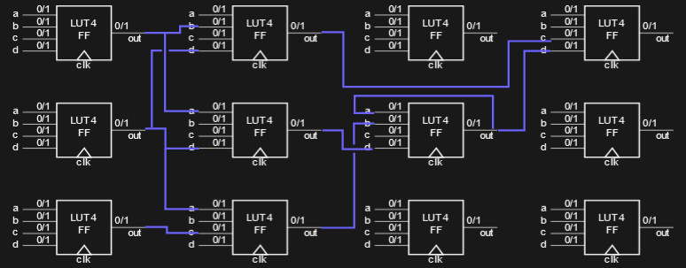
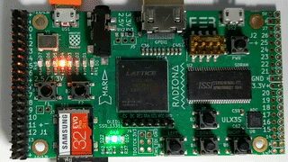

# Learn FPGA programming with Silice

> This tutorial covers the basics with many code snippets. It is a hands on approach to learning Silice.

Quick pointers:
- Silice [reference documentation](Documentation.md).
- Learn by [looking at example designs](../projects/README.md).
- Have a question about the language syntax? [Ask it here](https://github.com/sylefeb/Silice/issues/108).
- [Advanced topics](Advanced.md) page.

## Which FPGA to choose?

> You don't really need an FPGA to start learning Silice, because everything can be simulated. However, it is more fun to run things on actual hardware!

There are many great options, and I mention below those which are best supported by Silice's framework. However this is a continuously expanding list! Whichever board you choose, *I strongly recommend a board with an FPGA well supported by the open source tool chain*. These are typically Lattice FPGAs: ice40 HX1K to HX8K, UP5K and the ECP5 family. Other FPGAs start being supported too (Gowin, Xilinx Artix-7) but setup may be a bit more difficult. However things are evolving quickly, the community is working hard!

As a beginner, the [IceStick](https://www.latticesemi.com/icestick) and [IceBreaker](https://1bitsquared.com/products/icebreaker) are great first options, with a preference to the *IceBreaker* for more flexibility.

The *IceStick* is inexpensive and features a fast but small (1280 LUTs) FPGA. It can still host many cool projects (checkout Silice [tiny Ice-V RISC-V processors](../projects/ice-v) and accompanying demos).

> What's a LUT anyway? Well that is a great question, answered in the [next section](#fpga-hardware-design-101) :)

The *IceBreaker*'s FPGA is ~5 times larger (5280 LUTs), the board features buttons and more connectivity, supports dual PMODs (modules that plug into the board connectors), for instance for VGA output. More generally, all boards featuring the similar UP5K ice40 FPGA and PMODs are great choices.

The [ULX3S](https://radiona.org/ulx3s/) is great for both simple and advanced projects. It features a more powerful ECP5 FPGA, and plenty of peripherals and connectivity. Other ECP5 boards are the [ECPIX-5](https://shop.lambdaconcept.com/home/46-ecpix-5.html) (tons of PMODs!) and the [OrangeCrab](https://github.com/orangecrab-fpga/orangecrab-hardware) (feather format).

## FPGA hardware design 101

The most important thing to remember, as you enter these tutorials, is that the code we write describes a *hardware design*. This is <ins>not</ins> code that will be *executed*. This is code that gets turned into an actual circuitry, composed of FPGA blocks configured and connected together to produce the circuit we described. This is illustrated below, where each block is a configurable FPGA lookup table (LUT) and blue connections are configurable routes between these blocks. In this example all blocks are *synchronous*: they only update their outputs from the inputs when the clock raises. Such blocks are implementing so-called *flip-flops*.

<p align="center">
  
</p>

> If you want to more explanations about this, please refer my talk about the Doomchip-onice ([slide](https://www.antexel.com/doomchip_onice_rc3/#/13),[video](https://youtu.be/2ZAIIDXoBis?t=483)). Also checkout my [FPGA gate simulator page](https://github.com/sylefeb/silixel).

From the illustration we can guess a few things:
- The circuit uses FPGA blocks (or LUTs for Lookup Up Tables), so there is a notion of how big it will become. Complex designs may not fit on smaller FPGAs. This *resource usage* is fun and often important to optimize, an activity often called *LUT golfing*.
- The routes can have different lengths. Because this is a circuit, and a configurable one at that, the signal takes actual time to propagate along the routes. This leads to delays. For instance, say that our longest route needs $50$ *nanoseconds* to propagate the signal. Our circuit will not be able to run faster than $\frac{1000}{50} = 20$ MHz. This longest route is called the *critical path*. [Nextpnr](https://github.com/YosysHQ/nextpnr) (the tool that maps the circuit to the FPGA) will tell us this max frequency, or *fmax* as well as the critical path.

> This is not only about the routes, the LUTs can be configured as *asynchronous* in which case they constantly update their outputs when the inputs change. In such case, the delay is the sum of route delays and LUT traversal delays. This is very typical: a design contains many synchronous (flip-flop) and asynchronous (*combinational*) gates.

Finally, something to remember, especially if you have a background in programming on CPU: *There is no concept of "not doing something"*. *Everything* you describe becomes a circuit and takes space on the FPGA. On CPU we tend to write things like:
```c
  if (condition) {
    do_something(); // could be always done, skip for faster exec
  }
```
The intent here is to skip the execution of `do_something()` when `condition` is false. However, if `do_something` can be always done anyway, on an FPGA doing the test will be *less efficient*: it will add LUTs and route delays *in addition* to the `do_something` circuit.

It takes time and practice to get used to that, but it is also a fun mindset, and a refreshing experience.

## Tutorial

This tutorial is meant to be done linearly, starting from entry T1 below. It gradually introduces concepts of Silice (many are general to hardware design) through toy examples. Each entry covers one specific concept, so they remain short and compact to read.

To run these examples, enter the [`tutorial`](./tutorial) directory, and run (here for T1):
```
make verilator file=t1.si
```
If you have an FPGA you could replace `verilator` by the name of your board. Plug the board first and it will be programmed automatically in most cases.

> Most of the initial entries of the tutorial use simulation so that we can print
> in the console using `__display`: a simulation only printf. (On a FPGA, if you want a printf you have to build hardware for it! for instance sending to UART or a screen ).

> In the first entries, simulated designs run forever, hit CTRL-C to stop them.

___
### T1: a simple blinker

Let's do a first design! This is the hello world of FPGA. Most boards have LEDs connected to the FPGA, if only for debugging. So the hello world consists in making these LEDs blink. Here's one possible Silice version:

<!-- MARKDOWN-AUTO-DOCS:START (CODE:src=./tutorial/t1.si&syntax=c) -->
<!-- The below code snippet is automatically added from ./tutorial/t1.si -->
```c
unit main(output uint8 leds)
//               ^^^^^ assumes 8 LEDs on board, will work in any case
{
  uint24 counter(0);
  //  ^^ 24 bits ^
  //             | initialized at configuration time
  always {
    leds    = counter[0,8];
    //                ^^^ from bit 0, take 8 bits
    // (simulation only) display leds as a vector of bits
    __display("leds:%b",leds);
    // increment the counter
    counter = counter + 1;
  }
}
```
<!-- MARKDOWN-AUTO-DOCS:END -->

To run it in simulation, enter the [`tutorial`](./tutorial) directory and run `make verilator file=t1.si`. Hit CTRL-C to stop the output.

You'll see this (looping forever):
```
leds:00000000
leds:00000001
leds:00000010
leds:00000011
leds:00000100
leds:00000101
leds:00000110
...
```

On real hardware the LEDs will blink with the corresponding pattern. That will be too fast to see (it will appear as if all LEDs are on, with slightly different brightness), we'll fix that in a later entry.

Let's walk through this example:
- `unit main( )`: This defines the main circuit of the design. All Silice designs are meant to have a main circuit, which is instantiated automatically.
- `output uint8 leds`: This means our circuit outputs an 8 bits signal called `leds`. This directly corresponds to eight pins going outside of the FPGA and driving actual LEDs on the board.

> How does Silice know there are LEDs on the board? The pin configuration is defined in the [board frameworks](../frameworks/boards/README.md), and we tell which pins we use [in the Makefile](tutorial/Makefile). Here the set of pins is called `basic` (hence `-p basic` in the Makefile). Many boards also have `buttons`, `uart`, etc.

- `uint24 counter(0)`: This creates a `counter` variable which is unsigned and is 24 bits wide. Because we are describing hardware we could make it any width, e.g. `uint3`, `uint13`. Variables can also be signed (e.g. `int3`). Indicating `(0)` means that the counter is initialized to `0` upon FPGA configuration.

- `always { ... }`: The always block describes operations performed at every cycle. This implies that whatever is inside has to be applicable in a single cycle: the always block is a *one-cycle* block.

- `leds = counter[0,8]`: We assign to `leds` the 8 less significant bits of `counter`. `0` means from bit `0` and `8` is the width we take. We could have used `counter[16,8]` to take the eight most significant bits.

- `__display(...)` prints the `leds` variable in binary format (`%b`). *This is only active in simulation* and is ignored otherwise. Using `__display` is very helpful to check some variables during simulation.

> Another, more powerful way to simulate is to output a full trace (wave) of the simulated design which records the status of all variables, every clock cycle, for the entire simulation. But that's a topic for later!

- `counter = counter + 1;` We increment the counter every clock cycle.

And this is it, we already have seen quite a few concepts!

> **Exercise**: change `counter[0,8]` to slow down the LEDs pattern (hint: use higher bits of the counter).

___
### T2: a second unit

Of course your design may contain other units beyond main, and main can *instantiate* other units. Indeed, a unit describes a circuit blueprint, but it has to be explicitly instantiated before being used (only main is automatically instantiated).

Here is an example where a second unit generates a bit pattern that is then applied to the LEDs:

<!-- MARKDOWN-AUTO-DOCS:START (CODE:src=./tutorial/t2.si&syntax=c) -->
<!-- The below code snippet is automatically added from ./tutorial/t2.si -->
```c
// create a unit producing a 'rotating' bit pattern
unit rotate(output uint8 o)
{
  uint8 bits(8b1);
  always {
    o    = bits;
    bits = {bits[0,1],bits[1,7]};
  }
}
// main unit
unit main(output uint8 leds)
{
  rotate r; // instantiate the unit
  always {
    leds = r.o;  // assign the output to leds
    __display("leds:%b",leds); // print leds
  }
}
```
<!-- MARKDOWN-AUTO-DOCS:END -->

Let's walk through this example:
- `unit rotate(output uint8 o)` declares a unit which outputs an 8 bit wide value, named `o`.
- `uint8 bits(8b1)` is an 8 bit internal variable initialized at configuration time with `8b1` which is a fancy way to say `1`, showing explicitly sized constants and binary basis (`b` for binary, `h` for hex and `d` for decimal). While unimportant in this case, sizing constants is good practice (and critical in some cases).
- `always{ ... }` means we are doing these operations at every cycle, always and forever.
- `o = bits;` assigns the output.
- `bits = {bits[0,1],bits[1,7]}` creates the rotating pattern. Here's how: `bits[0,1]` is the lowest bit, `bits[1,7]` are the seven other bits, and `{..,..,..}` concatenates into a different bit vectors. So in effect this moves bit `0` to bit `7` and shifts all other bits right. Handy! (All bit operators are directly inherited from Verilog).

Now let's move to main:
- `rotate r` *instantiates* the unit `rotate`, naming the instance `r`.
- `leds = r.o` assigns the output `o` of `r` to `leds`. This is using the *dot syntax* where we refer to outputs and inputs of an instance using `<instance name>` `.` `<io name>`
- `__display` is printing leds in simulation.

What is the result of this exactly? Let's run in simulation: enter the [`tutorial`](./tutorial) directory and run `make verilator file=t2.si`. Hit CTRL-C to stop the output.

We get this:
```
leds:00010000
leds:00001000
leds:00000100
leds:00000010
leds:00000001
leds:10000000
leds:01000000
leds:00100000
```

Indeed, that's a rotating bit pattern! In hardware LEDs would light up in sequence, however this would likely be too fast to notice, we'd have to slow this down.

Alright, we again saw some very important concepts: unit instantiation, dot syntax for outputs and some bit manipulation. Now we need to explain something excruciatingly important: registered outputs and latencies.

___
### T3: cycles and outputs

Designing hardware often means carefully orchestrating what happens at every cycle. Therefore, it is important to understand how information flows through your design, and in particular in between parent and instantiated units.

So let's modify our example from T2 to report the value of `o` at each cycle, within both the parent unit (`main`) and the instantiated unit (`rotate`).

<!-- MARKDOWN-AUTO-DOCS:START (CODE:src=./tutorial/t3.si&syntax=c) -->
<!-- The below code snippet is automatically added from ./tutorial/t3.si -->
```c
unit rotate(output uint8 o)
{
  uint32 cycle(0); // count cycles
  uint8 bits(8b1);
  always {
    o    = bits;
    __display("[%d] o :%b",cycle,o); // print cycle and o
    bits = {bits[0,1],bits[1,7]};
    cycle = cycle + 1; // increment cycle counter
  }
}
// main unit
unit main(output uint8 leds)
{
  uint32 cycle(0); // count cycles
  rotate r;
  always {
    __display("[%d] r.o:%b",cycle,r.o); // print cycle and r.o
    leds  = r.o;
    cycle = cycle + 1; // increment cycle counter
  }
}
```
<!-- MARKDOWN-AUTO-DOCS:END -->

Change log from T2:
- We add a 32-bits `cycle` variable in both units, incremented at the end
of the always blocks `cycle = cycle + 1`. Both will be perfectly in synch
since the entire design starts precisely on the same initial clock cycle.
- We print the value of `cycle` alongside the value of `o` in unit `rotate`
and alongside the value of `r.o` in `main`.

Here is the output for three cycles:
```
[     53057] o   :10000000
[     53057] r.o :00000001
[     53058] o   :01000000
[     53058] r.o :10000000
[     53059] o   :00100000
[     53059] r.o :01000000
```
A careful look reveals that the value of `o` in `rotate` is in advance by one cycle compared to the value of `r.o`. That's because by default unit outputs are *registered*. This means that whatever change occurs in the instantiated unit, the parent will only see the change *at the next cycle*.

Why would we do that? Remember [the introduction](#fpga-hardware-design-101) and how we talked about delays in propagating changes through the routes and asynchronous gates? If nothing was ever registered, by instantiating units we would end up creating very long critical paths, resulting in slow designs. So typically we want to register outputs, or inputs, or even both. And sometimes none of them. All of that is possible in Silice. For instance, let's switch to an immediate output using the `output!` syntax:
```c
unit rotate(output! uint8 o) ...
//                ^ note the exclamation mark
```

Now the output is:
```
[     53057] o   :10000000
[     53057] r.o :10000000
[     53058] o   :01000000
[     53058] r.o :01000000
[     53059] o   :00100000
[     53059] r.o :00100000
```
See how `r.o` now immediately reflects `o`? That's because there is no register in the path anymore.

Alright, we've seen how to use outputs and how to register them ... or not.

___
### T4: cycles, inputs and outputs

What about inputs? Of course we also have a similar capability. Let's create another toy example, only for simulation:
<!-- MARKDOWN-AUTO-DOCS:START (CODE:src=./tutorial/t4.si&syntax=c) -->
<!-- The below code snippet is automatically added from ./tutorial/t4.si -->
```c
unit eq(input uint8 i,output uint8 o)
{
  always {
    o     = i;
  }
}
// main unit
unit main(output uint8 leds)
{
  uint32 cycle(0);
  eq e; // instantiates eq as e
  always {
    e.i  = cycle; // set e input
    __display("[%d] e.o:%d",cycle,e.o); // print e output
    cycle = cycle + 1;
    if (cycle == 8) { __finish(); } // stop after 8 cycles
  }
}
```
<!-- MARKDOWN-AUTO-DOCS:END -->

As by now we are getting familiar with the syntax, I'll focus on the most important parts:
- The unit `eq` defines an input `input uint8 i`, and assigns it unchanged to its output: `o = i;`.
- The main unit instantiates `eq` naming it `e`, sets the current `cycle` value to `e.i` and prints the value of `e.o` at each cycle.
- As I got tired of hitting CTRL-C (I am very lazy :) ) I added this line `if (cycle == 8) { __finish(); }` to stop simulation after 8 cycles. This only works in simulation.

Here is the simulation output:
```
[         0] e.o:  0
[         1] e.o:  0
[         2] e.o:  1
[         3] e.o:  2
[         4] e.o:  3
[         5] e.o:  4
[         6] e.o:  5
[         7] e.o:  6
```
Ignore cycle 0 for now. We are getting a one cycle latency, and this is because the output are registered by default, but inputs *are not*.

What happens during the first cycle? We are seeing the initial value of the output, before it is set. It defaults to zero, but we could change it using `output uint8 o(111)`. Now we would obtain:

```
[         0] e.o:111
[         1] e.o:  0
```

What if we want to register the inputs? We can use an instance modifier, changing the instantiation for:
```c
eq e<reginputs>;
//   ^^^^^^^^^ all inputs are now registered
```

Here is the new simulation output:
```
[         0] e.o:  0
[         1] e.o:  0
[         2] e.o:  0
[         3] e.o:  1
[         4] e.o:  2
[         5] e.o:  3
[         6] e.o:  4
[         7] e.o:  5
```
Ignoring cycles 0 and 1, we now see a *two* cycles latency. This is due to both inputs and outputs being registered.

What if we use neither registered inputs nor registered outputs? Let's try! We remove `<reginputs>` and use `output!`.
Here is the new simulation output:
```
[         0] e.o:  0
[         1] e.o:  1
[         2] e.o:  2
[         3] e.o:  3
[         4] e.o:  4
[         5] e.o:  5
[         6] e.o:  6
[         7] e.o:  7
```
No latency anymore, `e.o` immediately reflects the assignment of `e.i`.

___
### T5: bindings

So far we used the dot syntax to refer to the inputs and outputs of an instantiated unit . However, sometimes we just want to plug the units together to form
bigger constructs. *Bindings* are perfect for this; here is an example of rewriting
T4 with bindings:

<!-- MARKDOWN-AUTO-DOCS:START (CODE:src=./tutorial/t5.si&syntax=c) -->
<!-- The below code snippet is automatically added from ./tutorial/t5.si -->
```c
unit eq(input uint8 i,output uint8 o)
{
  always {
    o     = i;
  }
}
// main unit
unit main(output uint8 leds)
{
  uint32 cycle(0);
  // instantiates eq as e, binds cycle to input, leds to output
  eq _( // we do not need to name the instance, '_' means anonymous
    i <: cycle, // i tracks cycle
    o :> leds   // leds tracks o
  );
  always {
    __display("[%d] leds:%d",cycle,leds); // print leds
    cycle = cycle + 1;
    if (cycle == 8) { __finish(); } // stop after 8 cycles
  }
}
```
<!-- MARKDOWN-AUTO-DOCS:END -->

Note that we are now instantiating `eq` as follows:
```c
  eq _( // we do not need to name the instance, '_' means anonymous
    i <: cycle, // i tracks cycle
    o :> leds   // leds tracks o
  );
```
What happens here, is that the variable `cycle` is *bound* to the input `i`
while `leds` is bound to the output `o`. Any change to `cycle` is seen by
the instance of `eq`, and the instance drives `leds` (which can no longer be assigned
in `main`). Thanks to this, we do not even need to name the instance, since
we never refer to it anymore. Thus, we use an anonymous instantiation which is
indicated by the underscore in `eq _( ... );`.

Here is the output:
```
[         0] leds:  0
[         1] leds:  1
[         2] leds:  2
[         3] leds:  3
[         4] leds:  4
[         5] leds:  5
[         6] leds:  6
[         7] leds:  7
```

There's something interesting going on here: we are using a registered output
in `eq`, yet the value of `leds` is that of the cycle, seemingly without latency. Why?
This is due to the meaning of the `<:` binding operator on the input. It means
*bind the input of the variable `cycle` as it is <ins>at the end of the cycle</ins>*. Thus,
at a given cycle `c` the input to `eq` is already `cycle = c + 1`. The output is
registered so we get the output `leds = c + 1` at cycle `c + 1`. That is why the values
match.

Now, maybe we want the value that `cycle` had at the start of the cycle (equivalently the value `cycle` had at the end of the previous cycle). We can do that!
We use the `<::` binding operator instead of `<:`

```c
  eq _( // we do not need to name the instance, '_' means anonymous
    i <:: cycle, // i tracks cycle (registered)
    o :>  leds   // leds tracks o
  );
```

Now we get this:
```c
[         0] leds:  0
[         1] leds:  0
[         2] leds:  1
[         3] leds:  2
[         4] leds:  3
[         5] leds:  4
[         6] leds:  5
[         7] leds:  6
```

Back to having a latency between the value of `leds` and `cycle`. Indeed, at
cycle `c` the input to `eq` now sees `cycle = c`, before `cycle` is incremented.
The output being registered we get the output `leds = c` at cycle `c + 1`.

> Using the binding operator `<:` means that the input is <ins>not</ins> registered,
while using `<::` asks for a registered input. You can choose `<:` or `<::` independently for each binding point.

Overall in Silice, the use of the double colon `::` indicates introducing a 1 cycle latency through a register, which is equivalent to getting the value from the
end of the previous cycle.

___
### T6: bindings and chains

An interesting possibility with bindings is to chain several units together.
In this toy example we will define a unit `inc` that simply increments its
input by one. Then, we will chain three instances to increment by three.

Here's the resulting design:
<!-- MARKDOWN-AUTO-DOCS:START (CODE:src=./tutorial/t6.si&syntax=c) -->
<!-- The below code snippet is automatically added from ./tutorial/t6.si -->
```c
unit inc(input uint8 i,output! uint8 o)
{ //    unregistered output ^^
  always {
    o     = i + 1;
  }
}
// main unit
unit main(output uint8 leds)
{
  uint32 cycle(0);
  // instantiate three inc and chain them together
  inc i0(i <:: cycle);
  inc i1(i <:  i0.o);
  inc i2(i <:  i1.o);
  always {
    leds = i2.o;
    __display("[%d] leds:%d",cycle,leds); // print leds
    cycle = cycle + 1;
    if (cycle == 8) { __finish(); } // stop after 8 cycles
  }
}
```
<!-- MARKDOWN-AUTO-DOCS:END -->

Here is the result:
```
[         0] leds:  3
[         1] leds:  4
[         2] leds:  5
[         3] leds:  6
[         4] leds:  7
[         5] leds:  8
[         6] leds:  9
[         7] leds: 10
```
Indeed, we get `cycle + 3` in `leds`!

Note how we use both the dot syntax and bindings to chain the three instances:
```c
  // instantiate three inc and chain them together
  inc i0(i <:: cycle);
  inc i1(i <:  i0.o);
  inc i2(i <:  i1.o);
```
Also note that we register the input to the first instance (`i <:: cycle`) and
then use an unregistered output in `inc` with `output! uint8 o`. This way, the information
propagates immediately through the entire chain, giving us cycle + 3 at the next
cycle when we read `i2.o`.

___
### T7: do *not* cross the streams

There's one thing to be careful with when combining *un*registered inputs and outputs.
Let's consider the following:

<!-- MARKDOWN-AUTO-DOCS:START (CODE:src=./tutorial/t7.si&syntax=c) -->
<!-- The below code snippet is automatically added from ./tutorial/t7.si -->
```c
unit inc(input uint8 i,output! uint8 o)
{ //    unregistered output ^^
  always { o = i + 1; }
}
// main unit
unit main(output uint8 leds)
{
  uint8 a(0); uint8 b(0);
  inc _( i <: a, o :> b );
  always {
    a = b;
  }
}
```
<!-- MARKDOWN-AUTO-DOCS:END -->

If you try to run this example (`make verilator file=t7.si` in `./tutorial`), Silice
will generate an error:

```diff
 ----------<<<<< error >>>>>----------
 => file: ./Silice/learn-silice/tutorial/t7.si
 => line: 14

 a = b
-^^^^^ variable assignement leads to a combinational cycle through instantiated unit (variable: 'a')
```

Why is that? Remember we are describing a circuit. Here, when we set `a = b` we
are closing a loop from `b` to `a` through the instance of `inc`.
Indeed, the input is not registered (`<:`); neither is the output (`output!`).
When we set `a = b` we directly connect `o` to `i` in the instance.

This produces a loop through an asynchronous circuit, also called a *combinational cycle*.
When this happens, the logic applied in `inc` would start to run free, seemingly
as fast as possible but in fact quickly producing *random results*. This is
generally not ok, and Silice issues an error when such configurations are produced.

> This is *generally* not ok, unless you truly want a random result. Combinational loops are one way to form ring oscillators and get randomness in circuits. Yes, there's a way to disable the check in Silice ;)

___
### T8: algorithms 101

Alright, we got all the basics for units, let's now talk about a big feature of
Silice, the algorithms.

Silice lets you write algorithms within your units, allowing to use a more
standard imperative programming flow. Just to get our feet wet, here is an
example in simulation:

<!-- MARKDOWN-AUTO-DOCS:START (CODE:src=./tutorial/t8.si&syntax=c) -->
<!-- The below code snippet is automatically added from ./tutorial/t8.si -->
```c
unit main(output uint8 leds)
{
  algorithm {
    uint8 n = 0; // a variable
    __display("Hello world, from a first cycle");
  ++:
    __display("Hello world, from a second cycle");
  ++:
    while ( n != 8 ) {
      __display(" - hello world from loop iteration %d",n);
      n = n + 1;
    }
  }
}
```
<!-- MARKDOWN-AUTO-DOCS:END -->

Running this with `make verilator file=t8.si` we get:
```
Hello world, from a first cycle
Hello world, from a second cycle
- hello world from loop iteration   0
- hello world from loop iteration   1
- hello world from loop iteration   2
- hello world from loop iteration   3
- hello world from loop iteration   4
- hello world from loop iteration   5
- hello world from loop iteration   6
- hello world from loop iteration   7
- build.v:187: Verilog $finish
```

The unit starts as usual (`unit main(output uint8 leds) { ... }`) but then contains
an algorithm block: `algorithm { ... }`.

Contrary the always blocks, algorithm blocks may contain *multi-cycle constructs*.

Here for instance, we are displaying a first message when the algorithm is launched
(the `main` algorithm automatically starts): `__display("Hello world, from a first cycle");`.

Then, we wait for the next cycle with the `++:` step operator, and print another
message: `__display("Hello world, from a second cycle");`.

We again skip one cycle (`++:`) and enter a loop: `while ( n != 8 ) { ... }`.
Note that `n` was declared at the start of the algorithm as `uint8 n = 0;`.
The `= 0` means that it will be initialized each time the algorithm starts, so it
equals `0` when we reach the loop.

The loop then prints a message and increments `n`. And we get the expected output!
We'll come back to algorithms later, but need a few more ingredients before.

> Algorithms are great for prototyping and for simpler, less critical parts of a design.
> Internally they get turned into finite state machines with multiplexers on the
> manipulated variables. Thus, their cost in size (number of LUTs) and max
> frequency is typically more than a carefully optimized unit using only an always block.
> Nevertheless, algorithms can go a long > way, for an extreme example see
> the [Doomchip project](../projects/doomchip/README.md),which reimplements the
> Doom 1993 render loop using Silice algorithms.

___
### T9: arrays and BRAMs

So far we have not discussed arrays. Arrays in hardware designs are very important
as they constitute memories where things can be stored: a command queue, a set
of registers in a processor, an L1 cache.

In Silice you can declare and use arrays like this:

<!-- MARKDOWN-AUTO-DOCS:START (CODE:src=./tutorial/t9.si&syntax=c) -->
<!-- The below code snippet is automatically added from ./tutorial/t9.si -->
```c
  unit main(output uint8 leds) {
    algorithm {
      uint8 table[8] = {0,1,2,3,4,5,6,7};
      uint8 n = 0;
      while (n != 8) {
        __display("[%d] = %d",n,table[n]);
        n = n + 1;
      }
    }
  }
```
<!-- MARKDOWN-AUTO-DOCS:END -->

Such an array is implemented with logic: internally the circuit produces
one register per table entry, and then generates a selection circuitry
that selects where to read/write from the index. That's ok for very small
array, but this quickly this circuitry becomes large and slow.

To circumvent this, FPGAs include specialized memory, called *BRAM*. A BRAM being
a memory it needs a bit of time to retrieve data. However, FPGA BRAMs are *very*
fast, so you can retrieve from or write to an address in only one cycle.

Here is the same example using a BRAM:

<!-- MARKDOWN-AUTO-DOCS:START (CODE:src=./tutorial/t9_2.si&syntax=c) -->
<!-- The below code snippet is automatically added from ./tutorial/t9_2.si -->
```c
  unit main(output uint8 leds) {
    algorithm {
      bram uint8 table[8] = {0,1,2,3,4,5,6,7};
      uint8 n = 0;
      table.addr = n;
      while (n != 8) {
        __display("[%d] = %d",n,table.rdata);
        n = n + 1;
        table.addr = n;
      }
    }
  }
```
<!-- MARKDOWN-AUTO-DOCS:END -->

Let's detail what is going on in this example.
First, note the `bram` key word in front of the table declaration. This is for
a 'simple' BRAM, as other types exist (most importantly *dual port* BRAMs).

The table is now automatically stored into a BRAM by Silice, and initialized
to the selected content. By the way, if you prefer *not* to initialize the BRAM
you may write `= uninitialized` or, to initialize to a single value write `= {pad(8haa)}`.
You can also load from file using `= {file("data.raw"),pad(uninitialized)}` which loads
from file and then considers the rest as uninitialized. Very common approach to
initialize, e.g. boot code for processor, or palettes for graphics.

Alright, the BRAM is declared, how do we access it? Since there is a one cycle
latency, the syntax is not just `table[n]`. Instead, we first need to tell which
address we are accessing, writing it to the `addr` member of the BRAM: `table.addr = n`.
Then, at the next cycle we will get the read value into `table.rdata`. Of course,
you have to watch out for the one cycle delay that is necessary for the BRAM to
fetch the data. This is why, in the loop, we set `table.addr = n` *after* incrementing
`n = n + 1`. The loop takes exactly one cycle (see [Silice documentation](Documentation.md#execution-flow-and-cycle-utilization-rules)), so every iteration we get the next value.

___
### T10: BRAMs, algorithms and always

Ok, let's do a design for hardware using algorithms and BRAMs, and another cool feature.

Silice lets you combine algorithm and always blocks. The general structure
of a unit is to have three blocks: an `always_before` block, an `algorithm` block,
and an `always_after` block.
The *before* and *after* of the always blocks are with respect to the algorithm:
this defines whether the block happens *before* anything in the algorithm, or
*after* anything in the algorithm. This is also why there is a single `always` block
when no algorithm is used.

Let's use this to produce interesting LED patterns, with the following:

<!-- MARKDOWN-AUTO-DOCS:START (CODE:src=./tutorial/t10.si&syntax=c) -->
<!-- The below code snippet is automatically added from ./tutorial/t10.si -->
```c
  unit main(output uint5 leds) {

    bram uint5 patterns[] = { // BRAM with 17 patterns
      5b00001, 5b00011, 5b00111, 5b01111, 5b11111, 5b11110,
      5b11100, 5b11000, 5b10000, 5b11000, 5b11100, 5b11110,
      5b11111, 5b01111, 5b00111, 5b00011, 5b00001,
    };

    always_before {
      leds = patterns.rdata; // assign leds to the current BRAM value
    }

    algorithm {
      while (1) { // forever
        uint22 n = 0;
        while ( ~ n[21,1] ) { n = n + 1; } // wait
        patterns.addr = patterns.addr == 16 ? 0 : patterns.addr + 1;
      }
    }
  }
```
<!-- MARKDOWN-AUTO-DOCS:END -->

Quick walkthrough:
- `bram uint5 patterns[] = { ... }` creates a BRAM and initializes it with a sequence of 5 bits entries (one bit per LED). The sequence produces a back and forth LED pattern.
- The `always_before` block always assigns `leds` to be the pattern currently read by the BRAM: `leds = patterns.rdata`.
- The `algorithm` block waits for a delay with a loop doing nothing (`while ( ~ n[21,1] ) { n = n + 1; }`) and then increments `patterns.addr`. The increment is using a [ternary conditional assignment](https://en.wikipedia.org/wiki/%3F:) (`= . ? . : . `) to reset the BRAM address to 0 when the last entry (16) has been reached. By the way, the initial address is always 0.

Note that we are using an `always_before` block but no `always_after` block,
all are optional.

Here is the result on the ULX3S (plug your board and in `tutorials` run `make <board> file=t10.si`):

<center></center>

> That will run well on any board having 5+ LEDs (e.g. *IceStick*, *IceBreaker*, *ULX3S*, etc ). Timing will vary depending on base clock.

___
### T11: algorithm autorun

The algorithm in main always starts automatically, since it is the entry point
of the design. However, algorithms in other units do not start automatically
by default. To start them, we either have to choose *autostart* or *call* them.
Let's first see autostart. We introduce calls in T12.

Below, we take our LED pattern from T10 and move it to a different unit, `k2000`.
We also adapt the design for simulation by removing the waiting loop.

<!-- MARKDOWN-AUTO-DOCS:START (CODE:src=./tutorial/t11.si&syntax=c) -->
<!-- The below code snippet is automatically added from ./tutorial/t11.si -->
```c
unit k2000(output uint5 leds)
{
  bram uint5 patterns[] = { // BRAM with 17 patterns
    5b00001, 5b00011, 5b00111, 5b01111, 5b11111, 5b11110,
    5b11100, 5b11000, 5b10000, 5b11000, 5b11100, 5b11110,
    5b11111, 5b01111, 5b00111, 5b00011, 5b00001,
  };

  always_before {
    leds = patterns.rdata; // assign leds to the current BRAM value
  }

  algorithm <autorun> {
  //        ^^^^^^^^^ This is the important part: algorithm will run immediately
    while (1) { // forever
      patterns.addr = patterns.addr == 16 ? 0 : patterns.addr + 1;
    }
  }
}

unit main(output uint5 leds) {
  k2000 _(leds :> leds);
  always {
    __display("leds %b",leds);
  }
}
```
<!-- MARKDOWN-AUTO-DOCS:END -->

We get the following result with `make verilator file=t11.si` (CTRL-C to stop):
```
leds 10000
leds 11000
leds 11100
leds 11110
leds 11111
leds 01111
leds 00111
leds 00011
leds 00001
...
```

However, if you remove the `<autostart>` from unit's `k2000` algorithm nothing
happens anymore. That is because the algorithm never starts. So adding
`algorithm <autorun> { ... }` ensures that the algorithm is automatically triggered
when the unit comes out of reset. In unit main `<autostart>` has no effect
since the algorithm always automatically starts already.

___
### T12: algorithm calls

Another way to run algorithm is to *call* them. This is a topic with several
aspects so we'll come back to it, but let us start with a simple yet useful
example:

<!-- MARKDOWN-AUTO-DOCS:START (CODE:src=./tutorial/t12.si&syntax=c) -->
<!-- The below code snippet is automatically added from ./tutorial/t12.si -->
```c
unit left(output uint5 v = 5b00001)
{
  algorithm {
    while (~v[4,1]) { v   = v << 1; }
  }
}

unit right(output uint5 v = 5b10000)
{
  algorithm {
    while (~v[0,1]) { v   = v >> 1; }
  }
}

unit main(output uint5 leds)
{
  left l; right r;

  algorithm {
    while (1) {
      () <- l <- (); // call l (blocking)
      () <- r <- (); // call r (blocking)
    }
  }

  always_after {
    // select leds pattern from running algorithm
    leds = ~isdone(l) ? l.v // left is running
         : ~isdone(r) ? r.v // right is running
         : leds;            // none running, keep as is
    __display("leds: %b",leds);
  }

}
```
<!-- MARKDOWN-AUTO-DOCS:END -->

We get the following result with `make verilator file=t12.si` (CTRL-C to stop):
```
leds: 00001
leds: 00010
leds: 00100
leds: 01000
leds: 10000
...
leds: 10000
leds: 01000
leds: 00100
leds: 00010
leds: 00001
...
```

Three algorithms are responsible for creating this pattern. First, `left` and
`right` which respectively generate a 'left shift' and 'right shift' moving
bit pattern. Let us take `left` for the example since `right` is almost the same.

The algorithm in `left` does *not* autostart. It is a loop that continues
until the left-most bit (Most Significant Bit, MSB) of `v` is 1:
`while (~v[4,1]) { ... }`. But where is `v` defined? It is actually an
output to the algorithm: `unit left(output uint5 v = 5b00001)`. This not
only declares the output (which becomes a variable driving the output),
it also gives it an initial value. Using `= 5b00001` means that the initial
value is assigned to `v` everytime the unit algorithm starts.

The third algorithm orchestrating the pattern is in main. It is a simple infinite
loop calling first left, then right. Both are instantiated and given a name:

```c
left l; right r;
```

Then we can call left/right using the following syntax:

```c
() <- l <- (); // call l (blocking)
```

This syntax is a *synchronous* call; meaning that the calling algorithm is waiting
for the called algorithm to complete. The call is in fact composed of two parts:
```c
l <- (); // starts algorithm in l
() <- l; // joins (waits) the algorithm in l
```
Try to replace the line with these two, same result! But of course the calling
algorithm could be doing something in between, in *parallel*.

But wait, where's the output of `l` and `r` used? Here we are using the dot syntax
in an `always_after` block:
```c
  // select leds pattern from running algorithm
  leds = ~isdone(l) ? l.v // left is running
       : ~isdone(r) ? r.v // right is running
       : leds;            // none running, keep as is
```
This is using two nested [ternary conditional assignment](https://en.wikipedia.org/wiki/%3F:) (`= . ? . : . `)
to choose between the output of `l` and `r`. The condition is simply that if the
algorithm is not done (`~isdone(.)`) we read its output. The `always_after` block
here allows to track the output of the running algorithms.

Calling an algorithm takes one cycle before it starts and one cycle after it
returns. For this reason there are pauses in the LED pattern, and for some cycles
both `l` and `r` are done, in which case we simply hold the latest value of `leds`.

> Of course it is also possible to [read the outputs of algorithms when they return from a call](Documentation.md#call). We will see that later.

___
### T13: a faster clock

On real hardware you'll often want the FPGA to be clocked at a frequency that
is different from the base frequency, for instance running 25 MHz when the
base clock is 12 MHz.

To achieve this you need to use what is called a *PLL* ([Phase-Locked Loop](https://en.wikipedia.org/wiki/Phase-locked_loop)). In terms of code, this means using a pre-defined *Verilog* module, which syntax varies between FPGAs.

Silice comes with many PLL Verilog modules that I pre-generated using the dedicated tools (e.g. *icepll* and *ecppll*). These are command line tools that determine the FPGA-specific module parameters from a base frequency and a requested frequency.

The pre-generated PLLs can be found in [./projects/common/plls](../projects/common/plls/). They are named after the target board and frequency, e.g. [icestick_25.v](../projects/common/plls/icestick_25.v) for the icestick at 25 MHz.

So, let's see how can we use such a PLL in a Silice design:

<!-- MARKDOWN-AUTO-DOCS:START (CODE:src=./tutorial/t13.si&syntax=c) -->
<!-- The below code snippet is automatically added from ./tutorial/t13.si -->
```c
import('../../projects/common/plls/icestick_25.v')

unit main(output uint5 leds) <@cpu_clock>
//                           ^^^^^^^^^^^ main will run with the new clock
{
  // generates a faster clock
  uint1 cpu_clock  = uninitialized; // will be our new clock
  // vvvv PLL instantiation
  pll _( clock_in <: clock,      clock_out :> cpu_clock);
  //     ^^^^^^^^^ old clock in  ^^^^^^^^^^^^^ new clock out

  always { // a simple blinky
    uint26 counter(0);
    leds    = counter[21,5];
    counter = counter + 1;
  }

}
```
<!-- MARKDOWN-AUTO-DOCS:END -->

First, we *import* the Verilog module: `import( ... )`. This loads the Verilog source and turns the module inside into a Silice unit that we can use as any other unit.

Then we instantiate the PLL to produce a new clock:
```c
  pll _( clock_in <: clock,      clock_out :> cpu_clock);
```

The PLL takes as input clock the default clock, which is always named `clock` in a unit. It generates a new clock which we bind to `cpu_clock`.

> Note how the pll instance name is just `'_'`: this is an *anonymous* instance: we do not need to refer to it later, so we don't give it a name.

Now, how do we tell Silice we want to use this clock for the `main` unit? This was done before, when we declared the unit and added the *modifier* `<@cpu_clock>`:

```c
unit main(output uint5 leds) <@cpu_clock> { ... }
```

Running the design with and without the modifier (comment or remove `<@cpu_clock>`), we see that it's twice as fast with it: The IceStick runs at 12 MHz by default and the PLL makes the design go twice as fast at 25 MHz!

> Is the sky the limit? Nope, because if you look at NextPNR's report, it tells us `Info: Max frequency for clock '__main._w_pll_unnamed_0_clock_out_$glb_clk': 178.76 MHz`. So we could run at up to 178 MHz but not faster or the design would glitch (well, in reality there is a bit of margin, and this even depends on operating temperature!).

___
### Tx: inouts

> To be written
