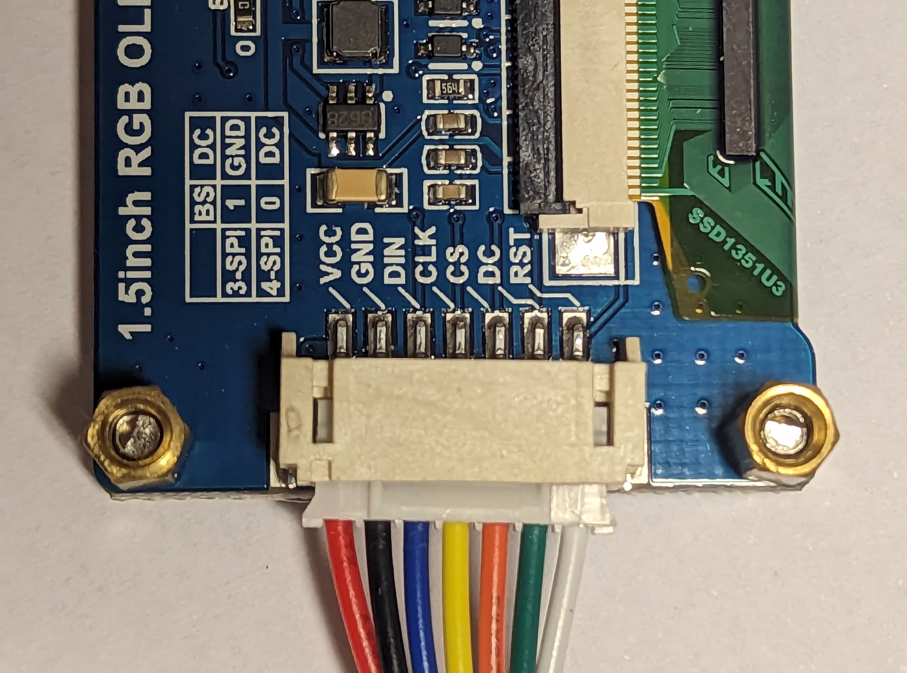
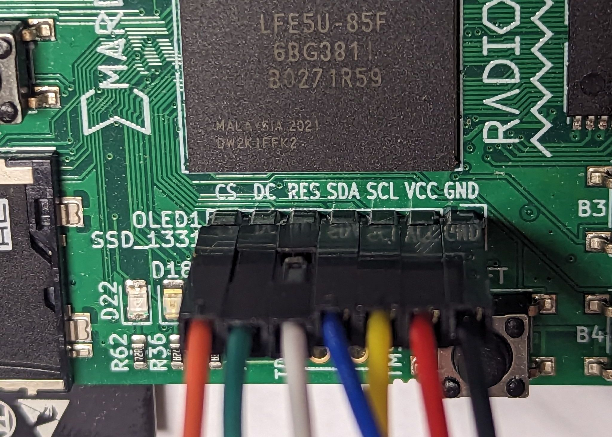
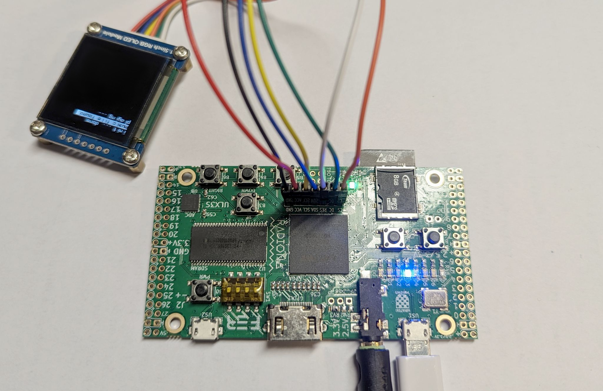

# Classroom project: music player
*Building a simple but feature complete SOC, with screen and audio, step by step.*

---

This classroom project targets the [ULX3S board](https://radiona.org/ulx3s/) with a [SSD1351 128x128 pixel SPI screen](https://www.waveshare.com/1.5inch-rgb-oled-module.htm), a SDcard and speakers/headphones with a standard audio jack. The end goal is to build a custom wave player reading files from a SDcard, with a graphical selection menu.

We will not be starting from scratch. Instead we will hack new features within
an existing basic SOC. The idea is to learn and understand
progressively by enriching the design, while starting with something quite
capable already.

The project focuses on the so called "System-On-Chip" (SOC). This is the hardware
that glues the CPU ([we use a RISCV RV32I CPU](../../../projects/ice-v/IceV.md))
to the peripherals (screen, SDcard, audio, etc.).
The SOC is a key part of a design, and in particular this is where we can implement additional hardware support for functionalities that the CPU cannot efficiently deal with -- think co-processors for sound,
graphics and input devices. In this project we will implement a hardware PWM
for the audio, and the SOC also helps the CPU with audio streaming.

We will proceed step-by-step with exercises, to understand each component of
the SOC.

The project is divided into seven steps. While most steps have exercises, a few
are only about testing and understanding the design. The very first step (step 0)
has a [complete walkthrough](#step-0).

The final exercise is to build your own player around these components. Please
send share the results with everyone!

## Setup instructions

- Format the SDcard in FAT32 and insert it into the board.
- Connect speakers or headphones to the board with the stereo jack.
  > **Warning:**  Beware that the generated sounds can be loud and very high pitched. Set volume to a minimum, do **not** wear the headphones when starting
  a design.
- Connect the screen to the board with the following correspondences between labels on the ULX3S and labels on the screen:

|             |    |    |    |    |    |    |    |
|-------------|----|----|----|----|----|----|----|
|Pin on screen| VCC| GND| DIN| CLK| CS | DC | RST|
|Pin on ULX3S | VCC| GND| SDA| SCL| CS | DC | RES|

<p align="center">
  &nbsp;&nbsp;&nbsp;
  
</p>

> **Warning**: Double check the screen connection to the board, in particular the GND/VCC wires!

- Connect the board to the computer (use the USB port labelled US1 on the board).

Ready to go! Here is a picture of the complete setup:

<p align="center">
  
</p>

## How to proceed

We will go through the project in steps. The steps are automatically generated
by a Makefile. The source of each step is a file `stepN.si`, with `N` the index
of the step from 0 to 6. Each subsequent step contains the completed previous
steps. The very first step (step 0) has a [complete walkthrough](#step-0).

To start working on a step simply type `make stepN` on a command line in this
directory. Note that the make process will automatically attempt to build the hardware and send it to the board. If the board is connected it will be automatically programmed.

Once the `stepN.si` file generated you may freely edit it and rerun `make stepN`, it will keep your changes and use your file to build the hardware.

The design embeds a firmware binary: the compiled C code that runs onto
the RISC-V processor.
The firmware is compiled and embedded when building with `make`.
To change the firmware source use
`make stepN FIRMWARE=<src>` where `<src>` is the name of a firmware file
(without extension) in the subdirectory `firmware`.
For instance, to build step 0 with the firmware `firmware/step0_leds.c` use the command: `make step0 FIRMWARE=step0_leds`

> All files `step*.c` or `test*.c`  in `firmware` can be used to generate a firmware. A file prefixed with `step` is meant to be used during the classroom,
files prefixed with `test` are unit testing the framework.

During development it is useful and important to simulate the designs. For
simulation add `BOARD=verilator` to the command. For instance, try
`make step1 FIRMWARE=step0_leds BOARD=verilator`. This will simulate the design
running a firmware producing a light pattern on the board LEDs. The status of
the LEDs is reported in the console when it changes.

## Steps

With the exception of the final step, each step is either about changes to the hardware ("modify the SOC") or the
firmware ("modify the firmware") but not both.

- Step 0 ([complete walkthrough](#step-0))
  - **Todo**     : Modify the SOC to allow the firmware to drive the LEDs.
  - **Firmware** : `step0_leds.c`

- Step 1
  - **Todo**     : Modify the SOC to allow the firmware to output audio.
  - **Firmware** : `step1_audio_cpu.c`

  > **WARNING** High-pitch high-volume sounds! Do **NOT** wear the headphones!

- Step 2
  - **Test**     : Shows how to turn the screen on, how to print hello world, and how to display an image.
  - **File**     : img.raw on SDcard root
  - **Firmwares**: `step2_hello_world.c`, `step2_show_image.c`

- Step 3
  - **Todo**     : Modify the SOC to allow the firmware to read the on-board buttons, enabling the menu selection.
  - **Firmware** : `step3_menu.c`

- Step 4
  - **Todo**     : Modify the firmware to make a selection menu listing the files on the SDcard.
  - **Firmware** : `step4_list_files.c`

- Step 5
  - **Test**     : Shows how to output audio using hardware streaming.
  - **File**     : `music.raw` on SDcard root, prepare the file using `./encode_music.sh <file.mp3>`.
  - **Firmware** : `step5_audio_stream.c`

- Step 6 ([additional information](#step-6))
  - **Todo**     : Modify the SOC to implement an audio PWM in the `audio` unit.
  - **File**     : `music.raw` on SDcard root.
  - **Firmware** : `step5_audio_stream.c`

- Final
  - **Todo**     : Wave file reader, showing an image for each played song (pro tip: name image files following music files, e.g. `my_song.raw` would have a corresponding image `my_song.raw.img`). Have fun and make this a nice player to use and look at!
  - **Firmware** : `step_final.c` (to be created)

## Additional information

### Step 0

The goal is to write the data from the CPU onto the `leds` output of the SOC (`output uint8 leds`).

When the CPU (firmware) writes to the LEDs it does this:
```c
  // firmware writing a value to the LEDS (C code)
  *LEDS = 5;
```
where `LEDS` is an address. The specific value is in [`config.c`](firmware/config.c) and is:
```c
  // from config.c ... (C code)
  volatile int* const LEDS     = (int*)0x10004; // 10000000000000100`
```
To get the value written at this address, the SOC has to monitor the memory
bus, and in particular the range of memory addresses that are not RAM but instead
peripherals. In the SOC this is done by these lines:
```c
  // in step0.si ... (Silice design)
  // track whether the CPU reads or writes a memory mapped peripheral
  uint1 peripheral   =  prev_mem_addr[$periph_bit$,1];
  uint1 peripheral_r =  peripheral & (prev_mem_rw == 4b0); // reading periph.
  uint1 peripheral_w =  peripheral & (prev_mem_rw != 4b0); // writing periph.
```
When `peripheral` is set we know the address is not a RAM address but instead a peripheral.
This will be true for the LEDS ; indeed look carefully at the address in bit format: `10000000000000100`.
Bit 16 is set, making `peripheral` true.

Now we want to know whether the CPU is writing to, or reading from this address.
This is what `peripheral_r` and `peripheral_w` are about. Note how they test whether
`prev_mem_rw` is zero. Indeed, `prev_mem_rw` is the write mask and it is how the
CPU tells that it is writing! The data being written is in `prev_wdata`.

> Why are these variables prefixed by `prev_`? That's because these are the values
tracked from the previous cycle. Indeed, the CPU requests a read/write to memory at cycle $i$ but expects the result at cycle $i+1$.

So, every time `peripheral_r` is set we can
further check the address `prev_mem_addr` to see whether the addressed peripheral
is indeed the LEDs. From the value of `LEDS` in `config.c` (`0x10004`) we can see it will be the case if the bit 0 of `prev_mem_addr` is set, that is `prev_mem_addr[0,1]` is set.

> Why would we test bit 0 of `prev_mem_addr` while the pointer is set to `0x10004`
which is `10000000000000100` in binary? Looks like it should be bit 2? Excellent observation! That is because the two least significant bits are absent as we are seeing
32 bits aligned addresses from the CPU.

We can thus add a variable tracking whether the LED is being written:
```c
  // in step0.si ... (Silice design), add after line 71
  uint1 leds_access = prev_mem_addr[ 0,1] & is_device;
```

We now detect that the LEDs address is being written, but we still have to act on it! When, how and what do we write to the `leds` output?
- *when* is detected by `peripheral_w` and there is already a conditional test
for this purpose in the SOC:
  ```c
    // in step0.si ... (Silice design)
    // writes CPU => peripherals
    if (peripheral_w) {
      // <--- here we know the CPU is writing to a peripheral
    }
  ```
- *what* to write is simply the data the CPU previously sent, that is `prev_wdata`.
- *how* we write to `leds` is simply with a conditional assign, using the `leds_access` variable we created above:
  ```c
    // (line to add in the conditional block above)
    leds = leds_access ? prev_wdata[0,8] : leds;
  ```
  This says "if `led_access` is true, assign `prev_wdata[0,8]` to `leds` otherwise assign `leds` to `leds`" (which means `leds` keeps its value).
  This sort of conditional "assign or stay the same" is very often encountered
  in hardware designs. If you find it confusing, simply do ```if (led_access) { leds = prev_wdata[0,8]; }``` instead.

  > We used the syntax `prev_wdata[0,8]` to assign the eight least significant
  bits of the 32 bits `prev_wdata` from the CPU. Using `prev_wdata` would have done the same by defaults since `leds` is 8 bits, however it is a good practice
  to be explicit when assigning to variables of different widths.

### Step 1

Proceed as with [step 0](#step-0), this time writing data to `audio_l` and `audio_r` when the CPU firmware writes to the `AUDIO` pointer (see [`config.c`](firmware/config.c)).

### Step 3

This step differs from steps 0 and 1 in that this time we send data back to the
CPU when it accesses (reads) the `BUTTONS` pointer.
The on-board buttons are given to the SOC as an input, `input uint7 btns`.

Proceed similarly to detect
when the accessed address corresponds to the buttons. Then, insert a new line
in the assignment to `memio.rdata = ...` such that it is assigned the button
status when the corresponding address is selected.

> The assignment to `memio.rdata = ...` is written with a specific `or` construct
in mind that is convenient when multiple assignment conditions are mutually exclusive. Keep in mind
that the following expression `(a ? A : 0)` will evaluate to `A` if `a` is true
and `0` otherwise. Therefore, assuming `a` and `b` are mutually exclusive
an expression `(a ? A : 0) | (b ? B : 0)` evaluates to:
> - `A` if `a` is true and not `b`,
> - `B` if `b` is true and not `a`,
> - 0 if neither `a` nor `b` are true
>
> It is then possible to chain multiple such expressions `(a ? A : 0) | (b ? B : 0) | (c ? C : 0) | ...` that will evaluate to `A`, `B` or `C` assuming `a`,`b` and `c` are mutually exclusive. This construct is used in the SOC to assign different values to `memio.rdata = ...`, it is generally more efficient that a cascade of ifs.

### Step 4

See how the menu was implemented in the firmware from step 3 ([step3_menu.c](firmware/step3_menu.c)) and combine
it with the firmware of step 4 ([step4_list_files.c](firmware/step4_list_files.c)).

### Step 5

Encode a music, copy it onto the SDcard and listen to it with the design produced
by `make step5 FIRMWARE=step5_audio_stream.c`. The music will be recognizable but
the quality will be horrendous.

> The music file should be called `music.raw` and place on the SDcard root directory. Prepare the file using `./encode_music.sh <file.mp3>` (ffmpeg has to be installed). Use your favorite `mp3` (or perhaps not, this music is going to go through a grinder ;) ).

Why is the sound so bad? The onboard DAC is only 4 bits and our music file only
has 8 bits per sample to start with. We need a way to take into account this
missing information!

### Step 6

To improve sound quality we implement a hardware audio PWM ([see here for the principle](https://electronics.stackexchange.com/questions/239442/audio-using-pwm-what-is-the-principle-behind-it)).

Somewhat surprisingly I got best results with the PWM using a single bit of the DAC, considering all 8 sample bits as fractional part.

Implementing the PWM does not require a lot of code ; the solution should
take only a few lines. Tip: all that is needed is a counter and a comparison.

### About image files

Save the image on the sdcard in a raw pixel format, 256 grayscale 128x128 pixels
(for instance using Gimp, select grayscale mode, export as raw image data).

An example is provided in `data/img.raw`.

### About music files

Prepare the file using `./encode_music.sh <file.mp3>`, this generates a file
`music.raw` in the expected format (uncompressed wave file, PCM mono **unsigned** 8 bits at 8KHz).

> **Note:** ffmpeg has to be installed for the script to work.

## Credits

- Uses the absolutely excellent FAT32 lib by @ultraembedded https://github.com/ultraembedded/fat_io_lib (included as a submodule, see README and LICENSE in [firmware/fat_io_lib](firmware/fat_io_lib)).
