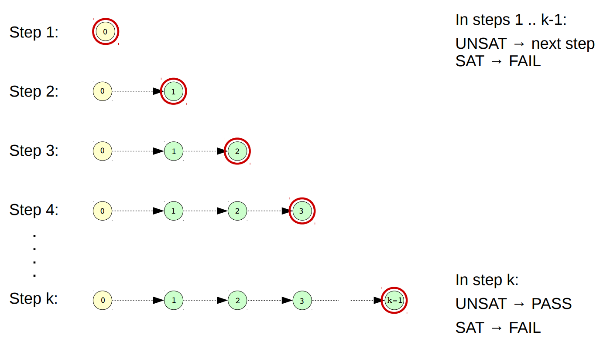
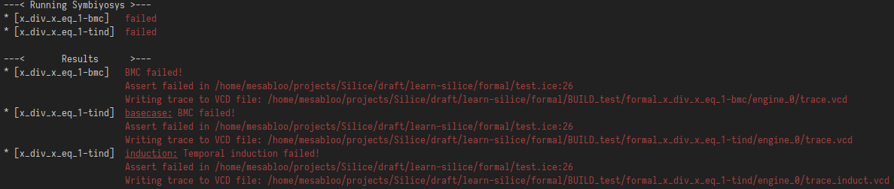
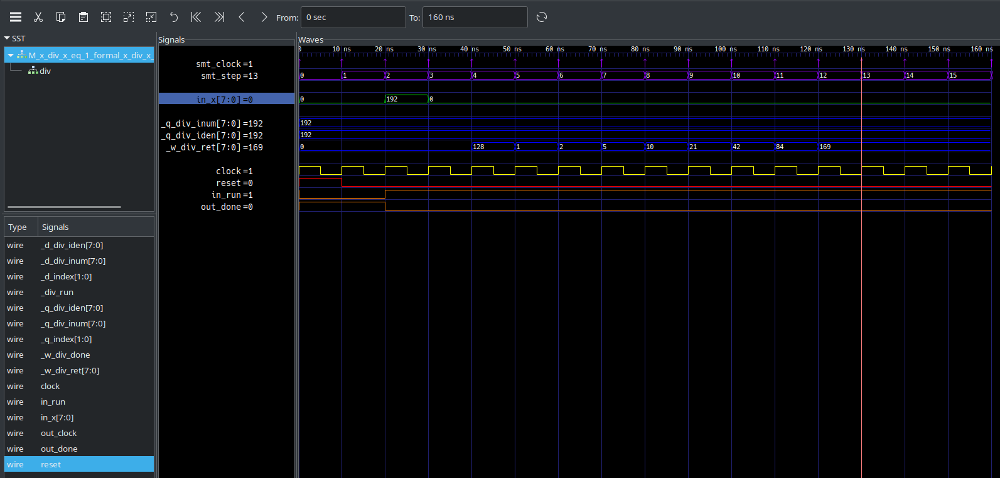
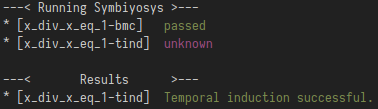

# Verifying designs written in Silice

> __Disclaimer:__
> The techniques presented here fall within the domain of “formal verification”, 
> and more precisely “property checking”.
> These methods would only provide a *proof* a correctness if the space of possible outcomes is exhaustively searched. In practice, there are bounds
> on how long the solver will try to find flaws in the design, so a design that *passes* is not *proven*: it may still not be correct at any time in any situation.
> But if it fails, it is flawed!
> For example, performing a BMC with a very low depth parameter may result in a passing design, even if flawed
> (e.g. no false assertion has been reached yet, therefore nothing is incorrect, leading to a passing test).

## Table of contents

<!-- markdown-toc start - Don't edit this section. Run M-x markdown-toc-refresh-toc -->
- [Verifying designs written in Silice](#verifying-designs-written-in-silice)
    - [Table of contents](#table-of-contents)
    - [Prerequisites](#prerequisites)
        - [**Verification methods**](#verification-methods)
            - [*Bounded Model Checking (BMC)*](#bounded-model-checking-bmc)
            - [*Temporal k-induction*](#temporal-k-induction)
        - [**Programs needed**](#programs-needed)
    - [Easy verification with `make formal`](#easy-verification-with-make-formal)
    - [Verifying designs, what to know and how to use](#verifying-designs-what-to-know-and-how-to-use)
        - [**Algorithm modifiers for verification**](#algorithm-modifiers-for-verification)
            - [*The `#depth` modifier*](#the-depth-modifier)
            - [*The `#timeout` modifier*](#the-timeout-modifier)
            - [*Choosing which method to use with the `#mode` modifier*](#choosing-which-method-to-use-with-the-mode-modifier)
        - [**Assertions and assumptions**](#assertions-and-assumptions)
        - [**Stable values**](#stable-values)
        - [**Verifying our interactive example**](#verifying-our-interactive-example)
    - [Other verification features](#other-verification-features)
        - [**State checking**](#state-checking)
        - [**Cover tests and trace generation**](#cover-tests-and-trace-generation)
    - [Other examples](#other-examples)

<!-- markdown-toc end -->


<!-- Symbiyosys, Yices2, Yosys, ABC and minimal knowledge -->
## Prerequisites

Getting started with design verification requires a bit of knowledge about the methods and programs that are used.
Please make sure that all the programs required are installed!

For more information on formal verification, see also this presentation on [Yosys and Symbiyosys](http://www.clifford.at/papers/2017/smtbmc-sby/slides.pdf).

<!-- Explain: BMC, temporal induction (what it does + input parameters -- with interactive drawings) -->
### **Verification methods**

#### *Bounded Model Checking (BMC)*

A Bounded model Checking (or BMC for short) of depth `k` is a method trying to verify that for `i` going from `0` to `k - 1`,
if the state `i` is valid -- where “valid” means that all assertions hold under all assumptions -- then all of its successor states `i + 1` are also valid.

In other words, if verifies that starting from a valid state no invalid state is reached in `k` steps.


*Figure from [Formal Verification with SymbiYosys and Yosys-SMTBMC](http://www.clifford.at/papers/2017/smtbmc-sby/slides.pdf) by Claire Wolf.*

#### *Temporal k-induction*

A temporal k-induction takes the opposite point of view. It verifies that any valid state `s` is preceded by a sequence of (at most) `k` valid states.


*Figure from [Formal Verification with SymbiYosys and Yosys-SMTBMC](http://www.clifford.at/papers/2017/smtbmc-sby/slides.pdf) by Claire Wolf.*

### **Programs needed**

This tutorial assumes that you have the FPGA toolchain already installed, if not please see [getting started](../../GetStarted.md).
In addition you have to install [Symbiyosys](https://symbiyosys.readthedocs.io/en/latest/), a front-end for Yosys to facilitate formal verification.

> **Note:** verify that *yosys-abc* is in the path ; if you build yosys yourself, you may need to create a symlink to it.

In addition to Yosys and Symbiyosys, you have to install the SMT solver Yices2, which is available [here](https://yices.csl.sri.com/). This solver handles BMC and cover tests quite fine, and fast enough (compared to e.g. z3).

<!-- Introduce the formal board, what it does, how it is useful -->
## Easy verification with `make formal`

Running Symbiyosys requires writing a `.sby` file, and in our case SMT constraints files. This can be quite tedious, but worry not! Silice build system takes care of everything for you and makes it very easy to apply formal verification to your designs.

The build system also presents a summary of Symbiyosys logs for easier interpretation
of the results, linking them to your Silice code 

> **Note:** All Symbiyosys logs are kept if in-depth analysis is later required: see
`logfile.txt` file in the build directory.

> **Note:** In case you want to modify the file `formal.sby` (which is also generated), you will have to run Symbiyosys by hand using the command `sby -f formal.sby` (re-running the formal board will override all your modifications). The `-f` option indicates that we are okay discarding the old results of previous runs.

<!-- Describe implemented features (#assert, #assume, #restrict, #cover, #wasat, #stable, #stableinput, #mode, #depth, #timeout, algorithm#) -->
## Verifying designs, what to know and how to use 

In this section, we describe Silice features for design verification, and go 
through an actual design example, completing each step.

Throughout Silice the `#` symbol indicates something related to formal verification.

For instance, an algorithm that can be verified is marked with a `#`, like `algorithm#`. It is likely that you may not want to always include these algorithms
in your design, in which case it is a good practice to surround those algorithms with `$$if FORMAL then ... end` blocks. The `FORMAL` macro is automatically defined by the formal board.

Next, we are going to verify the unsigned 8-bit integer division implemented in [common/divint_std.ice](../common/divint_std.ice). Well, in fact a previous version of it as we've found a bug thanks to formal verification!
To make this short, we will only verify the following property: `x ÷ x = 1`. 

First, we write the skeleton of the algorithm that performs the verification (think *unit test*):
```c
$$div_width=8
$$div_unsigned=1
$include('../common/divint_std.ice')

// Silice needs a `main` algorithm
algorithm main(output uint8 leds) { /*do nothing*/ }

$$if FORMAL then
algorithm# x_div_x_eq_1(input uint$div_width$ x) {
                   //   ^^^^^^^^^^^^^^^^^^^^^^^ We register `x` as an input so that Symbiyosys tries
                   //                           to find a value for it that breaks everything.
                   //                           We could also have marked a local variable as `(* anyconst *)`.
  div$div_width$ div;
  // Instantiate the division algorithm 
  uint$div_width$ result = uninitialized;
  
  (result) <- div <- (x, x);
  // Perform `x ÷ x` and store the output in `result`
}
$$end
```

> **Note:** We can also verify [common/divint_any.ice](../common/divint_any.ice) with this algorithm by changing the `include` at the top.

### **Algorithm modifiers for verification**

Our algorithm skeleton looks great, but...it doesn't verify anything.
It just computes `x ÷ x` for any `x` it is given, and that's it.
The result is even discarded because it is put in a local variable declared at the beginning of the algorithm, which is therefore
not accessible outside of it.

But before trying to verify anything, we must sit down and study our algorithm. In particular,
to setup the property checker we need an estimation of the number of cycles that the
algorithm takes to complete.

- The standard division takes about 1 cycle per bit to complete, so about 8 cycles in our case;
- Our algorithm only performs this division for now, so it takes 2 more cycles for the algorithm call;
- Because we will add some verifying code, this will take some more cycles (around 2 in this case, trust me);
- The formal board also requires at least 3 more cycles to correctly initialize the circuit;

All this leads us to the fact that the algorithm `x_div_x_eq_1` takes about 15 cycles to fully complete.
It is usually a good idea to round up this value to the next 5, which gives 20 in this case.
This allows us to get an error margin on the number of cycles we computed (or guessed?).

> __Note:__ overestimating the number of cycles should not hurt the verification process, i.e. putting 25 instead of 20 works as well. Underestimating may lead to the test passing when the algorithm is actually flawed.
> As an example of a false-positive, please see [false-positive.ice](./false-positive.ice) which is a test passing despite the `#assert(0);` at the end of the algorithm.

To setup the property checker we use algorithm *modifiers*:

#### *The `#depth` modifier*

Remember the `k` parameter for the BMC or the temporal induction?
This specific parameter can be specified on a per-algorithm basis using the `#depth` modifier.
When doing a cover test, it corresponds to the number of cycles to take in account.

The `#depth` modifier takes a single integer as an argument, and defaults to `30` if not specified.
In our case, the test algorithm can be changed to:
```c
$$div_width=8
$$div_unsigned=1
$include('../common/divint_std.ice')

// Having no `main` algorithm somehow breaks the compiler...
algorithm main(output uint8 leds) {}

$$if FORMAL then
algorithm# x_div_x_eq_1(input uint$div_width$ x) <#depth=20> {
                                             //   ^^^^^^^^^ 20 cycles, as said earlier
  div$div_width$ div;
  uint$div_width$ result = uninitialized;
  
  (result) <- div <- (x, x);
}
$$end
```

#### *The `#timeout` modifier*

<details><summary>Click me to reveal the spoiler (please don't)</summary>

> We don't need it for our algorithm because it takes less than the default timeout to complete (around 2-3 seconds for a depth of 20).

</details>

Sometimes, verifying an algorithm takes too much time as too many constraints burden the solver.
There can also be an infinite loop somewhere that a verification statement depends on. 
For these reasons you may want to restrict the maximum time a verification algorithm is allowed to “run” for before declared as failing.

Therefore you can customize the timeout on a per-algorithm basis through the `#timeout` modifier. Just like the `#depth` modifier, it takes a single integer as argument to specify the solver timeout (in seconds), and defaults to 120 if not specified.

> __Note:__ if your test algorithm times out, it *might* be a good idea to increase this parameter.
> However, sometimes the algorithm may take too much time to be verified, because of complex generated constraints.
> 
> In this case, you can either wait half a day (43,200 seconds if you ever need this value) hoping for the best, or convince yourself
> that it's alright and most probably is correct (else it would have failed already).
> Obviously nothing can be concluded from a timeout, so it is up to you to decide.

#### *Choosing which method to use with the `#mode` modifier*

There are multiple ways to verify an algorithm: a simple BMC, a temporal induction and/or a cover test. All of these are *not* mutually exclusive (i.e. you may perform a BMC **and** a temporal induction).

Just as with other modifiers, it is possible to use the `#mode` modifier to specify what methods are used to verify an algorithm.
It takes a `&` separated list of modes  as argument (`bmc` to perform a BMC, `tind` for a temporal induction, `cover` for a cover test).

> **Note:** Modes are sorted using the partial order `bmc ≺ tind ≺ cover`. 
  This ensures that tests are always run in the same order no matter what happens.
  
If not specified, the `#mode` modifier defaults to`bmc`.

Going back to our example, we would like to perform both a BMC and a temporal induction.
The code thus looks like this:
```c
$$div_width=8
$$div_unsigned=1
$include('../common/divint_std.ice')

// Having no `main` algorithm somehow breaks the compiler...
algorithm main(output uint8 leds) {}

$$if FORMAL then
algorithm# x_div_x_eq_1(input uint$div_width$ x)
  <#depth=20, #mode=bmc & tind> { 
         //   ^^^^^^^^^^^^^^^^ Perform a BMC and a temporal induction
  div$div_width$ div;
  uint$div_width$ result = uninitialized;
  
  (result) <- div <- (x, x);
}
$$end
```

### **Assertions and assumptions**

Great!
Now that we have learned about all the available algorithm modifiers, it's time to verify that the division works correctly as expected (spoiler: *it does not*).
Remember that we want to check that `x ÷ x = 1`.
This is an undeniable fact of modern mathematics (assuming `÷` is the integral division only returning the quotient, not the remainder;
else we would have had to write `x ÷ x = (q=1, r=0)`).

One way to ensure that a property holds at some point is by writing an immediate assertion.
Asserting a property simply means “if the property does not hold here (i.e. it evaluates to a false value), then please inform me of what went wrong”.
Immediate assertions are introduced using the `#assert(property)` construct, where `property` is any boolean expression
(or at least an expression reducing to either a true or false value).

For our algorithm, the goal is to check that `result` is `1` and nothing else.
Therefore, we can add an assertions at the end of the algorithm, like this:
```c
$$div_width=8
$$div_unsigned=1
$include('../common/divint_std.ice')

// Having no `main` algorithm somehow breaks the compiler...
algorithm main(output uint8 leds) {}

$$if FORMAL then
algorithm# x_div_x_eq_1(input uint$div_width$ x) <#depth=20, #mode=bmc & tind> {
  div$div_width$ div;
  uint$div_width$ result = uninitialized;
  
  (result) <- div <- (x, x);
  
  #assert(result == 1);
  // Please make sure that at this point `result` is equal to `1`
}
$$end
```

But what if `x = 0`?
Anything divided by `0` is supposed to be undefined (turns out that `x ÷ 0 = 255` when this design is simulated using Icarus).

The division algorithm could already restricts this case to never happen by using the `#restrict` construct. But this older version did not ... so we will add this constraint.
Because `x ÷ x = 1` only if `x ≠ 0`, we can provide the assumption that `x ≠ 0` in our test.
This makes it so that Symbiyosys will not try to find counter-examples where `x = 0`.

We add an assumption with the `#assume` construct. Assume and
restrict are quite similar. The only difference between them lies in this property:

> If any assertion depends on an assumption use `#assume`, else use `#restrict`.
In doubt use `#assume`.

In our test algorithm, the assertion depends on the assumption that `x ≠ 0`, therefore it must be modified as follows:
```c
$$div_width=8
$$div_unsigned=1
$include('../common/divint_std.ice')

// Having no `main` algorithm somehow breaks the compiler...
algorithm main(output uint8 leds) {}

$$if FORMAL then
algorithm# x_div_x_eq_1(input uint$div_width$ x) <#depth=20, #mode=bmc & tind> {
  div$div_width$ div;
  uint$div_width$ result = uninitialized;
 
  #assume(x != 0); // Please don't consider states leading to `0 ÷ 0`...
 
  (result) <- div <- (x, x);
  
  #assert(result == 1);
}
$$end
```

### **Stable values**

<details><summary>Click me to reveal the spoiler (please don't)</summary>

> Because we do not use `x` in any assertions, there is little to no risk that a concurrent value change breaks something.
> 
> When in doubt, always stabilize the inputs. 
> The only thing it costs is some characters in the source code.

</details>

Our verification algorithm works ... but it will also try to change the parameter `x` while the division is running.

To prevent this, there is a special construct equivalent to saying that an input is assumed to be stable (i.e. to not change). If you did not already infer its name, it is `#stableinput`.
Note that it only takes a single identifier as an argument, and works only if this identifier is bound to an `input`.

There is also a counterpart to *assert* the stability of an expression, where “stability” means that the expression is expected not to change in the current state 
(or always, if in an `always` block).

To assume the stability of our input variable `x` we modify the algorithm as follows:
```c
$$div_width=8
$$div_unsigned=1
$include('../common/divint_std.ice')

// Having no `main` algorithm somehow breaks the compiler...
algorithm main(output uint8 leds) {}

$$if FORMAL then
algorithm# x_div_x_eq_1(input uint$div_width$ x) <#depth=20, #mode=bmc & tind> {
  div$div_width$ div;
  uint$div_width$ result = uninitialized;

  #stableinput(x);
  // We really don't want `x` to change in the middle of the algorithm...
  #assume(x != 0);
 
  (result) <- div <- (x, x);
  
  #assert(result == 1);
}
$$end
```

### **Verifying our interactive example**

Yay! Our example algorithm is finally ready to be run!

A Makefile is provided in this directory to automatically compile and run the verification process using the formal board.
Running `make tutorial` (there should be a file name `tutorial.ice` in this folder containing the complete example developed in this tutorial)
does not yield the correct results: our compact division is flawed at least on 8-bits!


> **Note:** Temporal induction fails in both cases here. The basecase *should* always fail whenever a simple BMC fails.
> The induction case is however much harder to debug, and make pass.

Visualizing the generated VCD trace in GTKWave yields a strange result: it appears that `192 ÷ 192 = 169`! That's strange...

> **Note:** I am using GTKWave here for simplicity's sake. More in-depth code exploration can be achieved 
> using the newly developed Silice debugger!

After a bit of research, minutes of debugging and researching in similar implementations, it turns out that the accumulator should be 1 bit wider.
This caused an overflow when computing the difference, leading to such incorrect results.

Fixing this bug (this has already been done in 099a7f06ab7445ad3c2eea31499e269938be10e5) and re-running the tutorial on the new compact division
now yields correct results, for the BMC as well as the temporal induction!



Therefore, our division should be working in most cases.

## Other verification features

### **State checking**

> *But where did I come from?*

<details><summary>Click me to reveal the spoiler (please don't)</summary>

> It doesn't quite make sens to verify this in our interactive example.
> Therefore, a dumb example will most likely be given, to illustrate how one may use `#wasin`.

</details>

It is sometimes useful to verify that an algorithm took the correct path, that is the state sequence is what should be expected.
A very simple (and dumb) example is this one:
```c
algorithm f() {
  uint8 cnt = uninitialized;
init:
  cnt = 0;
loop:
  while (cnt < 3) {
    cnt = cnt + 1;
  }
end:
  // we want to check the loop operated correctly and that 3 cycles before, we were in the `init` state.
}
```

The `#wasin(state, N)` construct can be used to verify such use case, by providing it with the name of the state that was expected
and the number of cycles to look back for (defaults to `1` if not specified).
The state given must have been declared in the scope using the state introduction construct (as above, where `loop:` introduces and names a state).

Instead of the comment at the end, we can write `#wasin(init, 3)` to verify the situation given.

> __Note:__ while the `#wasin` is accepted everywhere an instruction is expected (even in `always` blocks),
> it is most likely to always fail in an `always` block or when it isn't part of a specific state.

### **Cover tests and trace generation**

Cover tests are some specific kind of verification allowing to potentially debug situations by generating specific VCD traces,
according to some test.
While this may not be a huge feature, we believe that this is a nice one to have in case debugging a specific example is needed at some point.

Cover tests can be declared using the `#cover(condition)` statement, which takes the condition to satisfy.
If the cover statement is reached but the condition evaluates to a false value, then it is simply ignored.

Please be aware that an unreached `#cover` statement is considered a failure to satisfy the cover test, and is reported as such
by Symbiyosys and the formal board.

<!-- Some quick examples of verification -->
## Other examples

This directory contains several example of verifying code, for different algorithms:

- [divint_verif.ice](./divint_verif.ice) verifies some properties of unsigned integral division (the division used can be replaced quite easily by modifying the `$include` statement at the top of the file);
- [mulint_verif.ice](./mulint_verif.ice) verifies some properties of integral multiplication;
- [tutorial.ice](./tutorial.ice) is the final state of the interactive example presented here;
- [false-positive.ice](./false-positive.ice) reports a false result based on an incorrect `#depth` parameter;

You can run the verification process using the provided [Makefile](./Makefile), by simply running the command
`make file`, where `file` is the file without the `.ice` extension you want to run the whole process on.
