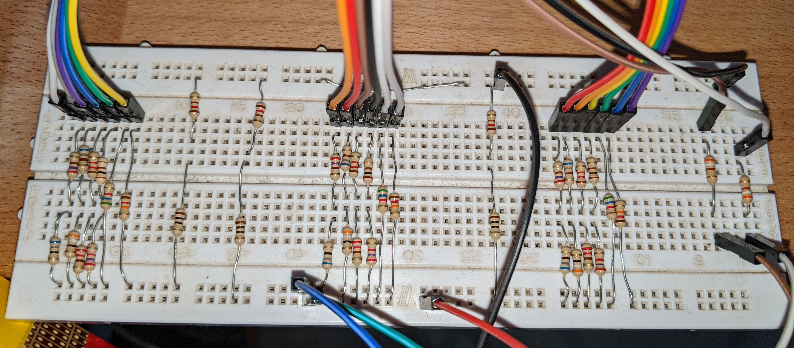

VGA 6-6-6 bits RGB DAC

Quite the hack! Does the job.

Bottom wires come from the VGA cable, white and brown are horizontal/vertical synch.

This was tested on the Mojo v3, de10nano and IceStick.

## Pinout for the IceStick

| IceStick pins | VGA signal |
|---------------|------------|
| PMOD7 (pin 87)  | horiz. synch |
| PMOD10 (pin 91)  | vert. synch |
| PMOD1 (pin 78)  | red 0 |
| PMOD2 (pin 79)  | red 1 |
| PMOD3 (pin 80)  | red 2 |
| PMOD4 (pin 81)  | red 3 |
| PMOD8 (pin 88)  | red 4 |
| PMOD9 (pin 90)  | red 5 |
| TR10  (pin 119)  | green 0 |
| TR9  (pin 118)  | green 1 |
| TR8  (pin 117)  | green 2 |
| TR7  (pin 116)  | green 3 |
| TR6  (pin 115)  | green 4 |
| TR5  (pin 114)  | green 5 |
| BR10 (pin 44)  | blue 0 |
| BR9  (pin 45)  | blue 1 |
| BR8  (pin 47)  | blue 2 |
| BR7  (pin 48)  | blue 3 |
| BR6  (pin 56)  | blue 4 |
| BR5  (pin 60)  | blue 5 |

## Pinout for the de10nano

The de10nano pinout is now compatible with the VGA onboard the [MiSTer IO board](https://github.com/MiSTer-devel/Main_MiSTer/wiki/IO-Board)

| de10nano pins | VGA signal |
|---------------|------------|
| pin AH22  | horiz. synch |
| pin AG24  | vert. synch |
| pin AE17  | red 0 |
| pin AE20  | red 1 |
| pin AF20  | red 2 |
| pin AH18  | red 3 |
| pin AH19  | red 4 |
| pin AF21  | red 5 |
| pin AE19  | green 0 |
| pin AG15  | green 1 |
| pin AF18  | green 2 |
| pin AG18  | green 3 |
| pin AG19  | green 4 |
| pin AG20  | green 5 |
| pin AG21  | blue 0 |
| pin AA20  | blue 1 |
| pin AE22  | blue 2 |
| pin AF22  | blue 3 |
| pin AH23  | blue 4 |
| pin AH21  | blue 5 |

## Pinout for the MojoV3
(NOTE: the MojoV3 is not yet integrated in the new build system)

| MojoV3 pins | VGA signal |
|---------------|------------|
| pin 133  | horiz. synch |
| pin 134  | vert. synch |
| pin 23  | red 0 |
| pin 21  | red 1 |
| pin 16  | red 2 |
| pin 14  | red 3 |
| pin 11  | red 4 |
| pin 50  | red 5 |
| pin 24  | green 0 |
| pin 22  | green 1 |
| pin 17  | green 2 |
| pin 15  | green 3 |
| pin 12  | green 4 |
| pin 51  | green 5 |
| pin 92  | blue 0 |
| pin 94  | blue 1 |
| pin 97  | blue 2 |
| pin 93  | blue 3 |
| pin 95  | blue 4 |
| pin 98  | blue 5 |
