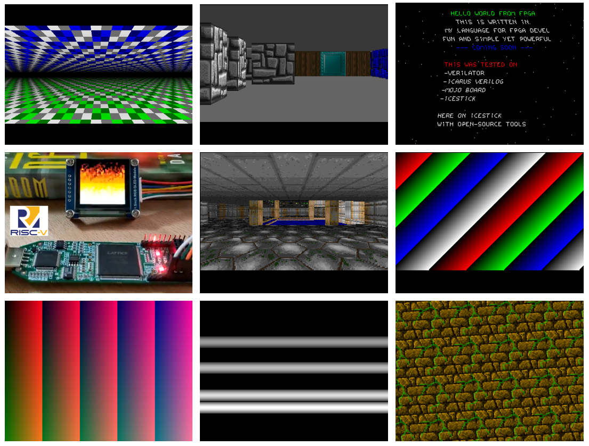

# Silice example projects

Looking at examples is a great way to learn and experiment. So I prepared several projects, from small to big, to show off Silice features. Some of these projects are still under active development, and evolve together with the language (DooM-chip, I am looking at you!). 

Note that these designs are entirely created from scratch with Silice, from SDRAM, HDMI, VGA, OLED and LCD controlers to dividers and multipliers, importing only tiny bits of Verilog (for e.g. PLLs). Most of the designs rely on common functions grouped in the *common* folder.

To build a design please refer to the [building](#building-the-examples) section below and the README of the project.
All designs can be simulated with Icarus/Verilator, and many will work right out of the box on real hardware. Please refer
to the README of each project.

A few projects rely on some external hardware (typical, low cost things: OLED, keypad, LCD, etc.), this is all detailed in the README of the projects.

<p align="center">
  
</p>

## Detailed tutorials

Some of the projects have detailed explanations:
- [pipelined sort](pipeline_sort/)
- [HDMI test framework](hdmi_test/)

## Building the examples

All examples are in the *projects* directory. 

To build a project, make sure your board is ready to be programmed, open a command line (MinGW64 under Windows), enter the project directory and type `make <target board>` ; for instance `make icestick`. 

Let's take an example! We will build the 'divint bare' demo for simulation with icarus. Do the following:

*Note:* under Windows please use a MinGW shell, please refer to the [getting started](../GetStarted.md) guide.

```
cd silice/projects/divint_bare
make icarus
```
If everthing goes well you should see in the last console output:
```
20043 /   -817 =    -24
```
and a gtkwave window opens to let you explore the produced signals.

A good project to start with Silice is *silice/project/blinky*.

## Extra hardware

### VGA

Some projects require extra hardware, for instance a VGA DAC (a bunch of resistors on a breadbord will do!). This is simple and fun to do, so I highly encourage you [to make one](DIYVGA.md). All VGA and SDRAM projects can be simulated with the verilator framework (see next section), which outputs images of what you would see on screen. They can also be simulated with Icarus, which outputs a fst file that can be explored with gtkwave or visualized with *silicehe*.

### OLED

To configure your OLED setup, edit the *oled.ice* file in [common/oled.ice](common/oled.ice) to specify the driver and resolution being used.
The OLED library supports the SDD1351 and ST7789 drivers. Also checkout the specific pinout used for your board.

# All examples

## Blinky

Blinks LEDs on all supported boards.

## VGA demos

### Old-school effects

Some old-school effects ported on FPGA.

*Requires*: [VGA DAC](DIYVGA.md)\
*Tested on*: IceStick, IceBreaker (VGA pmod), ULX3S (VGA DAC), de10nano (MiSTer SDRAM, VGA DAC or MiSTer I/O board)

### VGA text buffer

A small demo featuring a font and text buffer

*Requires*: [VGA DAC](DIYVGA.md)\
*Tested on*: ULX3S (VGA DAC), IceStick, IceBreaker (VGA pmod), de10nano (MiSTer SDRAM, VGA DAC or MiSTer I/O board)

## Video demos with SDRAM framebuffer

### WolfPGA

The (very simplified) render loop of Wolfenstein 3D.

*Requires*: [VGA DAC](DIYVGA.md) or HDMI, SDRAM\
*Tested on*: ULX3S (HDMI), de10nano (MiSTer SDRAM, VGA DAC or MiSTer I/O board)

### The DooM-chip

The DooM-chip, pushing the limits.

*Requires*: [VGA DAC](DIYVGA.md) or OLED/LCD screen, SDRAM\
*Tested on*: ULX3S (HDMI), de10nano (MiSTer SDRAM, VGA DAC or MiSTer I/O board)

## Ice-V

A cool and tiny Risc-V processor (fits a HX1K Ice40, e.g. on the IceStick).

*Tested on*: ULX3S, IceStick, IceBreaker\
*Optional*: OLED screen

## Arithmetic

Divider (because we need one), multiplier and pipelined multiplier.

## Algorithms

[Pipelined sort](pipeline_sort/) (with detailed explanations)

# Notes and tips

- If you are under Windows and run into trouble, checkout the notes on my [fpga-binutils repo](https://github.com/sylefeb/fpga-binutils) (end of page).

- Some Verilog code in *projects/common* comes from the [Alchitry](https://alchitry.com/) demos for the MojoV3. Also checkout [Lucid](https://alchitry.com/pages/lucid-fpga-tutorials) it is great for learning low-level FPGA programming (similar to Verilog but more beginner-friendly). The website features good tutorials on FPGAs in general.
