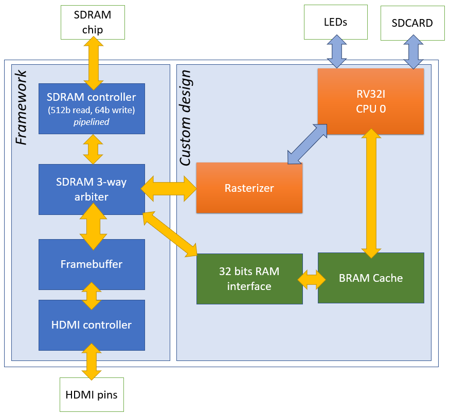

# Fire-V: RISC-V FPGA framework written in Silice

*The documentation effort is ongoing, this page will be updated regularly.*

**Design goals:** A video framework validated at a good fmax ( ulx3s: CPU ~90 MHz, SDRAM ~135 MHz), supporting overclocking to much higher frequencies ( ulx3s: full framework at 160 MHz, CPU alone seems still ok at 200 MHz ), with a RISC-V core in 2K LUTs, HDMI output, a pipelined SDRAM controller, and seamless access to the entire memory space. Oh, and there is a hardware rasterizer for triangles as well, for good measure. Everything will be documented, to serve as a detailed example for Silice.

*But really, this is about having fun revisiting some old-schools effects and rendering tricks!*

As always, designing hardware is a compromise. Here I attempt to maintain a simple, easy to read Silice code while achieving a good fmax and a relatively compact design. No doubt this can be further improved! 

**Note:** *I am not a CPU design expert --  I am just learning, playing and sharing. Please let me know your thoughts! This remains a work in progress.*

**Note:** *There are many resources on hardware design and RISC-V cores in particular. Be sure to checkout the [links section](#links).*

**Features and quick links:**
- [RV32I core](doc/fire-v.md) in about 2K LUTs, Dhrystone CPI ~4.043, best case: instruction in 2 cycles, full access to SDRAM with fast-memory (BRAM) mapped on a specific address range. Has 32 bits `rdcycle` and `rdinstret` plus a special `userdata` (hijacks `rdtime`), uses barrel shifters for 1 cycle ALU operations.
- [Pipelined SDRAM controller](../common/sdram_controller_autoprecharge_pipelined_r512_w64.ice).
- [A fast memory segment](ash/bram_segment_ram_32bits.ice) catching an address range in BRAM, falling back to SDRAM outside.
- A [hardware triangle rasterizer](doc/flame.md), exploiting the SDRAM wide write capability.
- An [SDRAM framebuffer](../common/video_sdram_main.ice), also exploiting the SDRAM wide write capability, with double buffering, 8 bit palette of 24bits RGB colors at 640x480 (can be configured for 320x200 as well).
- Four variants: [Spark](spark.ice) (minimalist), [Blaze](blaze.ice) (geared towards IceBreaker), [Wildfire](wildfire.ice) (geared towards ULX3S), [Inferno](inferno.ice) (dual-core version of Wildfire -- *needs update*).

<center></center>

**Detailed explanations:**
*Work in progress!*
- [The RISC-V processor design](doc/fire-v.md).
- [The hardware triangle rasterizer](doc/flame.md).
- [Framework memory mapping](doc/MemoryMap.md).
- [TODO]() How the framework is assembled from components written in Silice, and how to create your own flavor.
- [TODO]() How to create your own demos!

**Running the framework**

There are four flavors of the framework:
- [Spark](spark.ice): minimalistic, RISC-V core, BRAM, access to LEDs and SDCARD.
- [Blaze](blaze.ice): (for IceBreaker) RISC-V core, BRAM + SPRAM in continuous memory segment, access to LEDs and SPIFLASH, VGA output (via PMOD) and hardware rasterizer.
- [Wildfire](wildfire.ice): (for ULX3S)  RISC-V core with SDRAM, HDMI output, 640x480 framebuffer (8 bit palette of 24 bits RGB colors), full SDRAM access with fast memory segment and hardware rasterizer.
- [Inferno](inferno.ice): dual core version of Wildfire (*needs update*).

This comes with a minimalist (and quite horrible) software environment, providing the basics such as SDCARD / SPIFLASH access (bitbanging), boot, printf, swapping frame buffers, drawing triangles, and a few other low level functions. And yes, *you compile code for the framework directly from gcc*, one of the many things that makes RISC-V great!

**Directory structure**

- The RISC-V core is in the [fire-v](fire-v/) directory.
- The rasterizer is in the [flame](flame/) directory.
- The memory components are in the [ash](ash/) directory.
- The software components of the project are in the [smoke](smoke/) directory.

## Build and run!

### Pre-build binaries

The `bin` directory contains pre-built binaries for the ULX3S as well as pre-compiled sdcard images.

### From source

If you have never used Silice before, see [getting started](../../GetStarted.md) for initial setup (Windows, Linux, MacOS).

The build process has two separate steps. First, build the framework with a boot loader in BRAM. Second, compile C code, write it on an sdcard or spiflash and run it.
(*Note:* any program can be burned into BRAM at startup, but of course the boot loader allows to run different codes from sdcard/spiflash images).

In the following I describe instructions for the Wildfire and Blaze variants, but things are similar for all three variants.

### Building Wildfire

**Note:** the framework was primarily designed on the ULX3S (ECP5) ; I'll try to port it to other boards.

Plug your board, open a command line in this folder and run:
```
./compile_boot_sdcard.sh
make ulx3s
```
The first line compiles the [boot loader](smoke/boot/boot_sdcard.c). The second line produces the bitstream for the board, using Silice build system. The board is programmed at the end.

To run something, you have to compile code and write it to an sdcard image, see next (you may also use any of the pre-compiled images in `bin/sdcard/`).

**Compiling code for Wildfire**

```
./compile_to_wildfire.sh smoke/tests/cubes.c
make sdcard
```
This produces a `data.img` image for an sdcard.
Write the image on an sdcard (this is a raw image, not a file, see note below). Insert the sdcard in the board. On the ULX3S press 'PWR' to reset. Make sure to use a SDHC card.

The `compile_c.sh` takes a `--nolibc` option if you'd like to compile without the default library. A few examples, like `smoke/tests/leds.c` require this parameter.

**Important:** The sdcard image has to be written raw, for instance using `Win32DiskImager` on Windows. Beware that all previous data will be lost.

**Known issues:** 
- The sdcard sometimes fails to initialize. If this happens, try a reset (press 'PWR'). Next, try to carefully remove and re-insert the card after 1-2 seconds. Another option is to flash the board with `fujprog -j flash BUILD_ulx3s/built.bin`, usually the sdcard works fine on power up.
- If you update the sdcard image, reset won't reload it properly, you'll have to power cycle the board (or reprogram it). Fixing this is on my TODO list!

**Simulating Wildfire**

```
./compile_to_wildfire.sh smoke/tests/cubes.c
make verilator
```

This will output images in `BUILD_verilator/`.

### Building Blaze

**Note:** the framework was primarily designed on the IceBreaker (iCE40UP5k) with a VGA PMOD.

Plug your board, open a command line in this folder and run:
```
./compile_boot_spiflash.sh
make icebreaker -f Makefile.blaze
```
The first line compiles the [boot loader](smoke/boot/boot_spiflash.c). The second line produces the bitstream for the board, using Silice build system. The board is programmed at the end.

To run something, you have to compile code and write it to spiflash at offset 1M (2^20 bytes), see next.

**Compiling code for Blaze**

```
./compile_to_blaze.sh smoke/tests/ibrkrshape.c
make spiflash
```
This produces a `data.img` image for the spiflash.
Write the image to spiflash with:

```
iceprog -o 1M data.img
```

The board will reset and immediately execute your code.

## Architecture diagram

Here is a diagram of the architecture with the main modules. 

<center></center>

The CPU and SDRAM run at the same frequency (160 MHz overclocked), while the HDMI controller at 125MHz. Let us discuss a few components.

The reason for the 512 burst reads in the main SDRAM controller is to allow for higher efficiency when the framebuffer memory is read during screen refresh. The read/write interface has to be adapted for the 32 bits CPUs, which is the role of the `32 bits RAM interface` component (see [sdram_ram_32bits.ice](ash/sdram_ram_32bits.ice)).

The SDRAM is shared throughout the design. The 3-way arbiter shares between framebuffer, rasterizer and the CPU. The framebuffer, which is always active, gets top priority (in case of simultaneous request, it gets precedence). 

The HDMI controller generates the video signal from a 125 MHz clock. Read more about this in the [HDMI project notes](../hdmi/).

Accessing the SDRAM from the CPU has a high latency. This is mitigated by the BRAM cache, which implements a fast-memory segment in the address space, see [bram_segment_ram_32bits.ice](ash/bram_segment_ram_32bits.ice). It sits between the CPU and the SDRAM interface. It captures all addresses falling within its range, falling back to SDRAM if necessary. From the CPU point of view, memory is contiguous, but access is much (much!) faster in this specific range. See [notes on memory organization](doc/MemoryMap.md). Code executed from this space can be consumed at 2 cycles per instructions under ideal conditions, see [Fire-V notes](doc/fire-v.md).

## The RiscV processor

This is a [RV32I design](https://riscv.org/wp-content/uploads/2017/05/riscv-spec-v2.2.pdf). It is optimized for fmax, but remains relatively compact. It optimistically fetches the next instructions, before being done with the current one. Together with the instruction cache, this allows many instructions to execute in only 2 cycles. 

Please refer to the [Fire-V notes](doc/fire-v.md) for additional details.

## The SDRAM controller and arbiter

For details on SDRAM controllers please refer to the [sdram_test project](https://github.com/sylefeb/Silice/tree/master/projects/sdram_test).

## Links
* FemtoRV with RISC-V tutorials https://github.com/BrunoLevy/learn-fpga/tree/master/FemtoRV
* PicoRV https://github.com/cliffordwolf/picorv32
* Demo project voices made with https://text-to-speech-demo.ng.bluemix.net/
* RiscV toolchain https://github.com/riscv/riscv-gnu-toolchain
* Pre-compiled riscv-toolchain for Linux https://matthieu-moy.fr/spip/?Pre-compiled-RISC-V-GNU-toolchain-and-spike&lang=en
* Homebrew RISC-V toolchain for macOS https://github.com/riscv/homebrew-riscv
* Stackoverflow post on CPU design (see answer) https://stackoverflow.com/questions/51592244/implementation-of-simple-microprocessor-using-verilog
* Fonts from http://www.pouet.net/topic.php?which=10710 and https://jared.geek.nz/2014/jan/custom-fonts-for-microcontrollers
