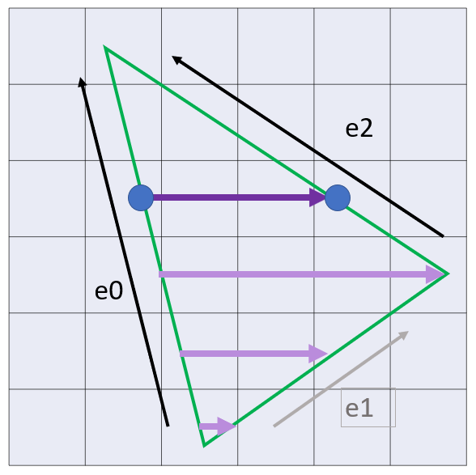
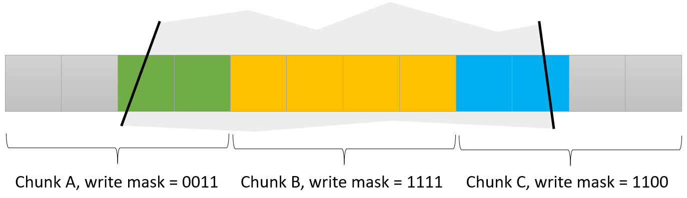

# The Flame GPU

Let's now dive into the framework's GPU called *Flame*.

**Note:** This is work in progress, for now I focus on the overview, will expand with a code walkthrough soon.
**Note:** The code is still very rough, I will polish, cleanup and comment.

Source code: [flame.ice](../flame/flame.ice).

## Overview

Flame is a very simple hardware accelerator currently only drawing triangles. It performs only one thing, filling the inside area of a triangle, but it does it by exploiting the SDRAM interface to the full extent, and in parallel to the CPU (which meanwhile is busy transforming vertices, or doing whatever CPUs do).

The principle is easily illustrated:

In this Figure, `e0`, `e1`, `e2` are *edge walkers*. These are three instances of a same algorithm. This algorithm takes as input a current `y` coordinate that is expected to start below the edge and to increment one by one. Given a current `y` coordinate the edge walker computes a current position on the edge, or indicates that `y` is above the edge.

The edge walkers perform computations in fixed point precision. They need as input the end point coordinates as well as an increment, which is computed by the CPU and send alongside the triangle coordinates. `x` is updated by this increment every time `y` changes (it is the ratio `x/y`).

Now, given a current `y` and the coordinates returned by the edge walkers, we have the endpoints of a *pixel span*: the purple arrow in the picture. Flame decomposes the span into chunks of 8 bytes (with a write mask) so they can be sent efficiently through the SDRAM controller. Flame has its own SDRAM interface, which goes through a memory arbiter between the CPU, Flame and the framebuffer (see the [architecture diagram](wildfire-arch.png)).

Here is how a span might be decomposed for a chunk size of 4:

This makes much better use of the SDRAM controller than sending these pixels one by one (helps hiding the access latencies). With the current controller, the chunks have a size of 8 pixels (64 bits).

And that's it for the core principles!

## Hardware design walkthrough

**TODO** 

## CPU side

It is interesting to look at the interplay between Fire-V (the CPU) and Flame (the GPU). The CPU has a few things to do, in particular computing the edge increments, but then it is free to do something else while the triangle is being rasterized. 

**TODO** 