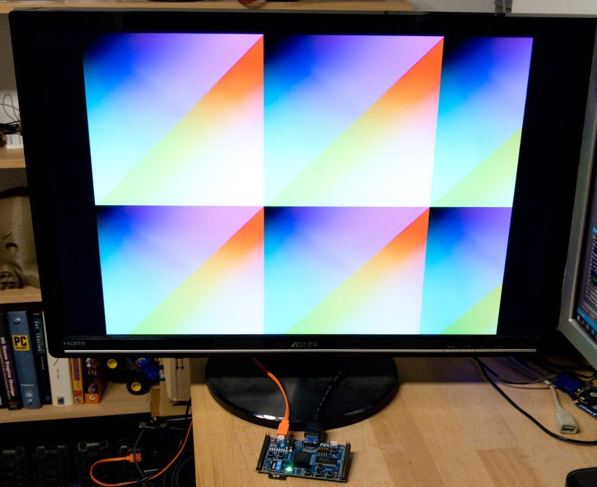

# Simple HDMI test framework with Silice

This project is a simple test of the [Silice HDMI implementation](../common/hdmi.ice). This page explains the example and then provides some
details on the HDMI controller implementation itself.

The example outputs an on-screen pattern through a 640x480 HDMI signal, with a pixel clock of 25 MHz. The design assumes the base clock is 25 MHz, which is the case for instance on the ULX3S.

To try it, open a command line in this directory and type `make ulx3s`.

**Note:** This project was primarily designed for the ULX3S board ; it is possible to adapt it for other boards but will require to replace
ECP5/Lattice specific primitives in [differential_pair.v](../common/differential_pair.v) and update the PLL / clock in [hdmi_clock.v](../common/hdmi_clock.v).

<p align="center">
  
</p>

## Example code walkthrough

The main algorithm first declares a number of variables that allow us to interact with the HDMI controller:

```c
  uint10 x      = 0; // (output from HDMI) the active pixel x coordinate
  uint10 y      = 0; // (output from HDMI) the active pixel y coordinate
  uint1  active = 0; // (output from HDMI) whether the active screen area is being drawn
  uint1  vblank = 0; // (output from HDMI) whether vblank is active (interval between frames)
  uint8  r      = 0; // (input to HDMI) the red value of the active pixel
  uint8  g      = 0; // (input to HDMI) the green value of the active pixel
  uint8  b      = 0; // (input to HDMI) the blue value of the active pixel
```

It then instantiates the HDMI controller and binds these variables to it. Note the syntax `:>` indicating an output (e.g. `x`,`y`) and `<:` indicating an input (`r`,`g`,`b`).
From this point on, the variables are bound to the HDMI controller and directly driven by its internal state. 

```c
  hdmi video(
    x       :> x,
    y       :> y,
    active  :> active,
    vblank  :> vblank,
    gpdi_dp :> gpdi_dp,
    gpdi_dn :> gpdi_dn,
    red     <: r,
    green   <: g,
    blue    <: b
  );
```

The controller forms the HDMI signal, which is output on the pins `gpdi_dp` and `gpdi_dn`. The HDMI protocol uses a 4 bits signal (RGBC: red, green, blue, pixel clock), but this signal is sent to the screen through two sets of pins (for a total of eight pins): four positive and four negative. The corresponding positive and negative bits form pairs, called *differential pairs*. This is done to strongly improve the signal quality and integrity. Thus, `gpdi_dp` encodes the signals on four bits and `gpdi_dn` are their negated counterpart: `gpdi_dn = ~gpdi_dp`.

Now we are ready to draw on screen! We enter an infinite loop, that computes `r`,`g`,`b` from `x`,`y`. If you have
done GPU shaders in the past, this is very similar to a pixel shader in concept.

The example draws simple red-green ramp along x/y as well as blue diagonals, with the following code:

```c
  while (1) { 
    if (active) {
      r = x;
      g = y;
      b = (x+y);
    }    
  }
```  

Feel free to experiment with this (it *is* fun), and please share your images and animations!
And if you need some inspiration, be sure to check out the [VGA demos](../vga_demo/) that rely on a similar framework but with a VGA output.

## HDMI code walkthrough

If you are only interested in using the HDMI controller, you can skip this. If you'd like to learn more about HDMI, keep reading!

Let's have a look inside the HDMI controller, [hdmi.ice](../common/hdmi.ice).
The controller uses three different algorithms:
- `tmds_encoder` takes a byte and transforms it into a 10 bit TMDS encoded signal,
- `hdmi_ddr_shifter` takes all three R,G,B TMDS encoded signals, and shifts them into the output pins, two at a time,
- `hdmi` is the main algorithm that implements the controller and uses the other two algorithms.

The overall flow is as follows: three TMDS encoders receive the 8-bits RGB colors, turn them into three 10 bits vectors, that are then shifted (serialized) 
and output to the three corresponding HDMI differential pairs. The last (fourth) pair carries the pixel clock for synchronization.

I will not detail the TMDS encoder -- the important thing to keep in mind is that it encodes a byte into ten bits to be sent. 
The goal of this encoder is to obtain a very stable and reliable high speed serial communication (see also links below).

The HDMI controller assumes that the base clock is 25 MHz. For a 640x480 8-bits RGB signal we need a 25 MHz pixel clock, so that matches the base clock. 
Each byte (RGB) is however encoded onto ten bits by the TMDS encoder, so we have to send 10 bits at each pixel clock on each component's differential pair. 
This means we have to send the bits at ten times the pixel clock: 250 MHz. 

This starts to be a fairly high frequency. To reduce the pressure on the place and route, we instead use a 125 MHz clock and output the ten bits over five clock cycles. How is that possible? We use a [DDR output](https://en.wikipedia.org/wiki/Double_data_rate), that outputs one bit on the clock's positive edge, and another bit on the clock's negative edge. This requires a vendor specific primitive, that is however very commonly used and available.

The 125 MHz clock is generated here:
```c
  // pll for tmds
  uint1  half_hdmi_clk = uninitialized;
  hdmi_clock pll(
    clk      <: clock,              //  25 MHz
    half_hdmi_clk :> half_hdmi_clk, // 125 MHz (half 250MHz HDMI, double data rate output)
  );
```
(the details of the pll are hidden in [hdmi_clock.v](../common/hdmi_clock.v))

The high speed clock is then used by the shifter that serializes the RGB components, as well as the pixel clock, onto the output pins:
```c
 uint8 crgb_pos = 0;
 uint8 crgb_neg = 0;
 hdmi_ddr_shifter shift<@half_hdmi_clk>(
    data_r    <: tmds_red,
    data_g    <: tmds_green,
    data_b    <: tmds_blue,
    p_outbits :> crgb_pos,
    n_outbits :> crgb_neg,
  );
```
Where `tmds_red`, `tmds_green` and `tmds_blue` are each 10 bits output by three instances of the TMDS encoder. Here is the TMDS instance for red:
```c
  tmds_encoder tmdsR(
    data        <:: latch_red,
    ctrl        <:: null_ctrl,
    data_or_ctrl<:: prev_active,
    tmds         :> tmds_red
  );
```

Note how `crgb_pos` and `crgb_neg` are both 8 bits. Each encode the (respectively) positive and negative side of the RGBC differential pairs for **two** cycles of a 250 MHz clock. The [`hdmi_differential_pairs.v`](../common/hdmi_differential_pairs.v) module (in Verilog) takes care of instantiating the four specialized DDR output cells, defined in [`differential_pair.v`](../common/differential_pair.v), that output the four differential pairs at twice the 125 MHz clock. For the ULX3S, the specialized DDR cell is called `ODDRX1F`.

Finally, the `always` block<sup>[1](#footnote1)</sup> of the `hdmi` algorithm updates the various internal states: 
- The internal pixel coordinates counters `cntx`,`cnty`.
- The `hsync`, `vsync` states (based on pixel coordinates)
- The `active` state (coordinate within drawable screen area)
- The `vblank` state (time interval between frames)
The input R,G,B signals are also registered to relax timing (e.g. `latch_red   = red;`).

And that's about it! Regarding the TMDS encoder, please refer to [wikipedia](https://en.wikipedia.org/wiki/Transition-minimized_differential_signaling) for the basics. For my implementation I used the [algorithm chart from digikey](https://www.digikey.com/eewiki/pages/viewpage.action?pageId=36569119).

A few other notes:
- The TMDS signals can be in data or control mode. They switch to control when the signal is not in the screen area (horizontal and vertical blank).
- During the horizontal and vertical blanks, the green signal carries the state of vsync/hsync encoded in the control bits.
- The positive/negative pairs are produced with the same logic paths to minimize the chance they would get different delays (we want them to be in sync). To ensure this, vendor specific primitives could be used for true differential pairs.

<a name="footnote1">1</a>: as a reminder, the always block of an algorithm in Silice is executed at each clock cycle, before anything else ; the `hdmi` algorithm only contains an always block.

# Links and further reading
- https://www.fpga4fun.com/HDMI.html
- https://www.digikey.com/eewiki/pages/viewpage.action?pageId=36569119
- https://github.com/lawrie/ulx3s_examples/blob/master/hdmi/tmds_encoder.v

