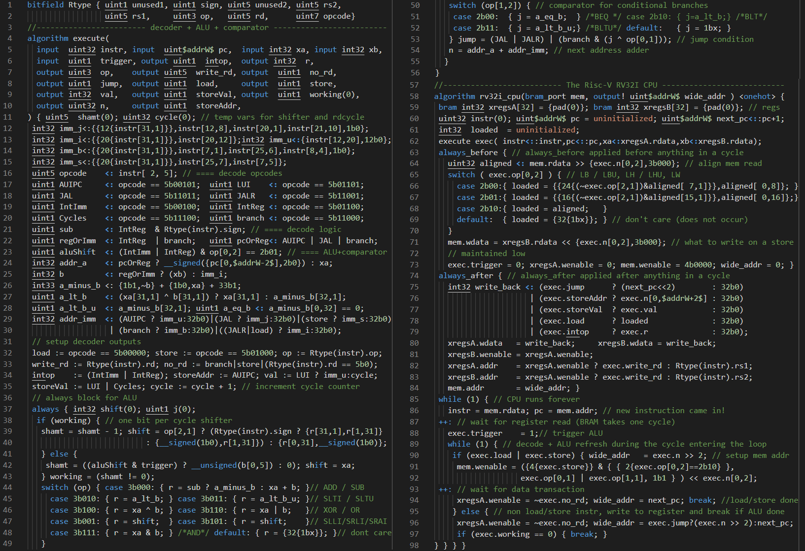
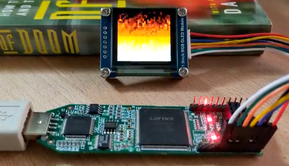

# The Ice-V: a simple, compact RISC-V RV32I implementation in Silice

**TL;DR** A small CPU design that can come in handy, a detailed code walkthrough, a good place to start learning about both Silice and RISC-V.

**Please note:** The text likely needs more polish, please send feedback!

## What is this?

The Ice-V is a processor that implements the [RISC-V RV32I specification](https://github.com/riscv/riscv-isa-manual/releases/download/Ratified-IMAFDQC/riscv-spec-20191213.pdf). It is simple and compact (~100 lines when reduced, see image below), demonstrates many features of Silice and can be a good companion in projects. It is specialized to execute code from BRAM, where the code is baked into the BRAM upon synthesis (can be a boot loader later loading from other sources).

It is easily hackable and would be extendable to boot from SPI, execute code from a RAM, and connect to various peripherals. The example drives LEDs and an external SPI screen.

The version here runs out of the box on the IceStick ice40 1HK, and can adapted to other boards with minimal effort.

## Features
- implements the RV32I specifications
- runs code compiled with gcc RISC-V (build scripts included)
- executes load/store in 4, instructions in 3 cycles but for shifts which additionally take one cycle per shifted bit
- less than 1000 LUTs
- validates at around 65 MHz on the IceStick
- < 300 lines of commented code (~100 lines compacted)
- 1 bit per cycle shifter
- 32 bits `rdcycle`
- comes with a DooM fire demo ;)

*The entire processor code*
<p align="center">
  
</p>

## The Ice-V dual

A second version of the processor is included in this repo: [the Ice-V *dual*](CPUs/ice-v-dual.si).
This is an only slightly larger design that implements *two* RV32I cores. The
dual version is described on [this separate page](IceVDual.md).

## Running the design

The build is performed in two steps, first compile some code for the processor to run:

From `projects/ice-v` (this directory) run:
```
./compile/icestick/ice-v/compile_c.sh src/test_leds.c
```

Plug your board tp the computer for programming and, from the project folder run:
```
make icestick
```

On an IceStick the LEDs will blink around the center one in a rotating pattern.

You may also simulate the design with:
```
./compile/icestick/ice-v/compile_c.sh src/test_leds_simul.c
make verilator
```
The console will output the LEDs pattern until you press CTRL+C to interrupt
the simulation.
```
LEDs: 00001
LEDs: 00010
LEDs: 00100
LEDs: 01000
LEDs: 00001
...
```

### Adding a screen

Optionally you can plug a small SPI-screen (I used [this one](https://www.waveshare.com/1.5inch-rgb-oled-module.htm), 128x128 RGB with SSD1351 driver).

Two different pinouts are supported. The first, shown next, uses all five wires
of the SPI-screen:
| IceStick        | SPI-screen|
|-----------------|-----------|
| PMOD1  (pin 78) | rst       |
| PMOD7  (pin 87) | dc        |
| PMOD8  (pin 88) | cs        |
| PMOD9  (pin 90) | clk       |
| PMOD10 (pin 91) | din       |

> Using this pinout, build the design with the `Makefile.oled` makefile (see below).

The second, recommended pinout uses only four wires of the OLED/LCD interface,
leaving room for a second peripheral (such as a sound chip!). The pinout then is:
| IceStick        | SPI-screen|
|-----------------|-----------|
| PMOD1  (pin 78) | rst       |
| PMOD2  (pin 79) | dc        |
| PMOD3  (pin 80) | clk       |
| PMOD4  (pin 81) | din       |

The CS pin of the screen has to be grounded. One way to do this is to plug it on top of the ground pin plug, see the orange wire in the picture below.

<p align="center">
  
</p>

> Using this pinout, build the design with the `Makefile.pmod` makefile (see below).

Equipped with this, you can test the [DooM fire](tests/c/fire.c) or the [starfield](tests/c/starfield.c) demos.

For the DooM fire with the first OLED/LCD pinout:
```
./compile/icestick/ice-v/compile_c.sh src/fire.c
make icestick -f Makefile.oled
```

For the DooM fire with the second OLED/LCD pinout:
```
./compile/icestick/ice-v/compile_c.sh src/fire.c
make icestick -f Makefile.pmod
```

<p align="center">
  <br>
  <i>Note that the pinout changed compared to this picture</i>
</p>

> **Note:** Compiling code for the processor requires a RISC-V toolchain. Under Windows-MinGW, this is installed as a package by the `get_started_mingw64.sh` script. Under macOS and Linux there are precompiled packages, or you may prefer to compile from source. See see [getting
started](https://github.com/sylefeb/Silice/blob/master/GetStarted.md) for more detailed instructions.

&nbsp;<br>

## The Ice-V design: code walkthrough

Now that we have tested the Ice-V let's dive into the code! The [entire processor](CPUs/ice-v.si) fits in less than 300 lines of Silice code (~130 without comments).

A Risc-V processor is surprisingly simple! This is also a good opportunity to discover some Silice syntax and features.

The processor is in file [ice-v.si](CPUs/ice-v.si). For the demos, it is included in
a minimalist SOC in file [ice-v-soc.si](SOCs/ice-v-soc.si).

The processor is made of three algorithms:
- `algorithm execute` is responsible for splitting a 32 bit instruction just read from memory into information used by the rest of the processor (decoder), as well as performing all integer arithmetic (ALU): add, sub, shifts, bitwise operators, etc.
- `algorithm rv32i_cpu` is the main processor loop. It fetches instructions from memory, reads registers, setups the decoder and ALU with this data, performs additional memory load/stores as required, and stores results in registers.

Let's start with an overview of the processor loop in `algorithm rv32i_cpu`.

### Processor loop

We will skip everything at the beginning (we'll come back to that when needed)
and focus on the infinite loop that executes instructions. It has the following structure:

```c
while (1) {

    // 1. - an instruction just became available
    //    - setup register read

++: // wait for registers to be read (1 cycle)

    // 2. - register data is available
    //    - trigger ALU

    while (1) { // decode + ALU while entering the loop (1 cycle)

        // results from decoder and ALU available

        if (exec.load | exec.store) {

            // 4. - setup load/store RAM address
            //    - enable memory store?

++: // wait for memory transaction (1 cycle)

            // 5. - write loaded data to register?
            //    - restore next instruction address

            break; // done
            // next instruction read while looping back (1 cycle)

        } else {

            // 6. - store result of instruction in register
            //    - setup next instruction address

            if (exec.working == 0) { // ALU done?
                break; // done
                // next instruction read while looping back (1 cycle)
            }
        }
    }
}
```
The loop structure is constructed such that most instructions take three cycles, with load/store requiring an additional cycle. It also allows to wait for the ALU which sometimes needs multiple cycles (shifts proceed one bit per cycle).
Silice [has precise rules](../../learn-silice/Documentation.md#sec:execflow) on how cycles are used in control flow (while/break/if/else), which allows us to write the loop so that no cycles are wasted.

### *A new instruction comes in*

Let's go through this step by step. The first `while (1)` is the main processor loop. At the start of the iteration (marker `1.` above) an instruction is available from memory, either from the boot address at startup, or from the previous iteration setup.
We first copy the data read from memory into a local `instr` variable, so that we
are free to do other memory transactions. We also copy the memory address from which
the instruction came in a variable called `pc` for *program counter*.
```c
// data is now available
instr           = mem.rdata;
pc              = mem.addr;
```

### *Registers*

Storing the instruction in `instr` will also update the values read from the registers.
That is done in the `always_after` block, which specifies things to be done *every cycle*
and *after everything else*. The `always_after` block contains these two lines
setting up register read from `instr`:
```c
//               vvvvvvvvvvvvvvvvvvvvvvvvvvvvvvvvvvvvv ignore for now
xregsA.addr    = /* xregsA.wenable ? exec.write_rd : */ Rtype(instr).rs1;
xregsB.addr    = /* xregsA.wenable ? exec.write_rd : */ Rtype(instr).rs2;
```
The registers are stored in two BRAMs, `xregsA` and `xregsB`. By setting their
`addr` field we known that the values of the registers will be in their `rdata`
field *at the next clock cycle*. That is the reason we wait for one cycle with
a `++:` after marker `1.`

The `Rtype(instr).rs1` syntax is using the bitfield declared at the top of the file:
```c
// bitfield for easier decoding of instructions
bitfield Rtype { uint1 unused1, uint1 sign, uint5 unused2, uint5 rs2,
                 uint5 rs1,     uint3 op,   uint5 rd,      uint7 opcode}
```
Writing `Rtype(instr).rs1` is the same as `instr[15,5]` (5 bits width from bit 15), but in an
easier to read/modify format.

The reason we use two BRAMs is to be able to read two registers in a single cycle.
So these two BRAMs always contain the same values, but can be read independently.

The BRAMs instantiated at the beginning of the processor:
```c
bram int32 xregsA[32] = {pad(0)}; bram int32 xregsB[32] = {pad(0)};
```

> `pad(0)` fills the arrays with zeros.

`xregsA` and `xregsB` are always written to together, so they hold the same values.
This is also done in the `always_after` block:
```c
// write back data to both register BRAMs
xregsA.wdata   = write_back;      xregsB.wdata   = write_back;
// xregsB written when xregsA is
xregsB.wenable = xregsA.wenable;
// write to write_rd, else track instruction register
xregsA.addr    = xregsA.wenable ? exec.write_rd : Rtype(instr).rs1;
xregsB.addr    = xregsA.wenable ? exec.write_rd : Rtype(instr).rs2;
```
Both BRAM `wdata` field are set to the same `write_back` value and `xregsB.wenable` tracks
`xregsA.wenable`. Finally, when their field `wenabled = 1` they both write to the
same `addr` given by `exec.write_rd`. This ensures both BRAMs always contain
the same values.

### *Triggering decoder and ALU*

After this setup, we wait for one cycle (`++:`) for the register values to be available at the BRAM outputs. Once the register values are available (marker `2.`), the decoder and ALU will start refreshing from these updated values. Both decoder and ALU are grouped in the second
algorithm called `execute`. The outputs of `execute` are accessed with the 'dot'
syntax: `exec.name_of_output`.

Algorithm execute is instantiated inside the processor as follows:
```c
// decoder + ALU, executes the instruction and tells processor what to do
execute exec(
    instr <:: instr, pc <:: pc, xa <: xregsA.rdata, xb <: xregsB.rdata
);
```
The algorithm receives the instruction `instr`, the program counter `pc`, the
register values `xregsA.rdata` and `xregsB.rdata`. These are *bound* to the
algorithm's inputs with the wiring operators `<::` and `<:` . There is an important
distinction between both related to timing. Operator `<::` means that the variable is wired such
that the instantiated algorithm `execute` sees its value *before* it is changed
by the host algorithm `rv32i_cpu` during the cycle. Therefore `execute` does not
immediately see the change when both `instr` and `pc` are assigned at marker `1.`,
but onlys see the change at the next cycle (after the `++:`). This creates a one
cycle latency, but also makes the circuit shorter leading to an increased max
frequency for the design. These are important tradeoffs to play with in your designs.

Back to marker `2.`, as soon as the register data is available information flows
through `execute` and we have nothing specific to do. However, the ALU part of `execute`
needs to be told it should trigger its computations at this specific cycle:
```c
exec.trigger = 1;
```

> For all details on the (important!) topic of algorithm bindings and timings [please refer to the dedicated page](../../learn-silice/AlgoInOuts).

### *The operations loop*

Then we enter a second `while(1)` loop. In many cases we will break out of this second loop after just one cycle, but sometimes the ALU needs to work over multiple cycles, so the loop allows to wait. Entering a loop takes one cycle, so while we enter the loop data flows through `execute` and its outputs are ready when we are in the loop.

In the loop we distinguish two cases: either a load/store has to be performed `if (exec.load | exec.store)` or else another instruction is running. Let's first consider the second case (marker `6.`). A non load/store instruction ran through the decoder and ALU.

### Other than load/store

First, we consider writing the instruction result to a register. This is done with the following code:
```c
// store result in register
xregsA.wenable = ~exec.no_rd;
```
Recall `xregsA` is a BRAM holding register values. Its `wenable` field indicates whether we write (1) or read (0). Here, it will be enabled if the decoder output `exec.no_rd` is low. But that seems a bit short? For instance where do we tell *what* to write?
This is in fact done in the `always_after` block, as we have seen earlier (see *Registers* section above). The data to be written is set with:
```c
xregsA.wdata   = write_back;      xregsB.wdata   = write_back;
```
This explains why we don't need to set it again when writing the result of the instruction to the register.

But why do that? Why not simply write this code in `6.` alongside the rest? This is for efficiency, both in terms of circuit size and frequency. If the assignment was in `6.` a more complex circuit would be generated to ensure it is only done in this specific state. This would require a more complex multiplexer circuit, and therefore it is best to always blindly set this value in the `always_after` block. As long as we do not set `xregsA.wenable = 1` nothing gets written anyway. This is a very important aspect of efficient hardware design, and by carefully avoiding uncessary conditions your designs will be made much more efficient. Please also refer to [Silice design guidelines](../../learn-silice/Guidelines.md).

So what is the value of `write_back`? It is defined with the following code:
```c
// what do we write in register? (pc, alu or val, load is handled separately)
// 'or trick' from femtorv32
int32 write_back <: (exec.jump      ? (next_pc<<2)        : 32b0)
                  | (exec.storeAddr ? exec.n[0,$addrW+2$] : 32b0)
                  | (exec.storeVal  ? exec.val            : 32b0)
                  | (exec.load      ? loaded              : 32b0)
                  | (exec.intop     ? exec.r              : 32b0);
```
`write_back <: ...` defines an expression tracker: the read-only variable `write_back`
is an alias to the expression given in its definition (a *wire* in Verilog terms).
`write_back` gives the value to write back based on the decoder outputs.
`exec.storeAddr` indicates to write back the address computed by the ALU in `exec.n` (AUIPC).
`exec.storeVal` indicates to write back the value `exec.val` from the decoder (LUI or RDCYCLE).
`exec.jump` indicates to write back `next_pc<<2` (JAL, JALR, conditional branches taken). The shift transform 32-bits instruction pointer into byte addresses.

Alright! the register is updated. Back to marker `6.` Next we set the address of the next instruction to fetch and execute:
```c
// next instruction address
wide_addr      = exec.jump ? (exec.n >> 2) : next_pc;
```
This is either the address computed from the ALU in case of a jump/branch
as indicated by `exec.jump`, or the value of `next_pc` which is simply `pc + 1`:
the instruction following the current one.

Almost done, but first we have to check whether the ALU is not in a multi-cycle
operations.
This is why we only break `if (exec.working == 0)`.
If not, the loop iterates again, waiting for the ALU.
Note that `6.` will be visited again, so we'll write again to the register. And yes, if the
ALU is not yet done the write we did before might be an incorrect value. But that is
all fine: the result will be correct at the last iteration, and it costs us nothing
to do these writes. In fact *it costs us less* because not doing them would again
require more multiplexer circuitry!

After we break, it takes one cycle to go back to the start of the loop. During this
cycle the next instruction is read from `mem` and the result (if any) is written to
the register in `xregsA`.

> You may have noticed that we wrote the next address in `wide_addr` while the
memory interface is `mem`, so we should have written to `mem.addr`? This is to allow
the SOC to see a wider address bus and perform memory mapping. The address we set
in `wide_addr` is assigned to `mem.addr` in the `always_after` block, that is
applied at the end of every cycle: `mem.addr = wide_addr`. It is also output
from the algorithm to the SOC: `output! uint12 wide_addr(0)` where `output!` means
the SOC immediately see changes to `wide_addr`.

### Load/store

That's it for non load/store instructions. Now let us go back to `if (exec.load | exec.store)`
and see how a load/store is handled. Because the Ice-V is specialized for BRAM, we
know all memory transactions take a single cycle. While we'll have to account
for this cycle, this is a big luxury compared to having to wait for an unknown
number of cycles an external memory controller.

When reaching marker `.4` we first setup the address of the load/store. This address
comes from the ALU:
```c
// memory address from wich to load/store
wide_addr = exec.n >> 2;
```
The sift by two is due to the fact that computed addresses are in bytes, while
the memory interface addresses are in 32-bits words.

Then, this is either a store or a load. If that is a store, we need to enable
writing to memory. The memory is called `mem` and is a BRAM, given to the CPU: `algorithm rv32i_cpu( bram_port mem, ... )`. The BRAM holds 32 bits words at each address.
To enable writing we set its `wenable` member. However this BRAM has a specificity:
it allows a write mask. So `wenable` is not a single bit, but four bits, which
allows to selectively write any of the four bytes at each memory address.

And we need that! The RISC-V RV32I specification features load/store for bytes,
16-bits and 32-bits words. That means that depending on the instruction (SB/SH/SW)
we need to setup the write mask appropriately. This is done with this code:
```c
// == Store (enabled below if exec.store == 1)
// build write mask depending on SB, SH, SW
mem.wenable = ({4{exec.store}} & { { 2{exec.op[0,2]==2b10} },
                                       exec.op[0,1] | exec.op[1,1], 1b1
                                } ) << exec.n[0,2];
```
That might seem a bit cryptic but what this does is to produces a write mask of the form `4b0001, 4b0010, 4b0100, 4b1000` (SB) or `4b0011, 4b1100` (SH) or `4b1111` (SW) depending on `exec.op[0,2]` (load type) and `exec.n[0,2]` (address lowest bits).
As this may not be a store after all, an AND between the mask and `exec.store` is
applied. The syntax `{4{exec.store}}` means that the bit `exec.store` is replicated
four times to obtain a `uint4`.

Next we wait one cycle for the memory transaction to occur in BRAM with `++:`. If
that was a store we just wrote and we are done when we reach marker `5.`

If that was a load we just read from memory and now have to store the result
in the selected register. This is done by this code:
```c
// == Load (enabled below if exec.load == 1)
// commit result
xregsA.wenable = ~exec.no_rd;
```
This is enough to trigger the register update, since `xregsA.wdata`  and
`xregsA.addr` are properly set up afterwards in the `always_after` block where
`wdata` is assigned `write_back`.
Recall that `write_back` selects `loaded` when `exec.load` is high (see
definition of `write_back` above). `loaded` is defined as follows:
```c
// decodes values loaded from memory (used when exec.load == 1)
uint32 aligned <: mem.rdata >> {exec.n[0,2],3b000};
switch ( exec.op[0,2] ) { // LB / LBU, LH / LHU, LW
    case 2b00:{ loaded = {{24{(~exec.op[2,1])&aligned[ 7,1]}},aligned[ 0,8]}; }
    case 2b01:{ loaded = {{16{(~exec.op[2,1])&aligned[15,1]}},aligned[ 0,16]};}
    case 2b10:{ loaded = aligned;   }
    default:  { loaded = {32{1bx}}; } // don't care (does not occur)
}
```
This selects the loaded value depending of whether a byte (LB/LBU), 16-bits (LH/LHU) or 32-bits (LW) were accessed (U indicates unsigned). `mem.rdata` is the value right out of memory, and
it is shifted in `aligned` to be the part selected by the address lowest bits `exec.n[0,2]`.

> Note that `{exec.n[0,2],3b000}` is simply `exec.n[0,2] << 3` (a left shift by three bits is  equivalent to concatenating three 0 bits to the right).

After the load/store is completed we restore the next instruction address `next_pc`,
so that the processor is ready to proceed with the next iteration after the break:
```c
// restore address to program counter
wide_addr      = next_pc;
// exit the operations loop
break;
```

And that's it! We have seen the entire processor logic. Let's now dive into some
of the other components.

### The decoder

The decoder is part of `algorithm execute`. It is a relatively straightforward affair.
It starts by decoding all
the possible *immediate* values -- these are constants encoded in the different
types of instructions:
```c
// decode immediates
int32 imm_u  <: {instr[12,20],12b0};
int32 imm_j  <: {{12{instr[31,1]}},instr[12,8],instr[20,1],instr[21,10],1b0};
int32 imm_i  <: {{20{instr[31,1]}},instr[20,12]};
int32 imm_b  <: {{20{instr[31,1]}},instr[7,1],instr[25,6],instr[8,4],1b0};
int32 imm_s  <: {{20{instr[31,1]}},instr[25,7],instr[7,5]};
```
These values are only used when the matching instruction executes. For instance
`imm_i` is used in register-immediate integer operations.

The next part checks the opcode and sets a boolean for every possible instruction:
```c
uint5 opcode    <: instr[ 2, 5];
uint1 AUIPC     <: opcode == 5b00101;  uint1 LUI    <: opcode == 5b01101;
uint1 JAL       <: opcode == 5b11011;  uint1 JALR   <: opcode == 5b11001;
uint1 IntImm    <: opcode == 5b00100;  uint1 IntReg <: opcode == 5b01100;
uint1 Cycles    <: opcode == 5b11100;  uint1 branch <: opcode == 5b11000;
```
These are of course mutually-exclusive, so only one of these is `1` at a given
cycle.

Finally we set the decoder outputs, telling the processor what to do with the instruction.
```c
// ==== set decoder outputs depending on incoming instructions
// load/store?
load         := opcode == 5b00000;   store        := opcode == 5b01000;
// operator for load/store           // register to write to?
op           := Rtype(instr).op;     write_rd     := Rtype(instr).rd;
// do we have to write a result to a register?
no_rd        := branch  | store  | (Rtype(instr).rd == 5b0);
// integer operations                // store next address?
intop        := (IntImm | IntReg);   storeAddr    := AUIPC;
// value to store directly           // store value?
val          := LUI ? imm_u : cycle; storeVal     := LUI     | Cycles;
```

> The *always assign* operator `:=` used on outputs means that
the output is set to this value first thing every cycle (this is a shortcut
equivalent to a normal assignment `=` in an `always_before` block).

For instance `write_rd := Rtype(instr).rd` is the index of the destination
register for the instruction, while `no_rd := branch | store | (Rtype(instr).rd == 5b0)`
indicates whether the write to the register is enabled or not.

> Note the condition `Rtype(instr).rd == 5b0` in `no_rd`. That is because
register zero, as per the RISC-V spec, should always remain zero.

### The ALU

The ALU performs all integer computations. It consists of three parts. The
integer operations such as ADD, SUB, SLLI, SRLI, AND, XOR (output `r`) ;
the comparator for conditional branches (output `jump`) ; the next address adder (output `n`).

Due to the way the data flow is setup we can use a nice trick. The ALU as well
as the comparator select two integers for their operations. The setup of the Ice-V
is such that both can input the same integers, so they can share the same circuits
to perform similar operations. And what is common to `<`,`<=`,`>`,`>=`? They
can all be done with a single subtraction! This trick is implemented as follows:
```c
// ==== allows to do subtraction and all comparisons with a single adder
// trick from femtorv32/swapforth/J1
int33 a_minus_b <: {1b1,~b} + {1b0,xa} + 33b1;
uint1 a_lt_b    <: (xa[31,1] ^ b[31,1]) ? xa[31,1] : a_minus_b[32,1];
uint1 a_lt_b_u  <: a_minus_b[32,1];
uint1 a_eq_b    <: a_minus_b[0,32] == 0;
```

`xa` is the first register, while `b` is selected before based on results from the decoder:
```c
// ==== select ALU second input
int32 b         <: regOrImm ? (xb) : imm_i;
```
The choice is made by this line in the decoder:
```c
uint1 regOrImm  <: IntReg  | branch;
```

Similarly, the next address adder selects its first input based on the decoder
indications:
```c
// ==== select next address adder first input
int32 addr_a    <: pcOrReg ? __signed({pc[0,$addrW-2$],2b0}) : xa;
```
For instance, instructions `AUIPC, JAL` and `branch` will select the program
counter `pc` for `addr_a` as can be seen in the decoder:
```c
uint1 pcOrReg   <: AUIPC   | JAL    | branch;
```
The second value in the next address computation is an immediate selected based
on the running instruction:
```c
// ==== select immediate for the next address computation
int32 addr_imm  <: (AUIPC  ? imm_u : 32b0) | (JAL         ? imm_j : 32b0)
                |  (branch ? imm_b : 32b0) | ((JALR|load) ? imm_i : 32b0)
                |  (store  ? imm_s : 32b0);
```
The next address is then simply the sum of `addr_a` and the immediate: `n = addr_a + addr_imm`.

The comparator and most of the ALU are switch cases returning the selected
computation from `op := Rtype(instr).op`.
For the comparator:
```c
// ====================== Comparator for branching
switch (op[1,2]) {
    case 2b00:  { j = a_eq_b;  } /*BEQ */ case 2b10: { j=a_lt_b;} /*BLT*/
    case 2b11:  { j = a_lt_b_u;} /*BLTU*/ default:   { j = 1bx; }
}
jump = (JAL | JALR) | (branch & (j ^ op[0,1]));
//                                   ^^^^^^^ negates comparator result
```
For the integer arithmetic:
```c
// all ALU operations
switch (op) {
    case 3b000: { r = sub ? a_minus_b : xa + b; }            // ADD / SUB
    case 3b010: { r = a_lt_b; } case 3b011: { r = a_lt_b_u; }// SLTI / SLTU
    case 3b100: { r = xa ^ b; } case 3b110: { r = xa | b;   }// XOR / OR
    case 3b001: { r = shift;  } case 3b101: { r = shift;    }// SLLI/SRLI/SRAI
    case 3b111: { r = xa & b; }     // AND
    default:    { r = {32{1bx}}; }  // don't care
}
```

However, something is going on for the shifts (SLLI, SRLI, SRAI). Indeed, integer shifts `<<` and `>>`
can be performed in one cycle but at the expense of a large circuit (many LUTs!).
Instead, we want a compact design. So the rest of the code in the ALU describes
a shifter shifting one bit per cycle. Here it is:
```c
int32 shift(0);
// shift (one bit per clock)
if (working) {
    // decrease shift size
    shamt = shamt - 1;
    // shift one bit
    shift = op[2,1] ? (Rtype(instr).sign ? {r[31,1],r[1,31]}
                        : {__signed(1b0),r[1,31]}) : {r[0,31],__signed(1b0)};
} else {
    // start shifting?
    shamt = ((aluShift & trigger) ? __unsigned(b[0,5]) : 0);
    // store value to be shifted
    shift = xa;
}
// are we still shifting?
working = (shamt != 0);
```
The idea is that `shift` is the result of shifting `r` by one bit
each cycle. `r` is updated with `shift` in the ALU switch case:
`case 3b001: { r = shift; } case 3b101: { r = shift; }`.
At the beginning, the shifter is not `working` and `shift` is assigned `xa`.
After that, `shift` is `r` shifted by one bit with proper signedness: `shift = op[2,1] ? ...`

`shamt` is the number of bits by which to shift. It starts with the amount read
from the decoder `((aluShift & trigger) ? __unsigned(b[0,5]) : 0)` and then
decreases by one each cycle when `working`.

> Note how `trigger` is used in the test initializing `shamt` and starting the shifter. This ensures the shifter only triggers at the right cycle, when `exec.trigger` is pulsed to `1` by the processor.

And voilà, our ALU is complete, and we have seen all major components of the processor!

## Going further

The Ice-V can serve as a nice playground. You may want to try to plug-it to a RAM
that has a wait interface, turn it into a RV32I**M**, experiment with different
setups of decoder and ALU. There are so many possibilities and tradeoffs!

## Links

This implementation greatly benefited from other projects (see also comments
in source):

* Ice-V's best friend: FemtoRV https://github.com/BrunoLevy/learn-fpga/tree/master/FemtoRV, also fits easily in less than 100 Verilog lines.
* PicoRV  https://github.com/cliffordwolf/picorv32
* Ibex  https://github.com/lowRISC/ibex
* Stackoverflow post on CPU design (see answer) https://stackoverflow.com/questions/51592244/implementation-of-simple-microprocessor-using-verilog

A few other great RISC-V projects (there are many! happy to add links, let me know)

* The smallest processor in the world: [SERV](https://github.com/olofk/serv)
* [vexriscv](https://github.com/SpinalHDL/VexRiscv)
* [neorv32](https://github.com/stnolting/neorv32)

Toolchain links:

* RISC-V toolchain https://github.com/riscv/riscv-gnu-toolchain
* Pre-compiled riscv-toolchain for Linux https://matthieu-moy.fr/spip/?Pre-compiled-RISC-V-GNU-toolchain-and-spike&lang=en
* Homebrew RISC-V toolchain for macOS https://github.com/riscv/homebrew-riscv
