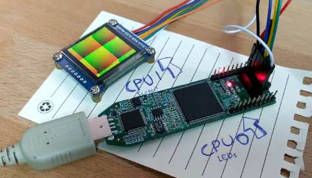
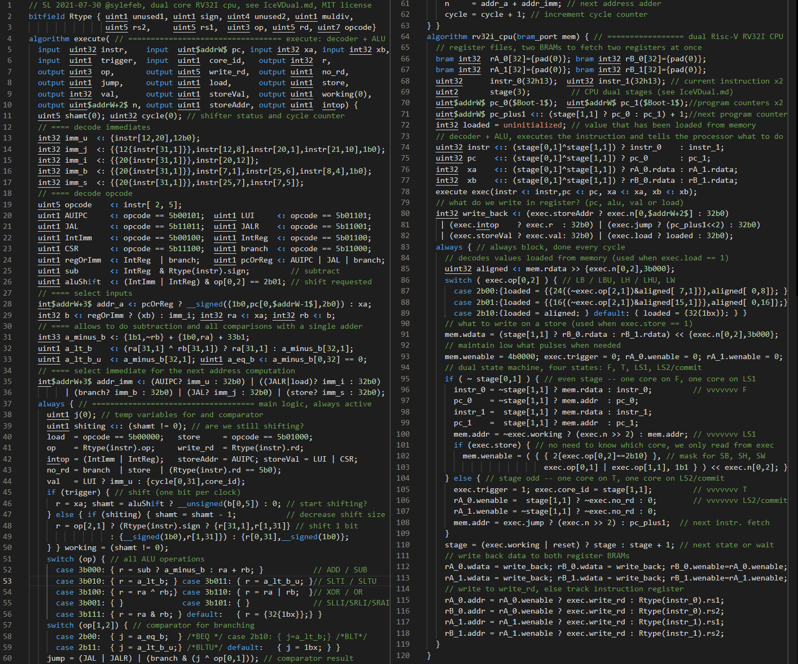
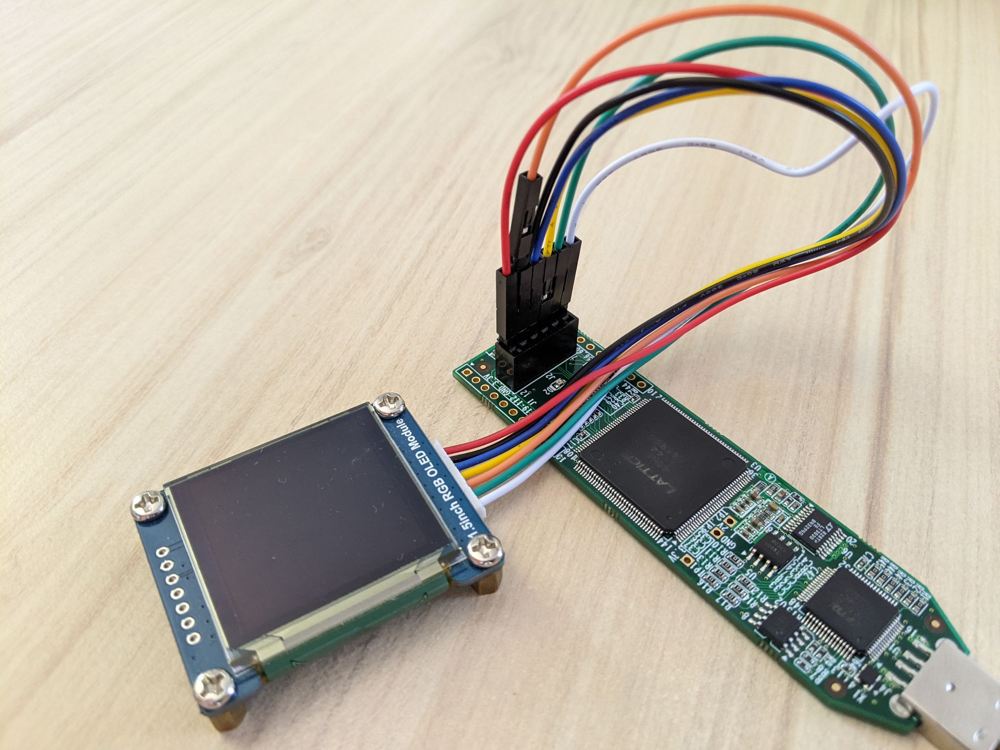

# The Ice-V-dual: a compact dual-core RISC-V RV32I implementation in Silice

The Ice-V-dual is a dual core version of the [Ice-V](README.md). It contains *two*
RV32I cores that work independently but share the RAM (code + data). Like
the Ice-V it is specialized to run from BRAM.

With its SoC it uses ~1240 LUTs on the IceStick and validates at ~55 MHz.
Each core is 4 cycles per instruction but for shifts (shifts are done one bit per cycle, both cores wait if one does ALU shifts - this is only to save LUTs, otherwise shifts could be one cycle). Cores retire instructions with a 2 cycles delay between them.
`rdcycle` is supported with a 31 bits counter, the LSB of `rdcycle` returns the CPU id.

The processor source code is in [ice-v-dual.si](CPUs/ice-v-dual.si), the SOC source code is in [ice-v-dual.si](SOCs/ice-v-soc-dual.si). Also
note that the Ice-V is available in [Silice RISC-V integration](../easy-riscv/README.md).

The following Section explains the processor design and how going from the [single core Ice-V](README.md) to the dual core version is actually relatively simple!

> If you only want to test the demos, jump directly to the [running the design and demos](#running-the-design-and-demos) Section.

> I made a talk about the Ice-V dual which you can [watch here](https://www.youtube.com/watch?v=fr4Dst1fQrk&t=6647s).

<center><i>One CPU controls the screen while the other controls the LEDs</i></center>
<p align="center">
  <br>
</p>

<center><i>The entire dual core processor code</i></center>
<p align="center">
  
</p>

## How is this possible?

It would seem that two CPUs should use twice the resources as one? Well not quite.
If we look carefully at the execution pattern of the Ice-V there are times where
parts of the logic is not used. This opens an interesting opportunity: could
we squeeze a second CPU (let's call it a second *core*) and use this logic when its free?

It turns out that yes, we can! But before we describe this in more details, let's
first recall the Ice-V execution pattern (even though the following explanations are self-contained, you might want to also check out the [Ice-V code walkthrough](README.md)). It comprises four states executed in sequence (1 cycle each):
1. `F` (fetched) A next instruction becomes available from memory (BRAM). Sets up reading register values as needed by the new instruction.
2. `T` (trigger) The register values become available. Triggers the decoder and ALU.
3. `LS1` (load-store 1) on a *load or store*, sets up the memory (BRAM) address and read/write mask.
4. `LS2/C` (load-store 2 / commit) Commits the result of a load or ALU operation by writing the result to a register (*write back*). Sets up the memory (BRAM) address to fetch the next instruction. This instruction will become available on the next cycle, back to step 1, `F`.

Note that we ignore here the special case of waiting for the ALU (on shifts). Let's
leave this aside for now, we'll come back to it later.

In the single core Ice-V, `LS1` is skipped when the instruction is not a load-store, resulting
in a pattern of 4 cycles for load-stores and 3 cycles for others. That's trying
to be as fast as possible. However making the pattern always 4 cycles opens interesting
opportunities. So let's consider the case where `LS1` is always done (and does nothing
if the instruction is *not* a load-store).

We get a clean, simple 4-cycles sequence: `F`, `T`, `LS1`, `LS2/C`.
The main resources used by the CPU are the BRAM (storing code+data), the registers
(in a separate BRAM, we'll simply refer to it as the 'registers' to avoid confusion),
the decoder+ALU. If we are to have two cores in a small design, they can at best
share the BRAM and the decoder+ALU. They need their own registers anyway (so
that execution context is independent).

Can we somehow reuse the BRAM and decoder+ALU? Let's tag when the resources are
accessed. This happens in between the steps as the clock ticks (accessed resources in parentheses, regsR for reading registers and regsW for writing to a register):

 |(bram+regW) | `F` | (regsR) | `T` | (d+ALU) | `LS1` | (bram) | `LS2/C` | (bram+regW) | ... |
 | --- | --- | --- | --- | --- | --- | --- | --- | --- | --- |

(this cycles indefinitely).

Obviously, a second core could not be aligned with the same pattern. However, if
we simply shift two cycles, we get this:

| *core 0* |..|(bram+regW) | `F` | (regsR) | `T` | (d+ALU) | `LS1` | (bram) | `LS2/C` | .. |
| --- | --- | --- | --- | --- | --- | --- | --- | --- | --- | --- |
| *core 1* |..| (d+ALU) | `LS1` | (bram) | `LS2/C` | (bram+regW) | `F` | (regsR) | `T` | .. |

See how in each column we get different resources every time, BRAM in particular? That's exactly what we want. Also note how the execution states become paired, we have either `F` / `LS1` or `T` / `LS2/C`. From this we can make the following table, which outlines the four possible execution stages:

| *stage*    | `F`__ | `T`__ | `LS1` | `LS2/C` |
| ---------- | --- | --- | ----- | ------- |
| 0 (2b00)   |  0  |  .  |   1   |   .     |
| 1 (2b01)   |  .  |  0  |   .   |   1     |
| 2 (2b10)   |  1  |  .  |   0   |   .     |
| 3 (2b11)   |  .  |  1  |   .   |   0     |

In fact, only two states in the FSM are really necessary (`F` / `LS1` and `T` / `LS2/C`) as indicated by the parity of *stage*. Which core is active is then
indicated by the most significant bit of *stage*. This makes for a very simple finite state machine! Everything is then carefully orchestrated such that resources have their correct values are exactly the right time. Consider for instance this part of the design:

```c
  // decoder + ALU, executes the instruction and tells the processor what to do
  uint32 instr <:: (stage[0,1]^stage[1,1]) ? instr_0 : instr_1;
  uint32 pc    <:: (stage[0,1]^stage[1,1]) ? pc_0    : pc_1;
  int32  xa    <:: (stage[0,1]^stage[1,1]) ? xregsA_0.rdata : xregsA_1.rdata;
  int32  xb    <:: (stage[0,1]^stage[1,1]) ? xregsB_0.rdata : xregsB_1.rdata;
  execute exec(instr <: instr,pc <: pc, xa <: xa, xb <: xb);
```
This selects which inputs go into the decoder+ALU (grouped in the `execute` algorithm) based on the value of `stage` (same as in table above). The instruction, program counters and register values are being selected. Note that  the decoder+ALU outputs have to be valid for both `LS1` and `LS2/C`, so their inputs are selected at the cycles before.

One complication is that the ALU, in order to save LUTs, is implementing a serial shifter (one bit is shifted at each cycle). A consequence is that we have to wait for the ALU in such cases. Due to the careful interleaving of both cores, we have little choice but to pause both. But where can we safely do that? It turns out the ideal place is during the `F` / `LS1` stages. First, it takes one cycle for the ALU to indicate it is busy, so that could not really be done during `T` / `LS2/C`. Second, the waiting core is then in the `LS1` stage, while the other core is stuck at `F` with the correct instruction in front of it. Upon resuming, everything will happen as if no pause had ocurred!

Upon pausing, the ALU sets `exec.working` to high. The pause is implemented by freezing the memory address in `LS1`:
```c
  // LS1
  // memory address from which to load/store
  mem.addr = ~exec.working ? (exec.n >> 2) : mem.addr;
```
and by similarly freezing `stage`:
```c
  // advance states unless stuck in ALU or reset is high
  stage = (exec.working | reset) ? stage : stage + 1;
```

## Running the design and demos

The ice-v-dual demos have been tested on both the IceStick and IceBreaker. Most demos require at least an OLED/LCD screen, some have audio (optional, but fun ; in most cases one CPU does graphics and the other streams audio).

### **Peripherals**

On the IceStick only the PMOD is used. On the IceBreaker use PMOD1A. **Beware** not to plug anyhting in the wrong orientation (VCC wire!): this may result in damage to the screen, the board, or both...

For the OLED/LCD screen, I mainly use [this model](https://www.waveshare.com/1.5inch-rgb-oled-module.htm) (128x128 RGB with SSD1351 driver). Any other screen with the same specs will do ; otherwise changes to [oled.h](src/oled.h) will be required.

The screen pinout uses only four wires of the OLED/LCD interface, leaving room for pluging an audio chip -- one goal is to turn this into a small gaming console ;)
The pinout for the screen is:
| PMOD            | OLED      |
|-----------------|-----------|
| PMOD1  (pin 78) | rst       |
| PMOD2  (pin 79) | dc        |
| PMOD3  (pin 80) | clk       |
| PMOD4  (pin 81) | din       |

The CS pin of the screen has to be grounded. One way to do this is to plug it on top of the ground pin plug, see the orange wire in the picture below.

<p align="center">
  
</p>

For audio I used a small PCM5102 breakout board (found mine on Amazon), which pinout is compatible with a half-PMOD. For more details on the audio part see also the [I2S audio project](../i2s_audio/README.md). The audio board plugs right next to the screen as shown below:
<p align="center">
  
</p>

Again, **beware of the orientation** as a VCC mismatch could likely damage the audio chip and/or the board.

### **Compiling / synthesizing**

As with all RISC-V designs, two things are necessary:
- Compiling RISC-V code (generates instructions)
- Synthesizing the hardware design and sending it to the FPGA

On the IceStick the instructions are embedded into the design, in BRAM initialized at FPGA startup. On the IceBreaker the code is also embedded, but this can be a bootloader that then loads code from SPIFLASH into SPRAM, where it can be executed. Thus, on the IceBreaker, much more memory is available than what fits in BRAM alone. The [boot process](src/icebreaker/boot_spiflash.c) is interesting in itself, but that in another story for later!

For compiling and synthesizing the design open a prompt in the `ice-v` directory. For compiling for the ice-v-dual on IceStick, plug-in the board and type in:
```
./compile/icestick/dual/compile_c.sh src/dual_demo.c
make icestick -f Makefile.dual
```

For compiling for the ice-v-dual on IceBreaker, plug-in the board and type in (note that the compilation script is in a different folder):
```
./compile/icebreaker/dual/compile_c.sh src/dual_demo.c
make icebreaker -f Makefile.dual
```
Note how much slower that is? This is because the FPGA fabric of the UP5K ice40 (the FPGA on the IceBreaker) is much slower, so we are limited to ~25 MHz while the IceStick runs at ~60MHz (and often higher). In exchange, the UP5K has SPRAM that we can use to our advantage! When compiling for the IceBreaker the SOC includes 64K of SPRAM (leaving another 64K for future extension) from which code can be executed. Because SPRAM cannot be initialized, the code has to be loaded there from SPIFLASH, a memory on the FPGA board that is relatively slow to read from but that can store a few megabytes. This is done by a [bootloader](src/icebreaker/boot_spiflash.c).

But let's go through the full process. First, we generate the ice-v-dual hardware with the compiled bootlader (plug-in the icebreaker before):
```
./compile/icebreaker/dual/compile_c.sh src/icebreaker/boot_spiflash.c
make icebreaker -f Makefile.dual
```
After this we compile a demo but this time we don't rebuild the hardware -- there is no need, the bootloader is already there to load code on startup. Instead, we will upload the complied code to SPIFLASH.

First, we compile the demo (note the use of a different script):
```
./compile/icebreaker/dual/compile_c_ext.sh src/dual_demo.c
```
Then, we upload it to SPIFLASH (plug-in the icebreaker):
```
make spiflash
```

As soon as this is done the demo starts. While this particular demo is still quite small, we could load a much bigger code that would enjoy the full 64KB space!

> **Note:** The `src/` directory contains many example to play with. Experiment! Nothing can break.
