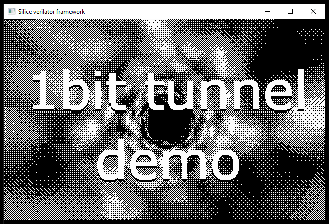

# The Ice-V-dual *fermata*
*dual-core, dual-memory interface RISC-V RV32I*

<p align="center">
  <br>
</p>

The Ice-V-dual *fermata* is a dual memory interface version of the [Ice-V dual](IceVDual.md). This means both cores can independently access memory, so if one is waiting the other is free to proceed (e.g. one core waiting for slow SPIflash while the other keeps executing from BRAM).

> *Fermata* is a musical term that refers to the prolongation of a note. This is what the ice-v fermata does, prolongating instructions while memory is busy. However, the *tempo* never stops and the internal state of the processor keeps going.

The original ice-v dual was designed around BRAM, assuming that memory can answer to a request in a single cycle. It therefore never waits for memory. The problem of course is that more complex memories have latency, and require pauses while data is being fetched.

While the original ice-v dual would not pause on memory accesses, it could pause on a busy ALU. Because the same ALU is shared between the cores this implies pausing *both* cores, interrupting the tempo: the processor state is no longer refreshed. This means that both cores are frozen until the ALU is done, as if time had ceased to pass.

> The ALU only needs additional cycles when shifts are performed at 1 bit per cycle, avoiding a barrel shifter that uses many LUTs. This is the default ; however setting `ICEV_FAST_SHIFT=1` will produce a barrel shifter eliminating pauses. The ice-v also has mul/div support (not full RV32IM support yet), which can be enabled by setting `ICEV_MULDIV=1`. Divisions also require multiple cycles and will pause both cores.

The way the ALU pauses is not something desirable for pausing on memory accesses. In most SOCs, the memory will be composed of fast and slow types of memory (BRAMs, SPRAMs, SDRAM, DDR, SPIflash, etc.), possibly with caches in between. If everytime one core starts accessing slow memory the other is also slowed down, we'll significantly degrade performance.

A better mechanism is required, which led to the *fermata* design. This requires two ingredients:
- A way for cores to prolong an instruction while waiting for memory.
- Two separate memory interfaces so that one can keep going while the other is waiting.

It might seem that having two memory interfaces means the cores are in different memory spaces. However, with a carefully designed memory controller we can ensure that both cores live in a same, consistent memory space while allowing one to keep executing from fast memory while the other is waiting on slower memory accesses.

Let's dive into the details!

> The ice-v fermata souce code is in [CPUs/ice-v-dual-fermata.si](CPUs/ice-v-dual-fermata.si).
The demo SOC source code is in [SOCs/ice-v-soc-dual-fermata.si](SOCs/ice-v-soc-dual-fermata.si) ;
the SOC is designed for the [icebreaker](https://1bitsquared.com/products/icebreaker) and simulation with Verilator. See [running the demo](#running-the-demo) below.

> The processor code is stable but not final, as it needs a bit of cleanup and optimization.

## Running the demo

For simulation, in a shell in this directory type:
```
make verilator -f Makefile.fermata_demo
```

To run on the icebreaker you will need a VGA PMOD. After plugging the PMOD to
the board and the VGA cable to a screen, connect the board to the computer through USB and run:

```
make icebreaker -f Makefile.fermata_demo
```

For details on the compilation process, please take a look
at [Makefile.fermata_demo](Makefile.fermata_demo).

The demo reproduces an old-school tunnel effect, which requires large
pre-computed tables stored in ROM. It uses both cores for faster drawing,
since all rendering occurs from the CPU cores directly into VRAM.

The main source code is [./src/tunnel_fermata.c](./src/tunnel_fermata.c)

> **Warning:** Once SPIflash enters the QPI mode, it might become impossible to program the board with iceprog. **Do not panic** (I did ;) ) you can recover by adding a jumper on the CRESET pins (may not be soldered, simply add a two pin header). Place a jumper, program, remove the jumper and you are back to normal.

<p align="center">
  <br>
</p>

## Memory interface

Since we are using a more elaborate memory, we need to define its interface.
There are various ways this can be done, but after various approaches I settled
on the one below, which essentially adds the `req_valid` and `done` signals
to the interface.

```c
interface icev_ram_user {
  output!  addr,      // memory address
  output!  wenable,   // write enable (one bit per byte)
  output!  wdata,     // data to be written
  input    rdata,     // data read from memory
  output!  req_valid, // pulses high when request is valid
  input    done,      // pulses high when request is completed
}
```

Note the use of `output!` (with a `!`) to indicate that the outputs are not
registered: the parent unit (memory controller) immediately sees changes to it.

## Processor

The ice-v takes four different stages in succession, over four cycles. In the table
below `0` indicates core 0 and `1` indicates core 1.

| cycle | *stage*    | `F`&nbsp;&nbsp; | `T`&nbsp;&nbsp; | `LS1` | `LS2/C` |
| ----- | ---------- | --- | --- | ----- | ------- |
| i     | 0 (2b00)   |  0  |  .  |   1   |   .     |
| i+1   | 1 (2b01)   |  .  |  0  |   .   |   1     |
| i+2   | 2 (2b10)   |  1  |  .  |   0   |   .     |
| i+3   | 3 (2b11)   |  .  |  1  |   .   |   0     |

Each core expects data from memory at stages `F` (next instruction is expected)
and stage `LS2/C` (on `LS2`, result from a load). Our goal is to allow the stages
to run freely, but do nothing when the last requested memory transaction is not
yet available.

First, we need to ensure the cores do not miss new data coming in:
```c
  uint1 reqmem0_done <:: reqmem0_was_done | :mem0.done; // combines current with past
  uint1 reqmem1_done <:: reqmem1_was_done | :mem1.done;
```
Note how `reqmem0_done` (resp. `reqmem1_done`) combines the input `mem0.done` at
this cycle with a variable `reqmem0_was_done`. The variable is updated every cycle
to remember that `done` pulsed high, even if the CPU was not in the right stage
to use this incoming data.

To wait for data while memory is busy, we record whether each core is waiting for
an instruction (`reqmem0_instr`/`reqmem1_instr`) or a load store
(`reqmem0_ldst`/`reqmem1_ldst`). These *wait bits* are set when a core wants to
fetch data, and lowered when this data is received in the corresponding stage.

Recall that the stages of the processor keep advancing as it waits for data,
so that while on core waits the other can execute. We therefore have to take
care that the stages do nothing (cancel their effect) if a wait bit is set.

This is done for instance in the `LS2/C` stage by canceling any write to registers
if the core is waiting for an instruction:
```c
  xregsA_0.wenable =  stage[1,1] ? (~exec.no_rd & ~reqmem0_instr) : 0;
  xregsA_1.wenable = ~stage[1,1] ? (~exec.no_rd & ~reqmem1_instr) : 0;
  //                                              ^^^^^^^^^^^^^^
  //                                 ignore if waiting for an instruction
```

Similarly, the ALU is normally triggered on stage `T` after an instruction was
received at the previous cycle, when register content is available. In the standard
design the ALU is always triggered, as there is always an instruction to process.
However, in the fermata the current instruction can be the same as before (this
is precisely the *fermata*: the core prolongates the instruction). Thus, we only
trigger the ALU when the instruction is first received ; this is the role of the
variable `instr_trigger`.

And this is it for basic operations! Please refer to the fermata's source code
as it contains comments on additional details.

## Memory controller

The demo SOC, which is meant for the ice40 UP5K FPGA (e.g. icebreaker board)
contains three types of memory: RAM, ROM and VRAM (video ram). All are exposed as
32-bits wide interfaces.
- RAM, maps to the UP5K 128KB SPRAM
- ROM, maps to part of the on-board SPIflash memory
- VRAM, maps to BRAM and is used for a framebuffer implementation

The memories are joined together is a single *composite* memory, using
different address ranges for each.

The composite memory exposes two independent interfaces. This means core 0 and
core 1 can independently access any of these three memories, in parallel.
What's more, the controller is designed such that if an interface is waiting
on a memory type (e.g. SPIflash has a large latency), the other interface can keep
running (as long as it does not access the same memory, of course). Here is the
declaration of the composite memory unit:
```c
unit composite_memory(
  icev_ram_user ram,
  icev_ram_user vrm,
  icev_ram_user rom,
  ram_provider  io0,
  ram_provider  io1,
) {
  // ...
```

It uses the `ram`,`vrm` and `rom` interfaces and exposes two `io0` and `io1`
interfaces for the CPU. It is important to remember that by design of the CPU,
the two cores cannot request a memory access at the exact same cycle.

The `ram` interface is expected to behave as BRAM/SPRAM that is it never blocks
and always returns in one cycle. Therefore, there cannot be any overlap between
`io0` and `io1` accesses, making this a trivial abitration.

The `rom` interface is the most complex since SPIflash has a multi-cycle latency.
Thus, the composite memory has to arbitrate between overlapping accesses from `io0`
and `io1`. A situation that is very likely to occur is that `io0` will want to access
the ROM while `io1` is already waiting for it. In such cases, the controller records
the request and triggers it as soon as the previous request is done.

> The address bus in the SOC is 20 bits, which implies that only
1MB of ROM can be addressed. It starts at offset 1MB in the SPIflash so use
`iceprog -o 1M` when uploading data to SPIflash. The bus width can be increased
if needed, at the expense of using more LUTs.

The `vram` interface is an interesting special case. The underlying memory is
a 32-bits wide BRAM, however this BRAM will be locked periodically by the framebuffer
refresh. Thus, the access requests from the CPU can be put on hold, by one additional
cycle at most in this design (the framebuffer is read only every 64 cycles, as we are
using 1 bit per-pixel and half the VGA resolution). Now, that might seem to warrant
for a full arbitration (as with ROM) but in fact, *assuming instructions are
never fetched from VRAM* there will always be a two-cycles gap between fetches
from both cores. This makes arbitration unecessary.

## Linker script and startup

The linker script is in [./compile/icebreaker-fermata/config_c.ld](./compile/icebreaker-fermata/config_c.ld).
It tells `gcc` where to place compiled code and data, using ROM for code and const
data by default. This can be overriden in firmware code. Declaring a function as ...
```c
__attribute__((section(".data"))) void func()
{
  /* ... */
}
```
... will place it in RAM. Well, it will in fact place it in ROM but it is copied in
RAM at startup, and then executed from RAM.

This startup process is not automatic, we have to do it in a special start glue code,
visible in [./compile/icebreaker-fermata/crt0_dual.s](./compile/icebreaker-fermata/crt0_dual.s).
This little piece of assembly takes care of the ROM to RAM copy expected by the
compiler.

What's different about it compared to single-core SOCs, is that we also have to
take care of the stack (a different `sp` pointer for each core) and also have
to synchronize the cores during init. Indeed, in the startup code `core1` is in
charge of the ROM to RAM copy. However, `core0` must not start before this is done,
otherwise it will try to execute code from RAM that is likely not there yet.

Thus, the startup code implements a synchronization mechanism with a lock in RAM.
First, `core0` lowers a barrier in the last RAM address:
```c
# core 0 only
li sp,65528    # end of SPRAM
li a0,65532    # barrier location
sw zero, 0(a0) # lower barrier (core0 waits for core1 while it copies into ram)
```
It then waits for the barrier to raise:
```c
wait:
   lw  a1, 0(a0) # read barrier state
   beq a1, zero, wait # if still low, wait
```
Meanwhile, after `core1` is done copying it raises the barrier:
```c
# raise barrier
li a0,65532 # barrier location
li a1, 1
sw a1, 0(a0)
```

This process works because there cannot be any overlap between both cores during
accesses in RAM, therefore accesses in RAM are atomic and immediately visible
by the other core.