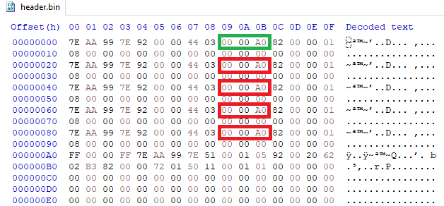

# Dynamic warm boot on the ice40, proof of concept

**TL;DR** *I teamed up with @juanmard and @unaimarcor to explore the possibility of manipulating warm boot addresses dynamically, from a running design. And it works! You can now fit as many bitstreams as you can in SPI-flash, and dynamically reboot to any of them from a running design, for no more than the cost of updating 4KB of SPI-flash.*

## Try it!

This proof of concept is designed for the IceBreaker. 

*From binary*

Plug your board, open a command line in this folder and run `./try.sh`

*From source*

Plug your board, open a command line in this folder and run `make`

## Warm boot?

If you are not familiar with the concept of *warm boot* on the ice40, do not worry, [read this tutorial first](../ice40-warmboot/README.md). I also recommend reading [@unaimarcor notes on the topic](https://umarcor.github.io/warmboot/).  

In the following I assume the reader is familiar with these basic ideas: 
- The ice40 can reboot itself and restart from any of four bitstreams stored in SPI-flash. This is achieved using the Verilog (ice40 specific) primitive `SB_WARMBOOT`.
- The addresses of the bitstreams are stored in a small table at the start of the SPI-flash. Let's call this the *header*. It looks like this:
<p align="center">
  
</p>

- The header table has actually five entries, one for the bitstream to load upon reset (green in image above), and four that can be dynamically selected when rebooting with `SB_WARMBOOT` (red in figure above).

This is great because writing a complete bitstream to SPI-flash is a relatively slow business, as they are relatively large (e.g. 32KB on IceStick, 104KB on IceBreaker). 

Also, `SB_WARMBOOT` allows a design to select which bitstream will be next from logic, paving the way to interesting effects, one being a bootloader menu to select between different designs.

## A bit of history

Normally, the warm boot is limited to the four bitstreams which addresses have been written down in the header (red rectangles in image above).

About four years ago (I write this in 2021) @juanmard made a [special version of `iceprog`/`icemulti`](https://github.com/juanmard/icestorm/) that can pack more than four bitstreams and can re-arrange entries in the header efficiently. This is very useful, but one drawback is that you still have to plug your device to the computer to swap the bitstreams. But @juanmard was already thinking about how to hot-swap the addresses in the header from a running design.

A few days back, [I started to tinker with the Fomu](https://twitter.com/sylefeb/status/1387884320359165956) and we were [discussing some SPI-flash difficulties with @brunolevy01](https://twitter.com/sylefeb/status/1388038336300920833). This is when I first encountered [foboot](https://github.com/im-tomu/foboot) and `SB_WARMBOOT`, which @juanmard and @unaimarcor kindly explained to us!

I found the idea quite amazing and put together [the demo](https://twitter.com/sylefeb/status/1388586566591913985) and [tutorial](../ice40-warmboot/README.md) about `SB_WARMBOOT`. 

But then, as we were discussing with @juanmard, we decided to investigate the hot-swap idea further. Here we are!

## Hot-swapping addresses in the SPI-flash header

The principle is quite direct, but SPI-flash write requirements makes it a bit more interesting. 

In this proof of concept (PoC) we will use three entries of the header:
- The reset bitstream address (green in image above), this will be a *bootloader*.
- The first bitstream address (first red) also pointing to the bootloader.
- The second bitstream address (second red), which will be the address of the next bitstream. This is the address we will manipulate directly. These are bytes 73, 74 and 75 in the header.

We will not use the other two entries in this proof of concept.

> **Note:** it might still be useful to use all entries to avoid rewriting the header too often.

Our goal is to make it so that the bootloader selects a new design to run, updating the second warm boot address (second red). It then resets and restarts from the new design using `SB_WARMBOOT`. When the design decides to stop it also uses `SB_WARMBOOT` to go back to the bootloader. This will select the first red entry, as `SB_WARMBOOT` cannot directly use the green one -- this one is selected upon an actual reset or power-up. 
The bootloader then selects the next design again, and uses `SB_WARMBOOT` again to reset to it. This loops back infinitely, chaining all designs:

*bootloader => design 0 => bootloader => design 1 => ... => design N => bootloader => ...*

The only limit is the SPI-flash size! 
Note how in this process only the second (second red in image) bitstream address is changed.

So, in the end, the only thing the bootloader has to do is to write a new address in bytes 73, 74 and 75 of the SPI-flash header? Yes! But not so fast. There is a catch... 

As far as I know, to write to SPI-flash we first need to erase *the entire 4 kilo-bytes sector* containing the address we want to write to. We have only 3 bytes to change, but this will require us to:
- read the first 4KB of SPI-flash
- modify the three bytes
- clear the entire first 4KB
- write back the updated 4KB data

This means we need 4KB of temporary memory ... This can be put in BRAM, but that is a lot of BRAM to spend. Instead, however, we can use the SPI-flash itself. 

Here is the idea. First, we duplicate the first 4KB in a 'far away' location that we call the *scratchpad*. Ideally the last 4KB of SPI-flash, but in this PoC I use a simple 1MB offset.

Then, the bootloader reads the three bytes at addresses 73, 74 and 75, getting the current address of the second warmboot bitstream. It increments it to go to the next design. 
Then, it copies the 4KB from scratchpad and *patches the address while it copies*. This is very simple: the copy occurs by chunks of 256 bytes, so when the first chunk is copied we intercept the values and modify bytes 73, 74 and 75 to be the new address.

In this IceBreaker PoC this is done with a RISC-V processor (I used my ~2K LUT [fire-v](../fire-v/README.md), but a much smaller [ice-v](../ice-v/README.md) or  [femtorv32](https://github.com/BrunoLevy/learn-fpga/blob/master/FemtoRV/TUTORIALS/DESIGN/FemtoRV32.md) would do!). I think a small hardware module could be design for that purpose as well.

Let's have a look at the PoC bootloader firmware code (C code running on RISC-V):

```c
void main()
{
  spiflash_init();

  // read address from current header
  spiflash_read_begin(73);
  next_bitstream_addr = 0;
  *((unsigned char*)(&next_bitstream_addr) + 2) = spiflash_read_next();
  *((unsigned char*)(&next_bitstream_addr) + 1) = spiflash_read_next();
  *((unsigned char*)(&next_bitstream_addr) + 0) = spiflash_read_next();
  spiflash_read_end();

  // update it
  if (next_bitstream_addr < (104250 + 7*104090)) {
    next_bitstream_addr = next_bitstream_addr + 104090;
  } else {
  	next_bitstream_addr = 104250;
  }
	
  // copy back
  spiflash_copy_patch_4KB(0x100000,0x000000,patch_vector); 
  
  // reboot to slot 1  
  while (1) {
  	*WARMBOOT = (1<<9) | 1;
  }
}
```

The address update assumes there are 8 bitstreams `104250 + 7*104090` but that could be any number.

And voilà!

## But why is this great?

First, you could put in SPI-flash many demos and create a nice bootloader with a visual menu to select from them.

But then, what this really is, is a 'meta' finite state machine, where designs can be hot-swapped to go to other designs. So you can split complex computations that would require too large a design into several steps (but of course the 'swap' here is quite slow -- 4KB SPI-slash copy -- so this will be good only for specific use cases).

One idea I want to pursue is to have one design that is packed (e.g. zipped), decompress itself in SPI-flash, and then jump to this new uncompressed version.

I mean, this stuff is amazing! What will *you* do with it?
