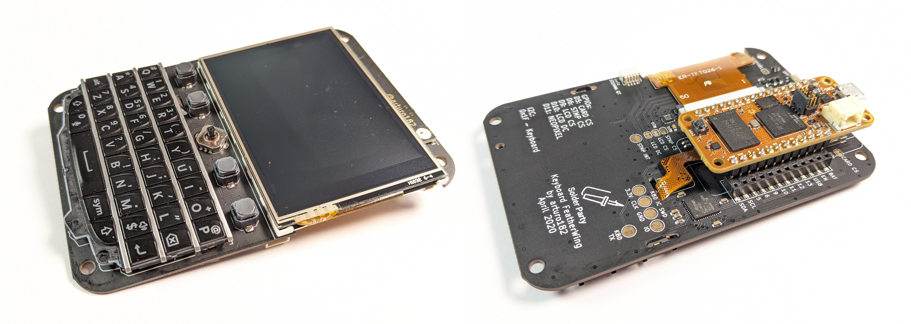
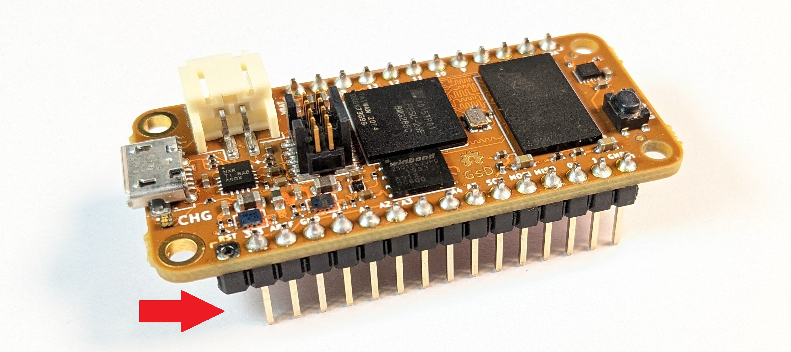
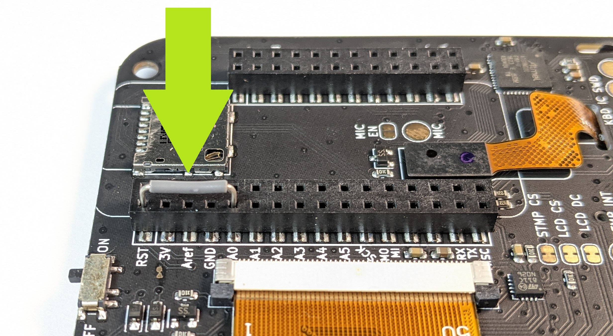
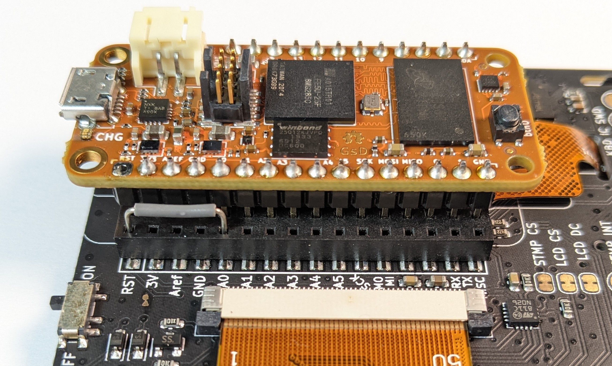
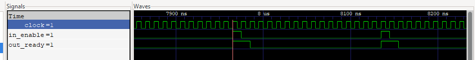

# Doom-fire on the OrangeCrab + Featherwing Keyboard

## TL;DR

Learn how to implement a full-screen Doom fire effect on the
OrangeCrab+Featherwing-keyboard,
using [Silice RISC-V integration](../easy_riscv/README.md) and the
[dual core Ice-V](../ice-v/IceVDual.md) (RV32I). These explanations
discuss the hardware setup and the implementation in Silice (FPGA hardware)
and C (firmware). Everything you need to start hacking!

> **Don't have the hardware?** Simply run `make verilator` from a shell in this directory for simulation.

<center></center>

## Overview

This project combines the
[OrangeCrab](https://github.com/orangecrab-fpga/orangecrab-hardware)
FPGA board (ECP5 25F) by [@GregDavill](https://twitter.com/GregDavill) with the
[Featherwing Keyboard](https://www.solder.party/docs/keyboard-featherwing/rev1/)
by [@arturo182](https://twitter.com/arturo182).
The project focuses on the display, using the onboard LCD 320x240 screen
(driver is the
[ILI9341](https://cdn-shop.adafruit.com/datasheets/ILI9341.pdf)), perfect for
some Doom-fire fun!

<center></center>

I won't spend too much time of the Doom-fire algorithm itself, for this please
refer to the excellent write up
by [Fabien Sanglard](https://fabiensanglard.net/doom_fire_psx/). Instead I'll
focus on explaining everything around it! We are designing our own hardware (*),
after all.

> (*) *By hardware I mean the FPGA part of it, not the physical device itself.
We're lucky to have this covered by @GregDavill and @arturo182 already ;)*

The project uses Silice RISC-V integration: we are going to create a hardware
framework around a RISC-V softcore, the [Ice-V dual](../ice-v/IceVDual.md).
You do not need to understand the processor specifically, only keep in mind
that it has two cores, and that a core always takes exactly 4 cycles per
instruction (so overall an instruction is executed every two cycles, interleaved
between CPU0 and CPU1).

The DooM fire is an interesting example, as we have to track the framebuffer on
the CPU side. Indeed, every frame the framebuffer is updated by reading
previous pixels values and applying a small change to them. Roughly: we move up,
dim and randomly offset previous pixels to create the flame effect.
Thus we'll be using a good chunk of BRAM to store the framebuffer
(the OrangeCrag ECP5 25F has plenty). This will be stored within the CPU RAM.

While we update the framebuffer each frame, we also want to send its content
towards the LCD screen. Things become more challenging here. The LCD driver uses
the SPI protocol. With a [simple SPI controller](../common/spi.si), it will
take roughly 16 cycles to send a single byte to the LCD.
We have to send three (RGB) per pixel. So just that, at full frame, means at
best `320*240*16*3` cycles per frame. Assuming a design running at a good
100MHz, that's ~34 milliseconds
(29 FPS). Quite ok, but that's assuming the CPU does nothing else! In practice,
because we lookup a color in a table, we are toping at ~40 milliseconds (25 FPS),
only sending the framebuffer.

> **Note:** we could move the palette lookup to hardware, but let's keep things
simple for this project!

But wait, we also have to update the framebuffer for the fire effect. This
also takes ~40 milliseconds (3.9 million cycles, at four cycles per
instruction, hence ~13 instructions per pixel). So now we're looking at 40 msec
for sending the framebuffer to the LCD and 40 msec for updating it.
On a single core we'd be down to roughly 12 FPS. Way too slow for a nice effect.

But we have two cores!! So let's make CPU0 in charge of sending the framebuffer
and CPU1 in charge of the update of the fire effect. No real need to sync them
as one *writes* to the framebuffer while the other one *reads* from it. Since the computations are balanced (~40 milliseconds both sides, that is no accident of course) we're in a good situation where the update rate matches the display rate.

## Hardware setup

Solder pins on the OrangeCrab feather connector being careful to have them on
the right side (the one allowing connecting it to the keyboard!). Please don't
laugh, I did get this wrong the first time (to my defense I did not know about
the keyboard yet... still...).

> **Important:** Do not solder the RST pin, leave it empty as on the image
below (left most pin is removed, see red arrow). The reason is explained later.

<center></center>

Next, plug the OrangeCrab into the Featherwing-Keyboard. We are however
not done yet: we need to add a small bridge between pin RST and A0, see green
arrow in picture below. This is made super-easy by the Featherwing two-rows
connectors.

<center>

<br>

</center>

Why do we have to do this? On the featherwing keyboard, the RST pin is connected to the
reset of most components, and has to be used to properly initialize them, the
screen in particular.
Problem is, on the OrangeCrab the RST pin is the FPGA reset. It can be
controlled from the FPGA design but pulling it low (reset is active low) resets
the FPGA *itself* ; thus everything immediately stops and we are stuck.

> **Note:** Alright, that's my understanding at least. Please let me know
if I got this wrong!

So instead, we do not use RST from the OrangeCrab, and bridge the A0 pin
from the OrangeCrab to the keyboard RST. A simple bypass! Now we can control
the featherwing keyboard RST independently, using A0.

## Running the demo

Plug the board while pressing the button (enters programming mode). Then from a shell in this directory:
```
make orangecrab
```

## FPGA design

Time to look at the Silice design! The design is in two parts, the RISC-V
processor instantiation and the hardware surrounding it. Here is the RISC-V CPU
declaration:

```c
riscv cpu_drawer(output uint1  screen_rst, // screen reset
                 output uint32 screen,     // screen command/data
                 output uint1  on_screen,  // pulses high when CPU writes screen
                 output uint32 rgb,        // send a pixel (RGB 24 bits)
                 output uint1  on_rgb,     // pulses high when CPU writes rgb
                 output uint32 leds,       // set on-board LEDs
                 output uint1  on_leds     // pulses high when CPU writes leds
                ) <
                  mem=98304, // we allocate a big chunk (framebuffer+code)
                  core="ice-v-dual", // dual core please
                  ICEV_FAST_SHIFT=1, // fast shifts (barrel shifter)
                  O=3        // compile with -O3
                > {
    /* === Firmware C code === */
    ...
}
```

The CPU only has outputs, since it only writes to the hardware (towards
the screen) and never reads its status (for now ... soon we'll be using this
keyboard, but one thing at a time!).

Let us start from the bottom of the list, the LEDs outputs.
We have one output called `leds` and one called `on_leds`.
Both are tightly related ; in fact, `on_leds` will pulse high whenever the CPU
writes to `leds`. So every time you see an input or output
`foo` and another one called `on_foo`, the same mechanism is automatically
created. This is the case for instance with `screen` / `on_screen`
and `rgb` / `on_rgb`.

How does the CPU writes to these outputs? Silice automatically generates C code
so that the firmware can call e.g. `leds(0x42)` to write `0x42` onto the output.
The hardware sees this update as soon as the instruction is executed, and
`on_leds` pulses exactly one cycle to indicate a write from the CPU. Convenient!

Here is a quick overview of what each set of outputs do:
- `screen_rst` / `screen` / `on_screen` : direct interface to the SPI controller
for the LCD. This is used by the CPU for initialization, see
[lcd_ili9351.h](lcd_ili9351.h)
- `rgb` / `on_rgb` : allows the CPU to write a RGB pixel (24 bits) and forget
about it while the hardware takes care of sending the three bytes. This reduces
CPU delays (recall each CPU instruction is 4 cycles).
- `leds` / `on_leds` : outputs to the board LEDs, also used in simulation to count
cycles between two `on_leds` pulses.

After the output we see the following lines in between `<` ... `>`
- `mem=98304,` this requests some amount of RAM for the CPU (in bytes), enough
for the framebuffer, code and stack (but most of it is framebuffer),
- `core="ice-v-dual",` this requests the ice-v-*dual* softcore,
- `ICEV_FAST_SHIFT=1,` specific to the ice-v softcores, we ask for a fast shift
(barrel shifter) that uses more LUTs but operates in one cycle,
- `O=3`, asks for `-O3` compilation level for the firmware (default is `-O1`)

### *Firmware*

The firmware code is well summarized by the C main function (putting in
parenthesis the outputs used by each part):
```c
  // firmware C main
  void main() {
    if (cpu_id() == 0) { // === CPU 0
      screen_init(); // init the LCD screen (screen_rst/screen)
      screen_rect(0,240, 0,320); // sets full-screen (screen_rst/screen)
      draw_fire();   // draws from framebuffer (rgb)
    } else {             // === CPU 1
      update_fire(); // updates the framebuffer
    }
  }
```
Simple, isn't it? Note the call to `cpu_id()` to identify the core ; this is
specific to the Ice-V dual. Also note that only CPU0 outputs to the hardware.
Both could, of course, but that would require synchronization (or careful
orchestration).

The pixels are actually written by these lines:
```c
  // palette lookup
  int *ptr = (int*)(pal) + clr;
  // send to screen
  rgb(*ptr);
  // insert a delay to wait for SPI completion
  asm volatile ("nop; nop; nop; nop; nop;");
```

The most important part is `rgb(*ptr);` which sends the 24bit RGB value to the
hardware. What's with all the `nop`s? (a `nop` is an instruction that does
nothing but waste cycles). Well, recall it takes time to write
the pixels to SPI, and our loop is actually too fast! So we have to make the CPU
wait a little bit, doing nothing.

### *Hardware*

Now, let's look at the hardware side of things. How is this `rgb` output dealt
with for instance?

First, the CPU is instanced and given a name:
```c
  // instantiates our CPU as defined above
  cpu_drawer cpu;
```
Yup, it's called `cpu` (!!).

Let's see where `rgb` / `on_rgb` are read. The bulk of the logic is
captured here:
```c
if (cpu.on_rgb) {
  // CPU requests RGB write
  // grab pixel data
  pix_data    = cpu.rgb[8,24];
  // initiate sending RGB
  pix_sending = 3b111;
} else {
  // if we can send, shift to next RGB component
  pix_data    = pix_send_ready ? pix_data>>8    : pix_data;
  pix_sending = pix_send_ready ? pix_sending>>1 : pix_sending;
}
// did we send this cycle?        vvv something to send    vvv SPI ready
pix_wait      = pix_wait ? 1b0 : (pix_sending[0,1] & displ.ready);
```

This tracks `cpu.on_rgb`, which pulses when the CPU outputs to `rgb`. The pixel
data is grabbed into a variable (`pix_data`) and the variable `pix_sending` is
set to `3b111`. This variable indicates at which step we are within the three
bytes send sequence. It is shifted every time a next byte is sent, along side
`pix_data`:
```c
// if we can send, shift to next RGB component
pix_data    = pix_send_ready ? pix_data>>8    : pix_data;
pix_sending = pix_send_ready ? pix_sending>>1 : pix_sending;
```

How do we know we can send the next byte? This is indicated by `pix_send_ready`
which is defined as:
```c
uint1  pix_send_ready  <:: displ.ready & ~pix_wait;
```
Here, `displ.ready` is the SPI controller indicating that it can accept the next
byte. However, we also need this `pix_wait` variable. This is due to a subtlety:
when we send an input to the SPI controller, it will still report ready at the
next cycle (`displ.ready`=1) ; see timing diagram below. This is due to the latencies in crossing
[registered outputs](../../learn-silice/AlgoInOuts.md).
After that point, ready will be low again. So `pix_wait` simply makes
sure we do not try to send again at the next cycle, despite `displ.ready`=1.

<center></center>

Before concluding let's have a quick look at the SPI driver instantiation:
```c
// screen driver
uint1 displ_en         <:: pix_sending[0,1] ? pix_send_ready
                                            : cpu.on_screen;
uint1 displ_dta_or_cmd <:: pix_sending[0,1] ? 1b1           : cpu.screen[10,1];
uint8 displ_byte       <:: pix_sending[0,1] ? pix_data[0,8] : cpu.screen[0,8];
spi_mode3_send displ(
  enable          <: displ_en,
  data_or_command <: displ_dta_or_cmd,
  byte            <: displ_byte,
);
```
The driver inputs `enable`, `data_or_command` and `byte` are respectively bound
to `displ_en`, `displ_dta_or_cmd` and `displ_byte`. So the driver will start
sending `displ_byte` when `displ_en` goes high. `displ_dta_or_cmd` is a single
bit used by the LCD controller to know whether we send a command or data.

Let's have a closer look at `displ_en`:
```c
uint1 displ_en         <:: pix_sending[0,1] ? pix_send_ready
                                            : cpu.on_screen;
```
What this says is that if we are sending a RGB pixel
(because the CPU called `rgb(.)`) then enable is tracking `pix_send_ready`,
otherwise we take orders directly from the CPU, tracking when `screen` is
written with `cpu.on_screen`.

But when is the SPI driver actually outputting to the FPGA
pins? This is done here:
```c
  G.oenable = 14b11111111111111;
  G.o       = {
    /*13:        */ 1b0,
    /*12:        */ 1b0,
    /*11:        */ 1b0,
    /*10:  lcd_dc*/ displ.spi_dc,
    /* 9:  lcd_cs*/ 1b0,
    /* 8:        */ 1b0,
    /* 7:        */ 1b0,
    /* 6: stmp_cs*/ 1b1,
    /* 5: card_cs*/ 1b1,
    /* 4:        */ 1b0,
    /* 3:        */ 1b0,
    /* 2:        */ 1b0,
    /* 1:        */ 1b0,
    /* 0:        */ 1b0
  };
  A.oenable = 6b111111;
  A.o       = {5b0,cpu.screen_rst};
```
where `G` refers to the feather connector GPIO pins and `A` to its so-called
*analog* pins (that's just their name, they are digital pins in our setup).
These pins are bidirectional so we first set them all as output `G.oenable = 14b11111111111111;` and then give them a value. The important ones are:
- `/*10:  lcd_dc*/ displ.spi_dc,` which reflects `displ_dta_or_cmd`,
- `/* 9:  lcd_cs*/ 1b0,`, `/* 6: stmp_cs*/ 1b1,` and `/* 5: card_cs*/ 1b1,`. The
SPI pins are shared between different peripherals, and the chip select (`cs`)
pins allow to activate/deactivate them. Here we only select the LCD (active low)
with `/* 9:  lcd_cs*/ 1b0`. How do I know this? From the
[featherwing keyboard doc](
https://www.solder.party/docs/keyboard-featherwing/rev1/)
of course!
- `A.o = {5b0,cpu.screen_rst};` this drive the RST pin through the bridge with
A0 we made during hardware setup. This is driven by the CPU through
`cpu.screen_rst` during initialization, see [lcd_ili9351.h](lcd_ili9351.h),
function `screen_init`.

## Conclusion

And that's all! Hopefully you got a sense on how simple it is to design hardware
around RISC-V cores with Silice, including some dual core fanciness.
Now it's your turn to experiment and hack, nothing can break!

> **Note:** Feedback is most welcome, please let me know what you thought about
this write up.
