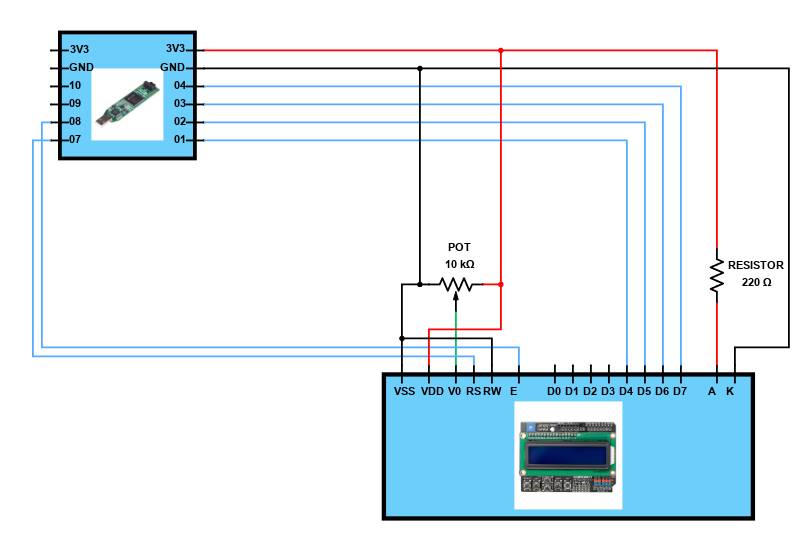
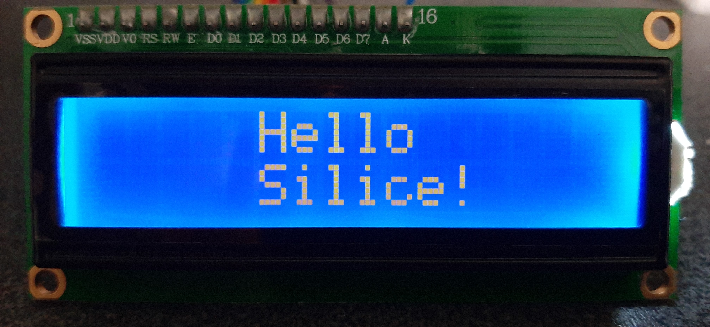

# LCD controller test

The controller is available [here](../common/lcd.ice).

Tested on:
- the iCEstick (`make icestick`)

## Pinout for the iCEstick

See [connector pins layout](../../frameworks/boards/icestick/icestick.pcf).

| iCEstick | LCD 1602 |
|----------|----------|
| PMOD8    | E        |
| PMOD7    | RS       |
| PMOD4    | D7       |
| PMOD3    | D6       |
| PMOD2    | D5       |
| PMOD1    | D4       |

## Full schematic

## Result

