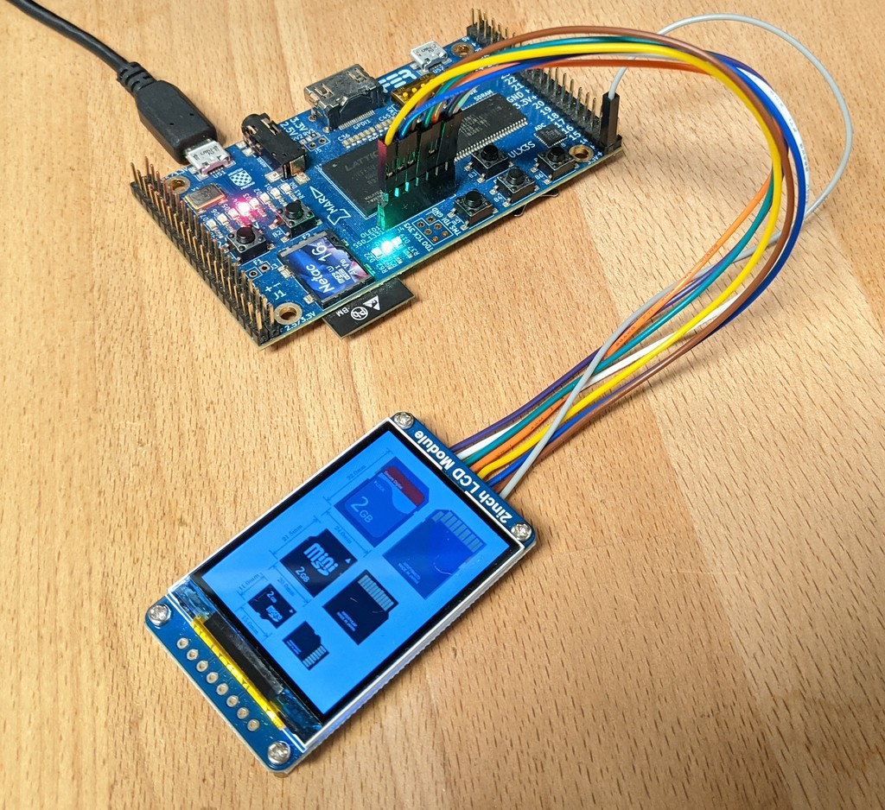

# SDcard test, using an OLED/LCD small screen.

## Content:

- *oled_sdcard_test.si* Allows to explore sectors, outputing the hex content on the screen. On the ULX3S the *fire* `f1`/`f2` buttons allow to go to previous/next sectors.

- *oled_sdcard_imgview.si* Displays a palleted image stored onto the SDcard. The input image (test.tga, 256 color palette) is turned into a raw file (*raw.img*) during compilation with `make ulx3s -f Makefile.imgview`. This file should be written to the SDcard at the start offset (0x00000000). For instance; under Windows this can be done directly using [Win32DiskImager](https://sourceforge.net/projects/win32diskimager/files/latest/download). **Beware that the SDcard formatting will be lost as well as all the data it contains**.

Tested on the ULX3S, with a 240x320 OLED screen (ST7789 driver) from Waveshare, plugged into the ULXS OLED pins.

<p align="center">
  
</p>

To test the raw SDcard dump, from a command line in this directory type:
```
make ulx3s
```

To test the image viewer, from a command line in this directory type:
```
make ulx3s -f Makefile.imgview
```
(do not forget to write *raw.img* on the SDcard after compilation, and insert the card in the ULX3S).

## Compatibility

This has been tested only on a couple SDcards. Works only with SDHC/SDXC cards (partial protocol implementation). Quite slow (always uses initialization frequency for now).

## Credits

The test image is a crop from Wikipedia: https://en.wikipedia.org/wiki/SD_card
