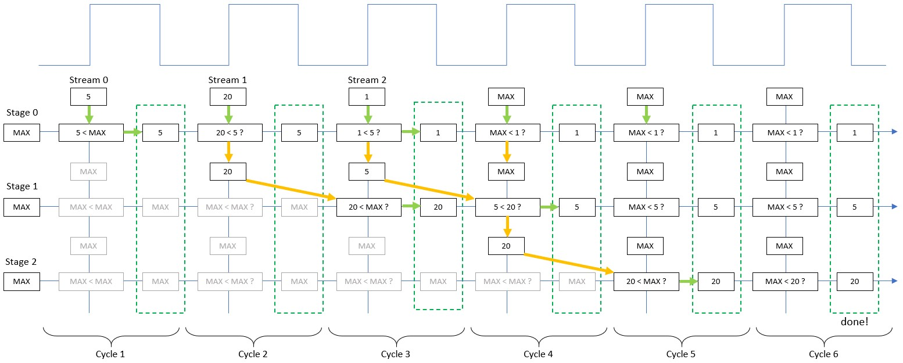

# Pipelined sort (linear time)

A sort has to be n.log(n), right? Well, not if you can design a pipelined architecture!

**Note:** This is a toy example demonstrating Silice pipelines, as well as Silice pre-processor for code generation.

## What this does

This algorithm is designed to sort a stream of N values as they come in. The sort is pipelined such that
if N values are received, they are sorted N cycles after the last one came in (linear time!). 
Of course there is no free lunch, and this comes at the cost of a pipeline of depth N. 
So beyond being a fun -- and hopefully interesting -- example, this will only be useful in practice for 
relatively small values of N. But such cases do occur in practice, and this algorithm may come in handy.

## How to test

Run `make verilator` or `make icarus` (the latter will open gtkwave with the simulated waves).

You will see a list of sorted entries, such as:

```
[          0] =   1
[          1] =   4
[          2] =  45
[          3] =  50
[          4] =  78
[          5] =  89
[          6] = 122
[          7] = 131
[          8] = 144
[          9] = 149
[         10] = 181
[         11] = 190
[         12] = 206
[         13] = 209
[         14] = 219
[         15] = 228
```

## Walkthrough the code

Now, let's have a look at [main.ice](main.ice).

The algorithm is built around a main while loop:
```c
  uint8 i = 0;
  while (i<$2*N$) {
     ...
  }
```
The pipeline is within the loop, and the loop iterates 2.N times to ensure the pipeline is fully flushed at the end (N cycles
after the last value is inserted).

The syntax `$2*N$` is using the Lua preprocessor. Indeed N is a preprocessor variable defined before with this line:
```c
$$N=16
```
Using `$$` at the start of a line indicates that the entire line is preprocessor code, while using `$...$` within a line of 
code inserts the preprocessor result within the current code line. So for instance `$2*N$` becomes `32` when N=16.

This loop inserts (streams) the values from the `in_values` into the pipeline. For each iteration
below N, a value is read from `in_value` and placed in front of the pipeline top stage. For iterations
above N we insert the MAX value, which in our case is 255, so that they no longer influence the result.

```c
to_insert_0 = i < $N$ ? in_values[i] : 255;
```

Again, the last N iterations are only here to flush the pipeline, ensuring the last inserted value
can fully propagate ; with this simple algorithm this requires N cycles.

Now, let's have a look at a single pipeline stage. From the point of view of a single stage things are fairly simple. 
Stage $n$ is responsible for the value stored at rank $n$ in the sorted array. The stage receives a value to be inserted. 
If the received value is larger than the one at rank $n$, it is simply passed further down the pipeline. 
If the value to insert is smaller than the one at rank $n$, it evicts and replaces it. 
The evicted value is passed to subsequent stages for further insertion.   

```c
  if (to_insert_$n$ < sorted_$n$) {  // if the value to insert is smaller, we insert here
    to_insert_$n+1$ = sorted_$n$;    // the current value is evicted ...
    sorted_$n$      = to_insert_$n$; // ...  and becomes the next one to insert
  } else {
    to_insert_$n+1$ = to_insert_$n$; // otherwise, the value has to be inserted further
  }
```

Each stage `$n$` uses two variables: `to_insert_$n$` and `sorted_$n$`.
The variables `sorted_$n$` actually are the result array. At the end `sorted_0` contains the smallest value and
`sorted_$N-1$` the largest. The role of each pipeline stage is to compare the current value of `sorted_$n$`
with the incoming value of `to_insert_$n$`. If `to_insert_$n$` is smaller, then the value of `sorted_$n$` is evicted,
replaced by `to_insert_$n$`, and the evicted value becomes the one to insert at stage n+1: it is stored
in `to_insert_$n+1$`.

The really interesting thing here is that all stages execute in parallel, such that the evicted values trickle down
the pipeline all together, at each clock cycle. It takes N cycles to flush the pipeline, as if the last inserted
value is the largest one it has to trickle down all N stages.

Now that we understand each stage, how do we tell Silice to build a pipeline? The syntax is simply:
```c
{
  // stage 0
} -> {
  // stage 1
} -> {
  // final stage
}
```
Silice takes care of the rest. Please refer to the documentation for more details on pipelines.

As our pipeline depth depends on the value of N, we build it with the preprocessor:
```c
$$for n=0,N-1 do
    {
      // [removed] code for stage n
    }
$$if n < N-1 then
    -> // pipe to next stage (if not last)
$$end    
$$end
```

And that's it! We have a linear time sorting algorithm for an incoming stream of values.

## Example run

The following figure illustrates a run for N=3. It takes 6 cycles to guarantee that the sort is fully terminated. 

The figure shows 6 clock cycles from left to right. For each cycle, we see the incoming stream value at the top, the comparisons of each stage (vertically) and the values to insert trickling down the pipeline (orange arrows). The horizontal green arrows show when a value is changed in the sorted array.

For instance, consider the value `20`. Its insertion starts at cycle 2. Stage 0 pushed it down as it is greater than `5`, already inserted there. On cycle 3, `20` evicts `MAX` and replaces it in the result array. However, `1` started its insertion at cycle 3 and evicted `5`. On cycle 4, `5` reaches stage 2 and evicts `20`. On cycle 5, in stage 3, `20` evicts `MAX` and replaces it in the result array.



## Further reading

For efficient sorting in parallel refer to [sorting networks](https://en.wikipedia.org/wiki/Sorting_network). 
Typical parallel algorithms are [odd-even sort](https://en.wikipedia.org/wiki/Odd%E2%80%93even_sort) and [bitonic sort](https://en.wikipedia.org/wiki/Bitonic_sorter). 
