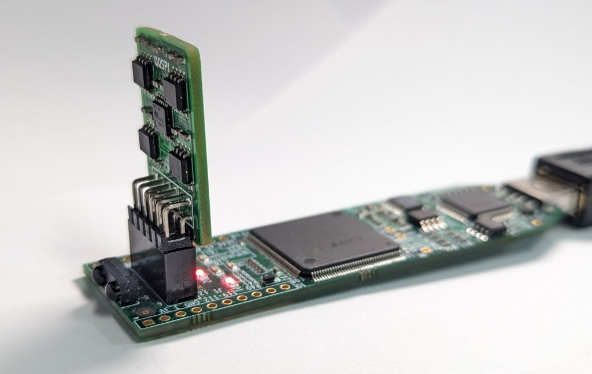
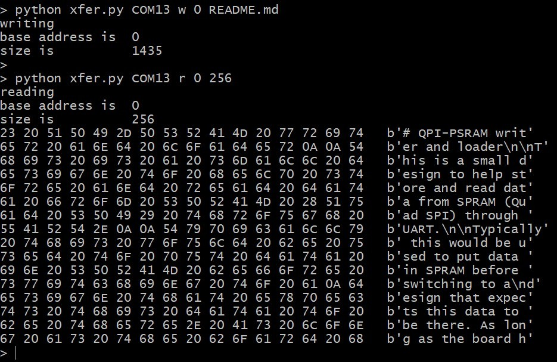

# QPI-PSRAM writer and loader

This is a small design to help store and read data from SPRAM (Quad SPI) through UART.

Typically this would be used to put data in SPRAM before switching to a
design that expects this data to be there. As long as the board has
power, the written data should remain in SPRAM.

> Tested on the mch2022 badge (built-in SPRAM),
> icebreaker and icestick ([QQSPI pmod](https://machdyne.com/product/qqspi-psram32/) from @machdyne).

> Prebuild bitstreams are in `bistreams`.

<p align="center">
  
</p>

___

To build, run
```
make <board>
```

To send data, run
```
python xfer.py <uart port> w <offset> <file>
```
where `<uart port>` is
typically `/dev/ttyACM1` under Linux and e.g. `COM6` under Windows.
`offset` is the address where to store in SPRAM and `file` is the data file.

To read data, run
```
python xfer.py <uart port> r <offset> <size>
```
where `<uart port>` is
typically `/dev/ttyACM1` under Linux and e.g. `COM6` under Windows.
`offset` is the address where to store in SPRAM and `size` is the number of byte to read. The received data is displayed in the console.

<p align="center">
  
</p>

___

## Limitations

- If the transfer is interrupted (e.g. CTRL-C) the design will end up in an undetermined state. Simply reprogram the board.
- When experimenting with QPI it can happen that interrupted or wrong commands put the SPRAM in a state that cannot be easily recovered from. In such cases unplug the board, plug again, reprogram (keep in mind the SPRAM is *not* reset when reprogramming the FPGA).
