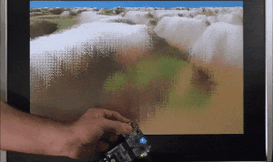
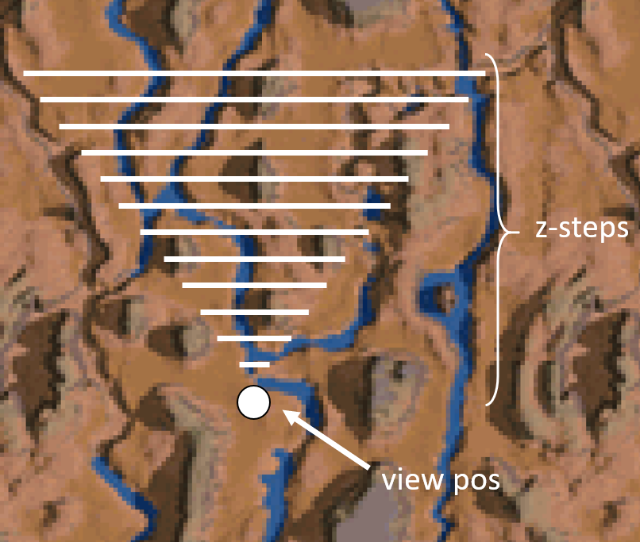
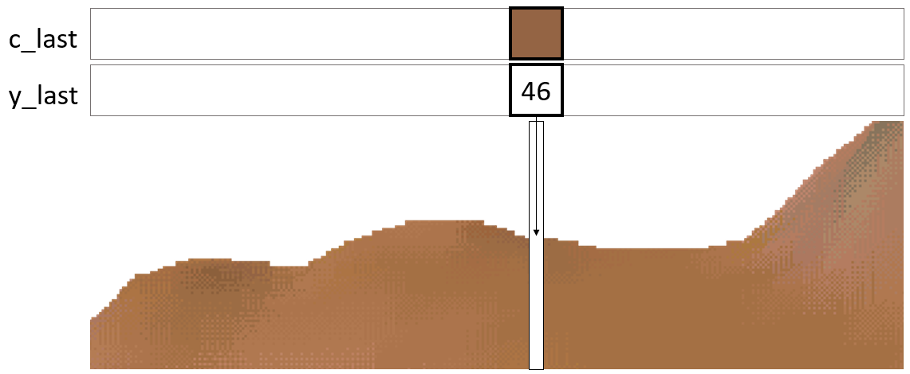
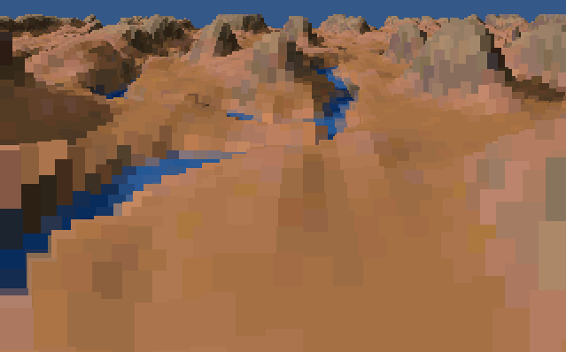
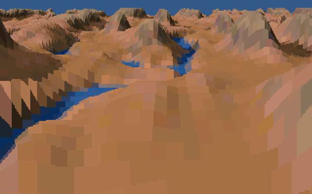
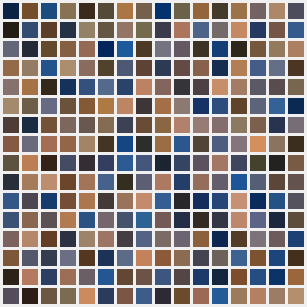
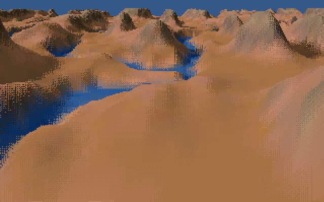

# Tiny terrain renderer on ice40 UP5K

This project is a recreation in FPGA hardware of the classic Novalogic Voxel Space terrain renderer featured in games such as [Comanche](https://en.wikipedia.org/wiki/Comanche_(video_game_series)).

It was developed and tested on an [IceBreaker board](https://1bitsquared.com/collections/fpga/products/icebreaker) with a Digilent VGA PMOD.

The code is in Silice, but most concepts are general and will map directly to other HDLs.

<p align="center">
  
</p>

### **How to test**

*From pre-build binaries*

Plug your Icebreaker + VGA PMOD, then from a command line in this directory `./try.sh`

*From source*

In addition to Silice, a RISC-V compilation environment is needed, see [Getting Started](../../GetStarted.md).

- **With an Icebreaker**: plug your board, then from a command line in this directory `./build.sh`
- **In simulation**: from a command line in this directory `./simul.sh` ; this requires the [Verilator framework](../../GetStarted.md).

> **Note:** As of writing there is an [open issue](https://github.com/YosysHQ/yosys/issues/2648) regarding yosys ice40 DSPs that will prevent the demo from running properly. I have [issued a patch](https://github.com/sylefeb/fpga-binutils/blob/master/patches/yosys_patch_ice40_dsp.diff). If you are under MinGW64 using my [pre-compiled toolchain](../../GetStarted_Windows.md) nothing to worry about, yosys is already patched.

### **Design files**

- [`main.si`](main.si) is the main framework.
- [`terrain_renderer.si`](terrain_renderer.si) is the hardware renderer.
- [`firmware.c`](firmware.c) is the RISC-V firmware code.

Each file is commented, but I recommend reading through this first.

For more details on the Risc-V implementation see the [fire-v project](../fire-v/README.md) (but here it is only used for copying data around).

## Revisiting the Voxel Space algorithm in hardware

The main principle of the terrain renderer is similar to the Voxel Space
renderer. The [github repo by s-macke](https://github.com/s-macke/VoxelSpace) gives an excellent overview of the algorithm. I give below some explanations to make this README self-contained but please checkout [s-macke](https://github.com/s-macke/VoxelSpace)'s page for more details and illustrations.

### **First, some memory considerations**

A first challenge in fitting this on an UP5K is the limited memory. A terrain renderer typically uses a large amount of memory to store the terrain data: elevation and color map.

Our UP5K FPGA features two types of specialized memories: BRAM ([Block RAM](https://www.nandland.com/articles/block-ram-in-fpga.html)) and SPRAM (Single Port RAM). These are very fast, returning a value in a single clock cycle, but they are also in limited supply: we have 128 kilobytes in four SPRAMs (each 32 kilobytes), plus 120 kilobits (*bits* not *bytes*) of dual-port BRAM. That's not much. In contrast, a single map of the original Comanche game is 2 *Mega*bytes (color + height), and a 320x200 framebuffer is already 64 kilobytes (320 x 200 x 8 bits for a 256 colors palette).

Of course we can always downsample the maps, and we will do just that, using maps of 128x128 pixels. However the loss in resolution is extreme, and the results on screen would be far from pleasing using the original algorithm. So we cannot stop there, we need some tricks. In particular, we will resort on both interpolation and dithering. More on that later.

Many rendering algorithms require two framebuffers: one is displayed while the next frame is drawn in a second buffer,  hidden from view. This is called *[double buffering](https://en.wikipedia.org/wiki/Multiple_buffering)*. It is important when, for instance, the previous view has to be cleared before drawing afresh. However, our terrain renderer draws the view from front to back, allowing to use a single framebuffer. As the next frame is quite similar to the previous one (the viewpoint changes progressively), the difference will not produce perceivable flickering as the frame is drawn in front of our eyes, apart from a potential screen tearing effect.
This means we can allocate 64 kilobytes to a single full 320x200 8 bits framebuffer. (*Note:* a first version was using two 4 bits framebuffers, and it was looking quite good! but the extra color depth can be useful for future extensions and a more varied terrain.)

Alright, so we've settled on a 8bits color palette, maps of 128x128 and screen resolution of 320x200. Our memory budget looks like that:
- 128x128 8 bits terrain height (16KB)
- 128x128 8 bits terrain color  (16KB)
- one 320x200 8 bits framebuffer (64KB)
So that's a grand total of 96KB, leaving some free SPRAM for future expansions.

This also fits nicely in four SPRAMs:
- SPRAM A, 32KB, framebuffer, 4bits of each pixel (least significant)
- SPRAM B, 32KB, framebuffer, 4bits of each pixel (most significant)
- SPRAM C, 32KB, interleaved height + color data (16bits per pixel)
- SPRAM D, 32KB, free!

In Silice, creating the SPRAMs first requires to include a Verilog module instantiating the vendor-specific primitive (we are looking at [main.si](main.si)):
```c
import('../common/ice40_spram.v')
```
(quick look at [ice40_spram.v](../common/ice40_spram.v), quite simple)

Then we instantiate all three SPRAMs. Two for the framebuffer:

```c
// SPRAM 0 for framebuffer
uint14 fb0_addr(0);
uint16 fb0_data_in(0);
uint1  fb0_wenable(0);
uint4  fb0_wmask(0);
uint16 fb0_data_out(0);
ice40_spram frame0(
  clock    <: vga_clock,
  addr     <: fb0_addr,
  data_in  <: fb0_data_in,
  wenable  <: fb0_wenable,
  wmask    <: fb0_wmask,
  data_out :> fb0_data_out
);

// SPRAM 1 for framebuffer
uint14 fb1_addr(0);
uint16 fb1_data_in(0);
uint1  fb1_wenable(0);
uint4  fb1_wmask(0);
uint16 fb1_data_out(0);
ice40_spram frame1(
  clock    <: vga_clock,
  addr     <: fb1_addr,
  data_in  <: fb1_data_in,
  wenable  <: fb1_wenable,
  wmask    <: fb1_wmask,
  data_out :> fb1_data_out
);
```

Note how we create Silice variables before binding them with the `<:` and `:>` syntax for inputs/outputs. By reading/writing these variables we will control these modules.

And then one for color and heightmap:

```c
// SPRAM for packed color + heightmap
// - height [0, 8]
// - color  [8,16]
//
uint1  map_write(0);
uint14 map_waddr(0);
uint16 map_data(0);
uint14 map_raddr(0);
uint14 map_addr    <:: map_write ? map_waddr : map_raddr;
uint1  map_wenable <:: map_write;
uint4  map_wmask   <:: 4b1111;
uint16 map_data_out(0);
ice40_spram map(
    clock    <: vga_clock,
    addr     <: map_addr,
    data_in  <: map_data,
    wenable  <: map_wenable,
    wmask    <: map_wmask,
    data_out :> map_data_out
);
```

This last one has some of its inputs using bound expressions (with the `<::` syntax). For instance `map_addr` will be either `map_waddr` or `map_raddr` depending on the value of `map_write`.

### **Algorithm overview**

The design for the renderer is in [`terrain_renderer.si`](terrain_renderer.si).

This demo implements the simplest form of the algorithm, which renderers a viewpoint
aligned with the y-axis. This means we are looking along y, and that the screen x-axis is aligned with x-spans of the terrain data.

Rotations are thus not yet possible (but of course a natural extension!).

The view is renderer front to back in a sequence of *z-steps*. Each z-step traverses the data along the x-axis as shown below: each white line (one z-step) is sampled 320 times (the screen width) to get the terrain height on a given screen column while the x-axis is traversed.

<p align="center">
  
</p>

The z-steps are produced in the loops:
```c
while (iz != $z_num_step$) {
  ...
  // go through screen columns
  x = 0;
  while (x != 320) {
    ...
  }
}
```

Given the height for the screen column at x, we compute the y position on screen by perspective projection (division by the distance from view). We then draw a vertical segment, from the position of the last z-step to the new one.
The animation below reveals the z-steps, drawn one after the other from front to back.

<p align="center">
  
</p>

The vertical spans are written in the loop:
```c
// fill column
while (y_last.rdata != 0 && y > y_screen) {
  ...
}
```

Between each z-step, two arrays `y_last` and `c_last` record the color and screen height reached by the previous z-step. The height is used to restart from this height when drawing the next z-step. Note that the height of the next z-step could be below due to a downward slope and/or the effect of perspective, in which case nothing is drawn. A nice property of this approach is that pixels are drawn only once!

<p align="center">
  
</p>

When the last z-step is reached, we draw a sky segment up to the top of the screen, completing the frame.

Colors are recorded along the z-step for dithering. More on this below, but first let's talk about the framebuffer!

### **The framebuffer**

The design generates a 640x480 VGA signal, fed into the VGA PMOD which implements a 6 bits Digital to Analog Converter (DAC). While the DAC is 6 bits, we have an 8 bits RGB palette internally, so if you have a better DAC, you can get the full color depth.

The VGA signal is created using the VGA controller provided with Silice: [`../common/vga.si`](../common/vga.si).

As the VGA signal is produced, the VGA module gives us screen coordinates and expects a RGB color in return. We will store our framebuffer in SPRAMs, and thus have to access the memory as the VGA signal is produced (e.g. we'll be *racing the beam*).

An SPRAM is used as follows: at a given cycle we set an address and ask either to read or write -- we cannot do both at once. On the next cycle the memory transaction is done (data is available if we were reading), and we can immediately do another memory request. So we can read or write one value every cycle, at any address. A huge luxury when it comes to memory!

As discussed earlier, we will use a single 320x200 8 bits framebuffer stored across two 32 kilobytes SPRAMs. The 8 bits of a pixel are split as 4 bits in each SPRAM. This has the advantage that both SPRAM are accessed with the same addresses: to retrieve pixel 0 we read address 0 and get the four least significant in the first SPRAM and the four most significant bits in the second SPRAM.

The ice40 SPRAMs are 16 bits wide. This means that we read 16 bits at once at a given address. As we read two SPRAMs simultaneously we get 32 bits, or four 8 bits pixels. This is great, because it means that we will not have to read often from the framebuffer as the VGA signal is produced. It gets even better: our VGA signal has a 640 pixels horizontal resolution, while we want to output only 320 pixels horizontally. So we only have to read once in the SPRAMs to cover 8 screen pixels. That is one read every 8 clock cycles. During the seven other cycles the SPRAMs are free. Why does it matter? Well we also have to write the rendered image into the framebuffer!

The table below shows what happens every eight cycles. On cycle 7 we read (R) four pixels. Every two other cycles we shift (>>) the read values to obtain the next pixel.
| 7 | 0 | 1 | 2 | 3 | 4 | 5 | 6 | 7 | 0 | 1 | 2 | 3 | 4 | 5 | 6 | 7 |
|:-:|:-:|:-:|:-:|:-:|:-:|:-:|:-:|:-:|:-:|:-:|:-:|:-:|:-:|:-:|:-:|:-:|
| R |   |>> |   |>> |   |>> |   |R  |   |>> |   |>> |   |>> |   | R |

It is important to understand why we read on cycle 7: the SPRAM takes one cycle to retrieve the data. If we ask for pixel 0 on cycle 0 it is already too late! We need to be one cycle in advance.

How do we implement this in practice?

In [`main.si`](main.si) we have two variables controlling the synchronization: `frame_fetch_sync` and  `next_pixel`.

`frame_fetch_sync` is a `uint8` initialized to `1` and is updated each cycle as
```c
frame_fetch_sync = {frame_fetch_sync[0,1],frame_fetch_sync[1,7]};
```
in the `always_after`, at the end of each cycle.

`next_pixel` is a `uint2` initialized to `1` and is updated each cycle as
```c
next_pixel = {next_pixel[0,1],next_pixel[1,1]};
```
in the `always_after`, at the end of each cycle.

By testing `frame_fetch_sync[0,1]` we determine when to read in the framebuffer SPRAM (the `R` step above). By testing `next_pixel[0,1]` we determine when to shift to obtain the next pixel (`>>` step above). This is performed in the `always_before` block:

```c
always_before {

    // Updates the four pixels, either getting data from spram or shifting them to go to the next one.
    // This is controlled through the frame_fetch_sync (8 modulo) and next_pixel (2 modulo).
    // As we render 320x200 4bpp, there are 8 clock cycles of the 640x480 clock for four frame pixels.
    // Note that the read from SPRAM is prepared on the cycle before, when frame_fetch_sync[1,1] == 1
    four_pixs = frame_fetch_sync[0,1]
              ? {fb1_data_out[12,4],fb0_data_out[12,4], fb1_data_out[8,4],fb0_data_out[8,4],
                 fb1_data_out[ 4,4],fb0_data_out[ 4,4], fb1_data_out[0,4],fb0_data_out[0,4]}
              : (next_pixel[0,1] ? (four_pixs >> 8) : four_pixs);

    // query palette, pixel will be shown next cycle
    palette.addr0 = four_pixs[0,8];

  }
```

Now there are some slight complications to ensure everything happens in sync and is ready at the start of every frame and row. I won't go through all details, but checkout `pix_fetch` and `next_frame` if interested.

As we read from the SPRAMs every eight cycles, we let the terrain renderer know when it can write through the `write_en` variable.
The terrain renderer then disables its writes (skipping one cycle) whenever `writen_end` is low:

```c
fb.in_valid = write_en;
// ...
y           = write_en ? y - 1 : y; // incremented only if we could write
```
This has to happen in advance, taking into account latencies throughout the design which is why `write_en` is:

```c
  uint1 write_en <:: ~ frame_fetch_sync[3,1]; // renderer can write only when framebuffer is not read
  //                                    ^ we cancel writes just at the right time to ensure that when
  //                                      the framebuffer value is read a write is not occuring
```

### **Blocky results and interpolation to the rescue**

If implemented as described so far, the results would be very blocky:
<p align="center">
  
</p>

This, of course, is due to the low 128x128 resolution of the height map and color map. In computer graphics (and many other fields!) the first thing that comes to ming is 'let's interpolate the data!'. Btw, this was one of the huge steps forward when GPUs were introduced. I vividly remember the jump in quality between the *Tomb Raider* software renderer and the *3dfx* one -- a lot of it was due to the nice smooth bi-linear texture interpolation! So, we know what to do, let's interpolate.

Interpolating the z-coordinates is relatively straightforward, and in this axis aligned version, we actually only have to interpolate between two samples during the x traversal of each z-step (but the code has a full bilinear traversal commented out, for future use ;) ). The linear interpolator is simply:

```c
algorithm interpolator(
  input  uint8 a,
  input  uint8 b,
  input  uint8 i,
  output uint8 v
) <autorun> {
  always {
    v = ( (b * i) + (a * (255 - i)) ) >> 8;
  }
}
```

This takes 8 bits values `a` and `b` and another 8 bit interpolator `i`. It outputs an 8 bits `v` such that `v == a` if `i == 0` and `v == b` if `i == 255`. In fact, linear interpolation is indeed very simple (and gets nicely mapped to DSP blocks by Yosys!).

The actual interpolation of elevation is done here:
```c
  // sample next elevations, with texture interpolation
  // interleaves access and interpolator computations
  map_raddr  = {l_y[$fp$,7],l_x[$fp$,7]};
++:
  h00        = map_rdata;
  map_raddr  = {l_y[$fp$,7],l_x[$fp$,7]+7b1};
++:
  h10        = map_rdata;
  interp_a   = h00[0,8];  // trigger interpolation
  interp_b   = h10[0,8];
  interp_i   = l_x[$fp-8$,8];
  map_raddr  = {l_y[$fp$,7]+7b1,l_x[$fp$,7]+7b1};
```

Remember that `map_raddr` is bound to the SPRAM for the terrain map. So when we set an address there we are getting ready to retrieve a value from the map. Then we use Silice `++:` operator to wait one cycle, and get the value from `map_rdata` into `h00`. This is our first value to interpolate from. We then retrieve the second value in `h10` in a similar manner, using the coordinates with +1 in x: `{l_y[$fp$,7],l_x[$fp$,7]+7b1}` (this is a concatenation of y,x that produces an address in row (x) major order). Now we are ready to call the interpolator that is bound to `interp_a` , `interp_b` and `interp_i`:
```c
  interp_a   = h00[0,8];  // trigger interpolation
  interp_b   = h10[0,8];
  interp_i   = l_x[$fp-8$,8];
```
We use only the first 8 bits of `h00` and `h10` as the higher 8 bits are the color palette index.

Here is the linear interpolation of heights applied to the view above. See the 'polygonal look'? Just an illusion resulting from interpolating the height values, there are no triangles here:
<p align="center">
  
</p>

Much better! But what about the colors?

### **Interpolating indexed colors?**

Interpolating z-heights is relatively simple, but what about colors? If we were using true RGB pixels that would be exactly the same. But that is a huge luxury that we can't really afford, can we? (plus, even if we could, I very much prefer 8 bits palette graphics! yeah I know, nostalgia).

The reason we cannot easily interpolate colors is because each value we retrieve from the map is an 8 bits index in a 256 entries color map. Interpolating the indices makes no sense, see for yourself, here is the color palette:

<p align="center">
  
</p>

As it lacks any order, selecting a color in between two others makes little sense. Of course, a palette can be carefully designed to support interpolation (*Doom 1994* does [amazing palette tricks](https://fabiensanglard.net/gebbdoom/) for lighting), but here that is not the case.

So what can we do? Well, we can rely on a different kind of interpolation, called *dithering*. You are likely already very familiar with dithering -- well at least your eyes are! -- because this is the technique used by printed newspapers and inkjet printers. The idea is to give the illusion of a gradient even though only few colors are available. This works by interleaving point spreads of the different colors, such that locally the proportion (as seen in a small neighborhood) give the correct average. Dithering and stippling are huge topics on their own, but here we will be using a simple old-shool technique, specifically [ordered dithering](https://en.wikipedia.org/wiki/Ordered_dithering) with a Bayer matrix.

These are fancy names to describe a simple idea: instead of *computing* an intermediate value between `a` and `b` based on `i` (e.g. `(a+b)/2` if `i` is 127) we will *select* either `a` or `b` with a probability based on `i` (e.g. for `i == 127` -- half way -- we will select  `a` or `b` with equal probability, while `i == 0` will always select `a`).

Dithering is very effective, see for yourself!

<p align="center">
  
</p>

Now there is one complication here. As we walk along the x-axis we can easily select between the two colors (corresponding to the two maps pixels `h00` and `h10` we are in-between). However, vertically (on-screen) we need to interpolate between the previous color along the z-step and the current color that has been selected by dithering.
That is why we have a second array (in BRAM) `c_last` storing colors from the previous z-step. And this is it! We now have a nicely smooth terrain, with the cool old-school dithering touch.

The dithering Bayer matrix is stored in code:

```c
  // 8x8 matrix for dithering
  // https://en.wikipedia.org/wiki/Ordered_dithering
  uint6 bayer_8x8[64] = {
    0, 32, 8, 40, 2, 34, 10, 42,
    48, 16, 56, 24, 50, 18, 58, 26,
    12, 44, 4, 36, 14, 46, 6, 38,
    60, 28, 52, 20, 62, 30, 54, 22,
    3, 35, 11, 43, 1, 33, 9, 41,
    51, 19, 59, 27, 49, 17, 57, 25,
    15, 47, 7, 39, 13, 45, 5, 37,
    63, 31, 55, 23, 61, 29, 53, 21
  };
```

It is accessed first choosing between x-axis colors:
```c
l_or_r = bayer_8x8[ { y[0,3] , x[0,3] } ] > l_x[$fp-6$,6]; // horizontal
```

and then choosing between y (screen)-axis vertical colors:
```c
t_or_b = bayer_8x8[ { x[0,3] , y[0,3] } ] < v_interp[4,6]; // vertical
```

with the final color selection being:

```c
clr = l_or_r ? ( t_or_b ? h00[8,8] : c_last.rdata ) : (t_or_b ? h10[8,8] : c_last.rdata);
```

This selects either the left (`h00`), right (`h10`) or bottom (previous z-step) color (`c_last.rdata`). The bottom color was retrieved from a BRAM (`c_last`) storing `uint8` indices in the palette. The BRAM is 320 pixel wide (one entry per screen column). It is access by first setting an address `c_last.addr := x;`. This continuously sets the address to be the current value of `x`. When `x` changes, the new value is available at the next cycle. `x` is updated at the end of the `while` loop (`x = x +  1;`). When the loop resumes we have the new value in `c_last.rdata`.

Going back to the Bayer matrices and `l_or_r`, `t_or_b`, note how in both cases the screen `x` and `y` coordinates are used to access the matrix. This is done for better visual temporal coherence. Then the value in the matrix is compared to the interpolation threshold, which is used used to decide  which of three colors to select: left/right of the new z-step, or the color from the previous step.

```c
clr         = l_or_r ? ( t_or_b ? h00[8,8] : c_last.rdata ) : (t_or_b ? h10[8,8] : c_last.rdata);
```

### **Where's all the data?**

Almost done! That's quite a few details for such a small piece of code ;)

So what's left? Well, the SPRAMs are great, but contrary to BRAMs they cannot be initialized from the FPGA configuration bitstream. So, how are we going to put the height map and color data there in the first place?

Here I went a bit overboard by adding a complete RISC-V CPU to the design just to do that. I know, total overkill but that is so easy! Silice comes with a choice of RISC-V implementations and here I used the [fire-v](../fire-v/README.md), just because it was ready, simple and does fit the hardware (*Note:* I am working on a compatible version of the [ice-v](../ice-v/README.md) which is much smaller and would be enough here).

Silice makes the integration very easy. First, we instantiate the ram interface between memory and CPU (we are looking again at [`main.si`](main.si)):
```c
rv32i_ram_io mem;
```
We then instantiate the memory. There are [several choices](../fire-v/ash/) but here we simply use a BRAM memory:
```c
  // instantiate CPU RAM
  bram_ram_32bits bram_ram(
    pram               <:> mem,
    predicted_addr     <:  predicted_addr,
    predicted_correct  <:  predicted_correct,
  );
```
`predicted_addr` and `predicted_correct` are given by the CPU and allow for faster fetching of instructions and data.

We then instantiate the CPU:
```c
  uint1  cpu_reset      = 1;         // CPU reset (pull low to run)
  uint26 cpu_start_addr(26h0000000); // starts at the first code address
  // instantiate CPU
  rv32i_cpu cpu<!cpu_reset>(
    boot_at          <:  cpu_start_addr,
    user_data        <:  user_data,
    ram              <:> mem,
    predicted_addr    :> predicted_addr,
    predicted_correct :> predicted_correct,
  );
```

The `user_data` input to the CPU is a simple hack to allow the firmware to read 32 bits of 'design state' through the `rdtime` instruction, which is hijacked for this purpose.

The BRAM size [defaults](../fire-v/ash/bram_ram_32bits.si) to 2048 x 32bits words (8K bytes). That is enough for our [small firmware](firmware.c) that only copies data from SPIFlash to SPRAM.

But wait!? How does the firmware code end up in the BRAM? This is done first by the pre-compiler script [`pre_include_asm.lua`](../fire-v/pre/pre_include_asm.lua) which generates a raw file from the [compiled code](compile.sh). Then the [memory algorithm](../fire-v/ash/bram_ram_32bits.si) automatically includes this data in the BRAM, initializing it with `... = { file("data.img"), pad(uninitialized) };`.

Final details! How exactly does the CPU code access SPIFlash and SPRAM? This is done through simple memory mapping in [`main.si`](main.si). Precisely here:

```c
if (mem.in_valid & mem.rw) {
    switch (mem.addr[27,4]) {
    // ...
        case 2b10: { // CPU spiflash bit-banging
            sf_clk  = mem.data_in[0,1];
            sf_mosi = mem.data_in[1,1];
            sf_csn  = mem.data_in[2,1];
        }
   // ...
        case 4b0001: { // CPU writes to SPRAM, this is how map data is sent!
          map_write  = 1;
          map_data   = mem.data_in[ 0,16];
          map_waddr  = mem.data_in[16,14];
        }
   // ...
```
The `miso` wire for SPIFlash is passed through the CPU `user_data`.

The rest is done by the [firmware code](firmware.c).

The raw terrain data is in `terrains.img` ; it is placed in SPIFlash using `iceprog` with an offset of 1MB (see [`build.sh`](build.sh)). See [here for details](data/README.md) on how `terrains.img` is built.

### **Conclusion**

I hope you enjoyed revisiting this algorithm with a hardware twist! I surely did. I'll keep improving these explanations, so please feel free to send me comments. You can reach me on github or twitter, [@sylefeb](https://twitter.com/sylefeb).

## Credits

- Comanche data extraction thanks to [s-macke](https://github.com/s-macke/VoxelSpace).
- One example, downsampled from 1024x1024 to 128x128 is provided under fair use for educational purposes.
