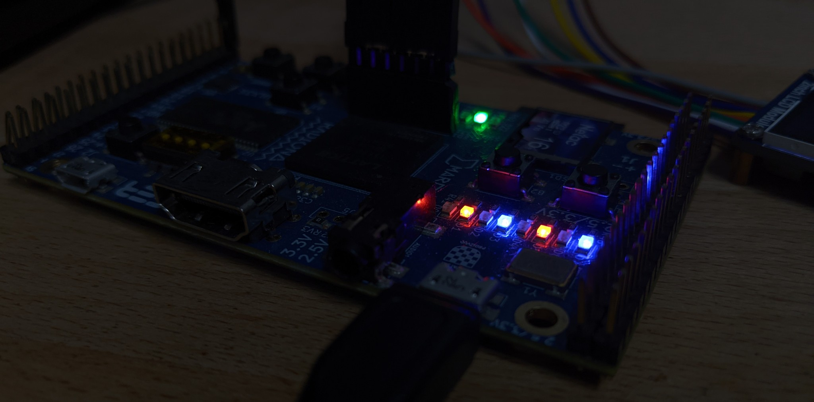

# Exporting Silice to Verilog

This tutorial demonstrates how to export a Silice written design towards a Verilog module that can be reused *from a Verilog design*.

The tutorial considers a relatively advanced case, which is to export one of Silice SDRAM controller for the ULX3S board, [sdram_controller_autoprecharge_r16_w16](../common/sdram_controller_autoprecharge_r16_w16.si). In many cases exporting is much simpler, but the goal of this tutorial is to give all details for even the most advanced cases.

If you want to learn all the gritty details of the SDRAM controller, please refer to my [SDRAM tutorial](../sdram_test/README.md). This is completely optional, in this tutorial we assume the controller is a black box we just want to use.

## Testing

Open a command line in this folder, plug the board and type `make ulx3s`.

You should see this:

<p align="center">
  
</p>

A 16 bits value has just been written to SDRAM and read back, from Verilog, using the exported Silice SDRAM controller.

## Exporting to Verilog

Our goal is to export Silice code so that we can use the controller in a Verilog design. The first thing we need to do is to write a small Silice code for exporting the design. This is in [export_controller.si](export_controller.si) which reads as:

```c
// we indicate that we want the controller synthesized for the ULX3S
// this is normally done by the framework, but for export we use
// the empty 'bare' framework
$$ULX3S = 1
// we include the controller and required interfaces
$include('../common/sdram_interfaces.si')
$include('../common/sdram_controller_autoprecharge_r16_w16.si')
```

Then, in the [Makefile](Makefile) we call Silice directly using the `--export` command line parameter to indicate we want to export `sdram_controller_autoprecharge_r16_w16` using the `bare` framework:

```
silice export_controller.si --output sdram_controller.v  \
  --export sdram_controller_autoprecharge_r16_w16         \
  --frameworks_dir ../../frameworks/                      \
  --framework ../../frameworks/boards/bare/bare.v         \
```

> **Note:** The `bare` framework is a completely empty Verilog glue that you can specially use for exports. [Learn more about frameworks here](../../frameworks/boards/README.md).

This will output the result to `sdram_controller.v`. However, the command in the Makefile is actually much longer, with these additional lines:
```
  -P SD_DONE_SIGNED=0 \
  -P SD_DONE_WIDTH=1 \
  -P SD_DONE_INIT=0 \
  -P SD_DATA_OUT_SIGNED=0 \
  -P SD_DATA_OUT_WIDTH=16 \
  -P SD_DATA_OUT_INIT=0 \
  -P SD_IN_VALID_SIGNED=0 \
  -P SD_IN_VALID_WIDTH=1 \
  -P SD_IN_VALID_INIT=0 \
  -P SD_WMASK_SIGNED=0 \
  -P SD_WMASK_WIDTH=1 \
  -P SD_WMASK_INIT=0 \
  -P SD_DATA_IN_SIGNED=0 \
  -P SD_DATA_IN_WIDTH=16 \
  -P SD_DATA_IN_INIT=0 \
  -P SD_RW_SIGNED=0 \
  -P SD_RW_WIDTH=1 \
  -P SD_RW_INIT=1 \
  -P SD_ADDR_SIGNED=0 \
  -P SD_ADDR_WIDTH=26 \
  -P SD_ADDR_INIT=0 \
```

Why is that? The SDRAM controller uses an interface, in this case defined in [`sdram_interfaces.si`](../common/sdram_interfaces.si) (see `sdram_provider`). Such interfaces are generic, and the actual signal width, signedness and initial value is determined at compilation time by Silice, based on how the controller is used. Because we are exporting the module, Silice cannot determine these, and we have to specify everything on the command line.

> **Note:** If the exported algorithm is not using an interface, these additional parameters are not required.

How do we know the name of these parameters? Let's open [sdram_controller_autoprecharge_r16_w16.si](../common/sdram_controller_autoprecharge_r16_w16.si) and look at the algorithm declaration. We can see the algorithm is expecting a `sdram_provider sd` parameter. The definition of `sdram_provider` in [`sdram_interfaces.si`](../common/sdram_interfaces.si) is as follows:
```c
// interface for provider
interface sdram_provider {
  input   addr,
  input   rw,
  input   data_in,
  input   in_valid,
  input   wmask,
  output  data_out,
  output  done
}
```
For each entry, we thus have to define an *upper case* parameter which is the concatenation of the group name in `sdram_controller_autoprecharge_r16_w16` -- in this case `sd` -- with each entry of the `sdram_provider` interface. For each we define `SIGNED` (`0`: unsigned, `1`: signed), `WIDTH` and `INIT` which is an initial value.
Have another look at the parameters in the [Makefile](Makefile), this is exactly what happens.

## Using the exported module

So now we have produced a `sdram_controller.v` file that we can use in a Verilog design. In this project our test design is in [`sdram_example.v`](sdram_example.v) and does a very simple test: it writes a 16 bits value to SDRAM at address 0x00, reads it back and displays the 8 LSB on the LEDs.

How to we bind our Verilog code to the Silice exported module?
This done with this piece of Verilog code:

```v
// SDRAM interface
reg [25:0]  sd_addr = 0;
reg         sd_rw;
reg [15:0]  sd_data_in;
reg         sd_in_valid;
wire        sd_wmask = 1'b0; // ignored by this controller
wire        sd_done;
wire [15:0] sd_data_out;

// instantiates SDRAM controller
M_sdram_controller_autoprecharge_r16_w16 sdram_controller(
  .in_sd_addr     (sd_addr),
  .in_sd_rw       (sd_rw),
  .in_sd_data_in  (sd_data_in),
  .in_sd_in_valid (sd_in_valid),
  .in_sd_wmask    (sd_wmask),
  .out_sd_done    (sd_done),
  .out_sd_data_out(sd_data_out),
  .out_sdram_cle  (sdram_cke),
  .out_sdram_dqm  (sdram_dqm),
  .out_sdram_cs   (sdram_csn),
  .out_sdram_we   (sdram_wen),
  .out_sdram_cas  (sdram_casn),
  .out_sdram_ras  (sdram_rasn),
  .out_sdram_ba   (sdram_ba),
  .out_sdram_a    (sdram_a),
  .inout_sdram_dq (sdram_d),
  .clock          (clk_design),
  .reset          (reset),
  .in_run         (1'b1)
);
```

Note that the name of the exported algorithm is prefixed by `M_` in Verilog: we instance the controller as `M_sdram_controller_autoprecharge_r16_w16`. We also
have to provide `clock`, `reset` and `in_run`, a Silice internal signal that
tells the module to execute. Here we simply keep it high to get things running.

Then, the bulk of the example is performed in this Verilog `always` block:
```v
// this test value will be
// 1) written to SDRAM
// 2) read back and displayed on LEDs
`define TEST_VALUE 16'b0000000010101010

reg [1:0] state = 0;
always @(posedge clk_design) begin
  // leds always display SDRAM controller output
  leds        <= sd_data_out;
  // state is updated as follows:
  // - during reset, state == 0
  // - state == 0, write TEST_VALUE to SDRAM @addr = 0
  // - state == 0 & sd_done, increment to 1
  // - state == 1, read from SDRAM @addr = 0
  // - state == 1 & sd_done, increment to 2
  // - state == 2, stay there
  state       <= reset ? 0 : (state != 2 ?
                             (sd_done ? state + 1 : state)
                           : state);
  // write to SDRAM when not in reset and state == 0
  sd_rw       <= ~reset && (state == 0);
  // tell the controller the state is valid when
  // writting (state == 0) or reading (state == 1)
  sd_in_valid <= ~reset && (state == 0 || state == 1);
  // we always store TEST_VALUE
  sd_data_in  <= `TEST_VALUE;
end
```

And that's it. All Silice algorithms can be exported in this manner, including the most advanced ones.
