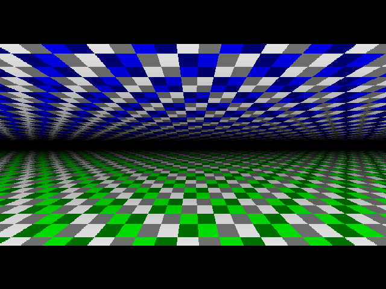
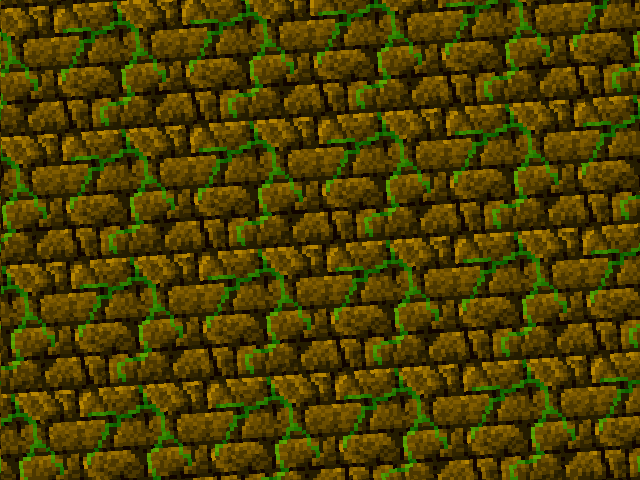

# VGA demo framework, with examples

This folder contains a small framework to create VGA demos, shader-style.

The main file is *vga_demo_main.ice*. Each demo includes it and then defines a
*frame_display* module that computes a color for each pixel, as the VGA signal
is being generated. Yes, there is no framebuffer here! 
(if you are familiar with GPU pixel shaders, this is a very similar programming style for the effects, except that we are [racing the beam](https://en.wikipedia.org/wiki/Racing_the_Beam) here).

All demos run on the IceStick (with [VGA DAC page](../DIYVGA.md)), IceBreaker (with VGA PMOD) or de10-nano (with I/O board VGA). Note that the custom [VGA DAC page](../DIYVGA.md) can be connected to all boards with the proper pinout (see link).

To build: `make icestick` or `make icebreaker` or `make de10nano`.
Other demos can be built using the corresponding makefile, for instance `make icebreaker -f Makefile.flyover3d`.

Available demos:

  
  
  

