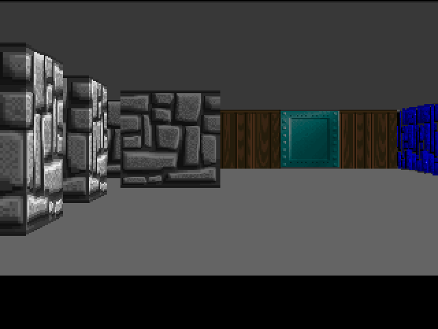

# WolfFPGA

*The Wolfenstein 3D render loop, fully in hardware (no CPU)*

   

## Source code

The source is in [wolfpga.si](wolfpga.si), there are comments but you might need
to get familiar with Wolfenstein 3D raycasting algorithm first (see e.g. https://lodev.org/cgtutor/raycasting.html).

## How to build

For simulation, open a shell in this directory and type `make verilator` (see [getting started](../../GetStarted.md) for instruction on installing Silice).

For hardware, e.g. the ULX3S, open a shell in this directory and type `make ulx3s`.

This projet requires a [VGA DAC](../DIYVGA.md) on the MojoV3/de10nano or an ULX3S (HDMI output). It was tested on a MojoV3 board, de10nano, ulx3s, and can be simulated with Icarus/Verilator

## Textures

The four textures in `wolf.tga` are damaged versions of the original ones
(for copyright reasons), and the result is quite horrible.

Simply replace by textures from your copy of the game for best results!
